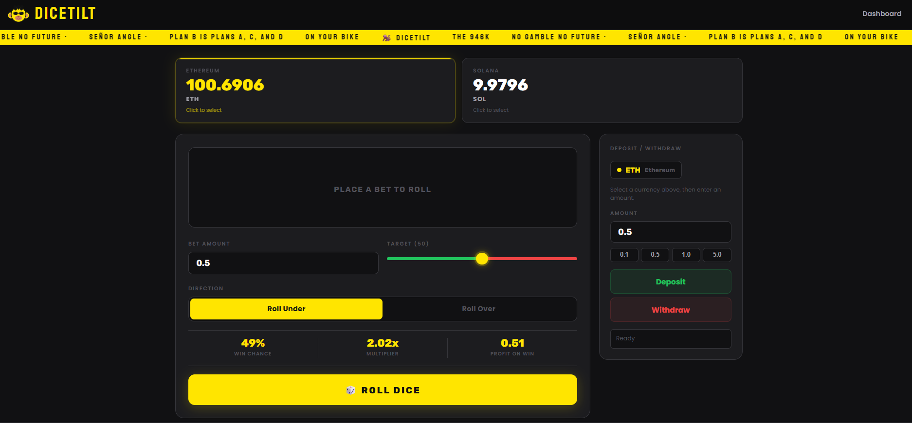
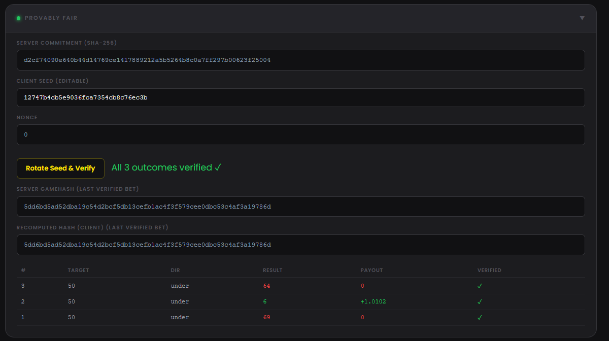
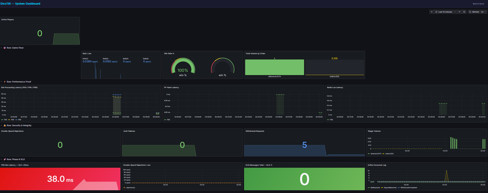

<div align="center">

# DiceTilt

**A crypto casino, built from scratch, by someone who actually plays at them.**

*A hobbyist engineer's deep dive into what really happens behind the felt.*

[]()
[]()
[]()
[]()

</div>

---



---

## Why I built this

I gamble. I also write code. At some point I started wondering what actually happens after I hit "bet" on a crypto casino. Where does my wager go? How does the house prove it's fair? What stops someone from spending the same balance twice in the same second?

Reading blog posts and watching youtube videos didn't answer those questions well enough. So I built the whole thing.

DiceTilt is what came out: a working crypto dice platform I designed and wrote from the database up through smart contracts, microservices, game server, and browser UI. It all runs locally. No cloud accounts, no real money, no API keys. One command and it's live.

---

## What you'll see

When you open DiceTilt you're looking at a real working casino floor.

| | |
|---|---|
|  | Instant dice bets. Pick over/under, choose your wager, get your result. Every bet settles in under 20 milliseconds. |
|  | Provably fair audit. After each session, rotate the server seed and verify that every roll was computed honestly. The math checks out or it doesn't. |
|  | Operations dashboard. Bets per second, P95 latency, active connections, wallet volumes. Everything a floor manager would want to see, refreshed every 5 seconds. |

*Note: On-chain deposit flow is fully functional (EVM listener → Kafka → ledger consumer → Redis pub/sub → WebSocket balance update), but no screenshot was captured during testing.*

---

## Features

### House integrity

| Concern | How DiceTilt handles it |
|---------|------------------------|
| Can players verify the game is honest? | Full provably fair implementation. Server commits to a SHA-256 hashed seed before any bet. After play, the seed is revealed and the player can recompute every outcome: HMAC-SHA256(serverSeed, clientSeed:nonce). An append-only audit trail in PostgreSQL tracks every commitment and reveal. |
| Can the house manipulate results after the fact? | No. The commitment hash is generated before the player bets. The server cannot change the outcome without breaking the hash, which the player can verify independently. |
| Is there an audit trail? | Every bet, deposit, withdrawal, and seed rotation lands in PostgreSQL. The `seed_commitment_audit` table is append-only with a database trigger that blocks deletes and restricts updates to a one-time reveal. |

### Fund security

| Concern | How DiceTilt handles it |
|---------|------------------------|
| What if two bets hit the same balance at the same instant? | Every balance mutation runs through a Redis Lua script, a single atomic operation the server cannot interrupt. In load testing, 20 simultaneous max-balance bets hit the wallet. Exactly 1 went through, 19 were rejected. That's the escrow model working. |
| Where is the money during a bet? | In escrow. When a bet is placed the wager moves from `available` to `escrowed` atomically. It only returns to available balance after settlement. In-flight funds can't be double-spent, even under concurrent load. |
| Who holds the keys? | Not the API server. The payout worker runs in an isolated Docker subnet with its own private key. A compromised API gateway cannot sign blockchain transactions. |
| What happens if settlement fails? | Wagers in escrow get released back to available balance on error. If that release itself fails (say Redis is down), the event routes to a dead-letter queue for manual reconciliation. No funds vanish silently. |

### Speed and uptime

| Concern | How DiceTilt handles it |
|---------|------------------------|
| How fast is a bet? | 17.9ms at P95, measured under 100 concurrent users over 60 seconds. That's the full round-trip: escrow, calculate, settle, respond. At peak the system processes 2,479 bets per second. |
| What happens under extreme load? | It degrades, it doesn't crash. At 1,000 concurrent users the P95 climbs to around 342ms (OS file descriptor limits, not application limits), but the system processed 356,000 bets with zero internal errors and zero crashes across a 5-scenario stress suite. |
| Can I see the floor in real time? | A Grafana dashboard auto-provisions at boot: bets/sec, latency histograms, active connections, double-spend rejections, wallet volumes. Prometheus scrapes every 5 seconds. |

### Blockchain operations

| Concern | How DiceTilt handles it |
|---------|------------------------|
| How do deposits work? | The EVM listener watches the Treasury contract for Deposit events, deduplicates across three layers (memory, database, Kafka), and credits the player's balance via Redis pub/sub. The browser updates live. |
| How do withdrawals work? | The API deducts the balance, publishes a Kafka event, and an isolated payout worker signs and submits the on-chain transaction. If the chain rejects it (nonce collision, for example), the worker retries automatically. If Kafka is down, the balance is restored right away. |
| What about chain failures? | Each chain's listener and payout worker runs independently. An Ethereum RPC outage does not affect Solana operations and vice versa. The casino floor stays open. |

---

## How it works (short version)

```
 Player ──WebSocket──▶ API Gateway ──Lua──▶ Redis (escrow)
                          │                       │
                     Provably Fair              settle
                    (HMAC-SHA256)                 │
                          │                       ▼
                     BET_RESULT ◄──── atomic balance update
                          │
                     Kafka ──────▶ Ledger Consumer ──▶ PostgreSQL
```

1. Player places bet. API Gateway locks the wager in escrow (Redis Lua, atomic).
2. Provably Fair Worker computes the result (HMAC-SHA256, verifiable by the player later).
3. Result sent to player. Wager settles, balance updates.
4. Event published to Kafka. Ledger Consumer persists to PostgreSQL (idempotent, audit-grade).

Deposits and withdrawals follow the same event-driven pattern: chain listener detects on-chain events, publishes to Kafka, and the ledger records them.

---

## The numbers

These aren't theoretical. Measured with [k6](https://k6.io/) load tests against a running system.

| Metric | Result |
|--------|--------|
| P95 bet latency (100 users, 60s) | 17.9 ms |
| Peak throughput | 2,479 bets/sec |
| Bets processed in 60s | 148,743 |
| Error rate under load | 0% |
| DLQ messages | 0 |
| Double-spend rejections | Proven (1 of 20 concurrent max-bets accepted, the other 19 correctly rejected) |
| Internal errors at 1,000 users | 0 |

---

## Architecture at a glance

16 Docker services. 5 TypeScript microservices. Everything event-driven through Kafka. Every balance operation atomic through Redis Lua scripts. Every outcome verifiable through provably fair cryptography.

| Service | What it does |
|---------|-------------|
| API Gateway | Game server. Handles bets via WebSocket, manages escrow, publishes events. Runs in cluster mode (multi-core). |
| Provably Fair Worker | Computes game results. Stateless, CPU-bound, runs in a worker thread pool. Internal only, no public access. |
| EVM Listener | Watches the blockchain for deposit events. Three-layer dedup. Publishes to Kafka. |
| EVM Payout Worker | Signs and submits withdrawal transactions. Isolated from the API. Retries on nonce collisions. |
| Ledger Consumer | Reads Kafka events, writes to PostgreSQL. Idempotent. Publishes balance updates to connected players. |

Backing all of that: PostgreSQL 16 with PgBouncer connection pooling, Redis 7, Apache Kafka in KRaft mode, Anvil for the local EVM node, Nginx as reverse proxy, Prometheus and Grafana for observability.

---

## Quick start

```bash
git clone https://github.com/Fennzo/DiceTilt.git
cd DiceTilt
cp .env.example .env
docker compose up -d
```

Wait about 60 to 90 seconds for all services to report healthy (`docker compose ps`), then:

| URL | What you'll see |
|-----|-----------------|
| [http://localhost](http://localhost) | The game. Play immediately, no wallet setup needed. |
| [http://localhost/dashboard.html](http://localhost/dashboard.html) | Live stats panel |
| [http://localhost:3001](http://localhost:3001) | Grafana dashboard |

To stop: `docker compose down`

---

## What I learned building this

The hardest part isn't writing the code. It's getting money right. Balances have to be correct under concurrency, under failure, under attack. A bet that debits but never credits is a bug that costs real money in production. A deposit that overwrites a player's accumulated winnings is worse, because nobody notices until someone complains.

The three hardest bugs I shipped and then had to track down:

1. ethers.js v6 swallowed the transaction hash. The EVM listener was processing the same deposit 15 times because `eventLog.transactionHash` returned `undefined` in v6. The real path is `eventLog.log.transactionHash`. The ON CONFLICT constraint on an empty string blocked every subsequent deposit.

2. Postgres overwrote Redis bet P&L on deposit. When a player deposits, the ledger consumer set the Redis balance to the Postgres wallet balance, which doesn't include bet activity. Player bets from 10 ETH down to 7.01, deposits 0.5, and suddenly their balance shows 10.5 instead of 7.51. Fixed with an `INCRBYFLOAT` Lua that adds the deposit on top of whatever Redis already tracks.

3. The win payout hadn't landed yet when the balance displayed. The WebSocket pushed `newBalance` to the client before the fire-and-forget settlement credited the payout. On wins, the displayed balance was short by exactly the payout amount. Adding `payoutAmount` to the display math fixed it, since it's zero on losses.

Each of these would have been a real-money incident in production. Hunting them down taught me more about financial software than anything I've read.

---

## Tech stack

For the engineers who want to look under the hood:

| Layer | Technologies |
|-------|-------------|
| Language | TypeScript (strict), Solidity (EVM contracts) |
| Runtime | Node.js 20+, pnpm workspaces (monorepo) |
| Game server | Express, ws (WebSocket), Node.js cluster (multi-core) |
| Cryptography | HMAC-SHA256 (provably fair), SHA-256 (seed commitment) |
| Data | PostgreSQL 16 + PgBouncer, Redis 7, Apache Kafka (KRaft) |
| Blockchain | Hardhat/Anvil (local EVM), ethers.js v6, Treasury.sol |
| Infrastructure | Docker Compose (16 services), Nginx, Prometheus, Grafana |
| Testing | Jest (unit), k6 (5-scenario stress suite + double-spend attack) |
| Validation | Zod (API gateway), SQL CHECK constraints (database safety net) |

---

## Documentation

Full architecture docs live in `/documentation/`:

| Document | What's inside |
|----------|--------------|
| [Architecture Overview](documentation/architecture-overview.md) | Service map, data flows, design decisions |
| [Blockchain Flows](documentation/blockchain-flows.md) | Deposit, withdrawal, and trade sequence diagrams |
| [Kafka Event Topology](documentation/kafka-event-topology.md) | Topics, partitions, consumer groups, DLQ strategy |
| [Database Schema](documentation/database-schema.md) | ERD, table definitions, Redis key schema, escrow model |
| [Solana Production Notes](documentation/solana-production-notes.md) | USDC/ATA/commitment/RPC/MEV requirements for Solana |

---

Built by a hobbyist software engineer who enjoys gambling, because understanding what happens behind the scenes of crypto casinos seemed more interesting than just trusting them.
