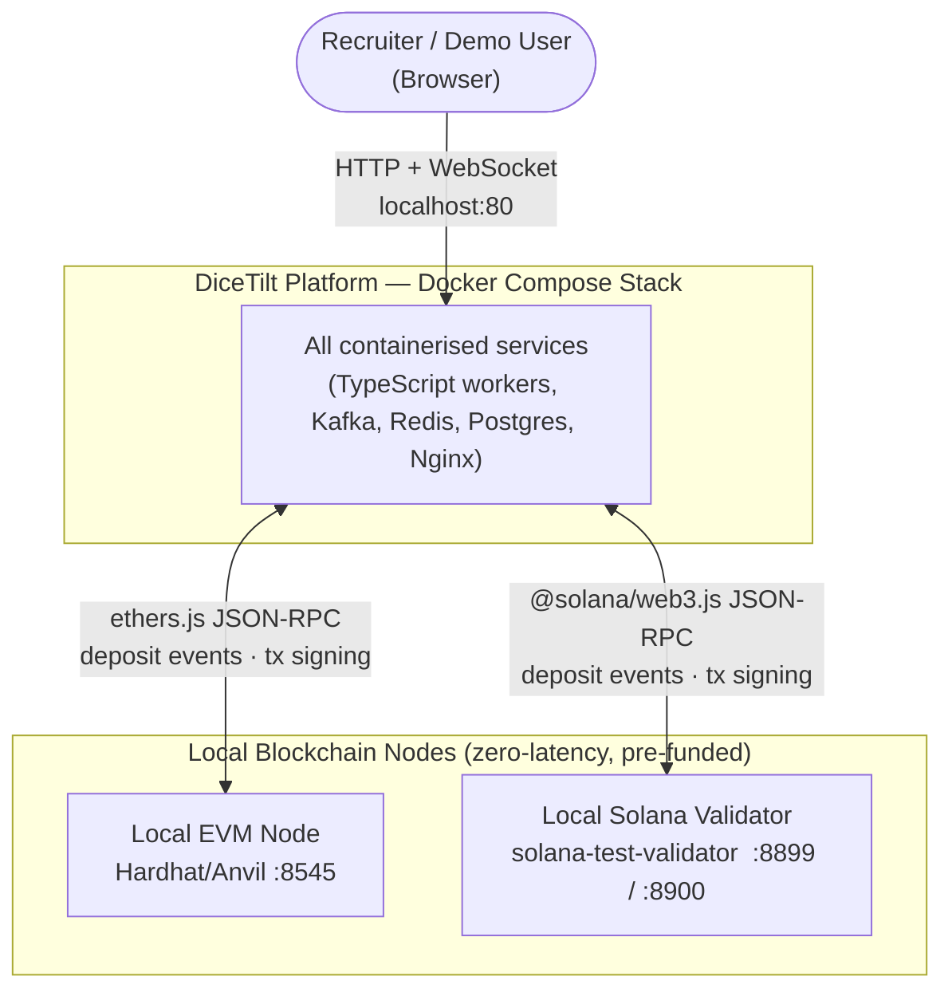
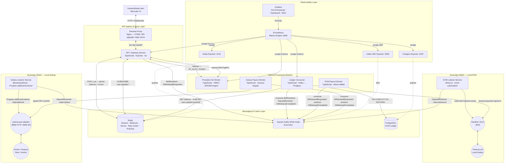
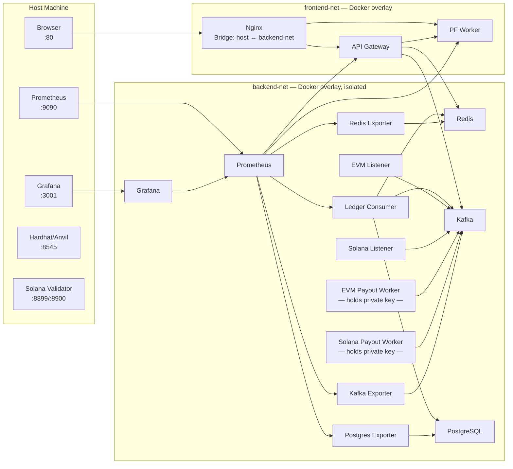

# DiceTilt — System Architecture Overview

**Audience:** Software architects, senior engineers, technical reviewers.

This document is the top-level structural reference for the DiceTilt system. For engineering constraints and business rules, see `implementation_plan.md`. For event message schemas, see `kafka-event-topology.md`. For the data model, see `database-schema.md`. For interaction flows, see `sequence-diagrams.md`, `blockchain-flows.md`, and `infrastructure-flows.md`.

---

## 1. System Context

DiceTilt is a fully sovereign, locally-deployable hybrid Web2/Web3 system. All blockchain nodes run locally — no internet dependency, no real assets required. The recruiter/demo user interacts entirely through a single browser endpoint (`localhost:80`).

---

## 2. Container Architecture (Full Topology)

---

## 3. Architectural Layer Breakdown

| Layer | Services | Primary Responsibility |
|---|---|---|
| **Ingress** | Nginx | Single entry point. HTTP/WS routing, CORS headers, WebSocket protocol upgrade (`Upgrade` header injection), static `index.html` serving. |
| **Application** | API Gateway | EIP-712 authentication, JWT issuance, WebSocket session lifecycle, Redis Lua atomic balance and nonce operations, Kafka event production for bets and withdrawals. **SUBSCRIBEs** to Redis channel `user:updates:{userId}` — on message, pushes BALANCE_UPDATE or WITHDRAWAL_COMPLETED to the user's WebSocket. Runs as clustered TypeScript-on-Node processes (one worker per CPU core) to parallelise signature verification and request handling. |
| **Cryptography** | Provably Fair Worker | **Stateless** HMAC-SHA256 engine. All inputs (including server seed) are passed by the API Gateway — the PF Worker never accesses Postgres or Redis. Generates seeds and computes hashes as a pure function. Accessible only via internal `PF_AUTH_TOKEN`. CPU-bound hash work is executed through a `piscina` Worker Threads pool to avoid event-loop blocking under concurrency. |
| **Messaging** | Kafka (KRaft) | Durable async event bus. Decouples the synchronous sub-20ms game loop from async DB settlement, blockchain event processing, and payout execution. |
| **Cache** | Redis | Primary balance and nonce read/write layer via atomic Lua scripts. Session registry with TTL-based revocation. Sliding window rate limiter via ZSET. **Pub/Sub:** Ledger Consumer PUBLISHes to `user:updates:{userId}` after balance/withdrawal updates; API Gateway SUBSCRIBEs and pushes BALANCE_UPDATE / WITHDRAWAL_COMPLETED to WebSocket clients in real time. |
| **Persistence** | PostgreSQL | Canonical ACID ledger. Receives idempotent `ON CONFLICT DO NOTHING` inserts from the Ledger Consumer. Source of truth for balance hydration on Redis cache miss. |
| **Settlement** | Ledger Consumer | Kafka consumer writing `BetResolved`, `DepositReceived`, and `WithdrawalCompleted` events to Postgres. Uses `eachBatch` with per-`user_id` grouping and `Promise.all` across groups so cross-user writes run in parallel while preserving per-user ordering. Routes failed messages to **per-topic DLQs** (`BetResolved-DLQ`, `DepositReceived-DLQ`, `WithdrawalCompleted-DLQ`) after exhausting retries. After updating Postgres and Redis, **PUBLISHes** to Redis channel `user:updates:{userId}` so the API Gateway can push real-time BALANCE_UPDATE / WITHDRAWAL_COMPLETED to WebSocket clients. |
| **Blockchain (EVM)** | EVM Listener, EVM Payout, Hardhat/Anvil, Treasury.sol | Local Ethereum chain. Event-driven deposit detection and isolated transaction signing for withdrawals. Private key never leaves the Payout Worker container. |
| **Blockchain (Solana)** | Solana Listener, Solana Payout, solana-test-validator, Anchor Treasury | *(Architecture stub — not yet implemented in this PoC. EVM layer is fully functional.)* Local Solana chain design mirrors the EVM layer: parallel deposit and withdrawal pipeline, completely independent of EVM. Multi-stage Docker build: Rust stage compiles Anchor program; Solana stage deploys it. |
| **Observability** | Prometheus, Grafana, 3 exporters | Pull-based metrics collection from all TypeScript services (`prom-client`) and infrastructure exporters. Pre-provisioned Grafana dashboard auto-loads at boot. |
| **Automation** | Ansible, Ansible Vault *(production only)*, EDA | Deployment automation, encrypted secret management for payout private keys (production — PoC uses deterministic keys from `.env`), automated Kafka broker remediation via Prometheus alerting → EDA rulebook. |

### 3.1 Runtime Concurrency Model (TypeScript on Node.js)

- TypeScript defines source language and type safety; runtime concurrency characteristics come from Node.js (`worker_threads`, `cluster`, libuv event loop).
- Provably Fair hash computation is CPU-bound and therefore executed in a `piscina` Worker Threads pool.
- API Gateway uses Node.js `cluster` to run one worker process per CPU core.
- Kafka `BetResolved` topic uses 3 partitions; with 3 Ledger Consumer replicas in the same consumer group, this yields 3 parallel partition processors.
- Ledger Consumer processes batches with per-user grouping and parallel writes across users, preserving per-user order while increasing throughput.

### 3.2 Redis Pub/Sub — Real-Time Balance & Withdrawal Updates

The Ledger Consumer and API Gateway run in separate processes. The API Gateway holds the active WebSocket connection; the Ledger Consumer has no direct way to notify it. **Redis Pub/Sub** closes this gap:

1. **Ledger Consumer** — After updating Postgres and Redis (on `DepositReceived` or `WithdrawalCompleted`), **PUBLISH** a message to channel `user:updates:{userId}`. Payload: `{ type: 'balance_update'|'withdrawal_completed', chain, currency, balance?, withdrawalId?, txHash? }`.
2. **API Gateway** — **SUBSCRIBE** to `user:updates:*` (pattern subscription) or per-user channels. On message, look up the user's WebSocket from the in-memory session map and push `BALANCE_UPDATE` or `WITHDRAWAL_COMPLETED` to the browser.

Without this, the user's balance would not update after a deposit until they place a bet or refresh the page — breaking the real-time demo experience.

---

## 4. Service Responsibility Matrix

| Service | Language | Produces (Kafka) | Consumes (Kafka) | Key Dependencies |
|---|---|---|---|---|
| API Gateway | TypeScript | `BetResolved`, `WithdrawalRequested` | — | Redis (Lua, Pub/Sub), PF Worker, Kafka, Postgres (hydration) |
| Provably Fair Worker | TypeScript | — | — | None (internal gRPC/HTTP only) |
| Ledger Consumer | TypeScript | `BetResolved-DLQ` *(on failure)* | `BetResolved`, `DepositReceived`, `WithdrawalCompleted` | PostgreSQL, Kafka, Redis |
| EVM Listener | TypeScript | `DepositReceived` (`chain: ethereum`) | — | Kafka, Hardhat/Anvil |
| EVM Payout Worker | TypeScript | `WithdrawalCompleted` (`chain: ethereum`) | `WithdrawalRequested` (`chain: ethereum`) | Kafka, Hardhat/Anvil, `.env` (PoC) / Ansible Vault (prod) |
| Solana Listener *(stub)* | TypeScript | `DepositReceived` (`chain: solana`) | — | Kafka, solana-test-validator |
| Solana Payout Worker *(stub)* | TypeScript | `WithdrawalCompleted` (`chain: solana`) | `WithdrawalRequested` (`chain: solana`) | Kafka, solana-test-validator, `.env` (PoC) / Ansible Vault (prod) |
| Trade Router *(stub)* | Rust | `TradeExecuted` *(future)* | — | *(Production: Jito, Jupiter; Rust selected for Tokio multi-thread runtime to support MEV path computation at parallelism levels unsuitable for Node.js event-loop workers.)* |

---

## 5. Port Reference

| Service | Internal Port | Host-Exposed Port | Protocol | Notes |
|---|---|---|---|---|
| Nginx | 80 | **80** | HTTP, WebSocket | Primary recruiter entry point |
| API Gateway | 3000 | — | HTTP, WebSocket | Internal Docker network only |
| Provably Fair Worker | 3001 | — | HTTP / gRPC | Internal only; protected by `PF_AUTH_TOKEN` |
| Redis | 6379 | — | Redis Protocol | Internal only |
| PostgreSQL | 5432 | — | TCP | Internal only |
| Kafka (KRaft) | 29092 | — | Kafka Protocol | Internal broker listener |
| Hardhat / Anvil | 8545 | **8545** | HTTP + WS JSON-RPC | Exposed for frontend burner wallet signing |
| Solana Validator | 8899 / 8900 | **8899 / 8900** | HTTP / WS JSON-RPC | Exposed for frontend Solana signing |
| Prometheus | 9090 | **9090** | HTTP | Direct metric access |
| Grafana | 3000 (internal) | **3001** | HTTP | Recruiter dashboard |
| Redis Exporter | 9121 | — | HTTP (Prometheus scrape) | Internal only |
| Postgres Exporter | 9187 | — | HTTP (Prometheus scrape) | Internal only |
| Kafka JMX Exporter | 5556 | — | HTTP (Prometheus scrape) | Internal only |

---

## 6. Docker Network Topology

Two overlay networks enforce security isolation. The payout workers hold private keys and must never be reachable from the public network.

> **Security note:** The payout workers (`EVMPay`, `SolPay`) reside exclusively on `backend-net`. They have no inbound routes from Nginx or any user-facing service. Their only communication is outbound Kafka consumption and outbound blockchain RPC calls. In the PoC, private keys are deterministic Hardhat/Solana test keys loaded from `.env` (safe — local chain, no real value). In production, keys are injected via Ansible Vault at deploy time and never written to disk unencrypted.
