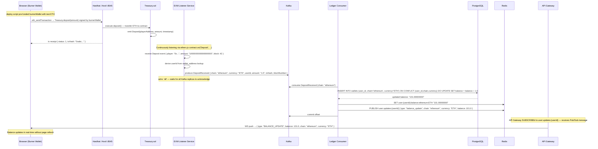
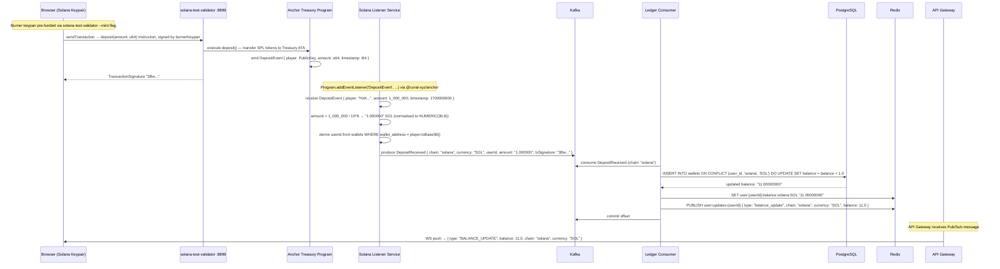
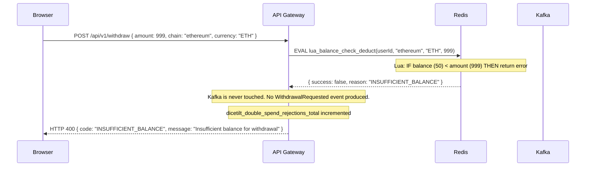
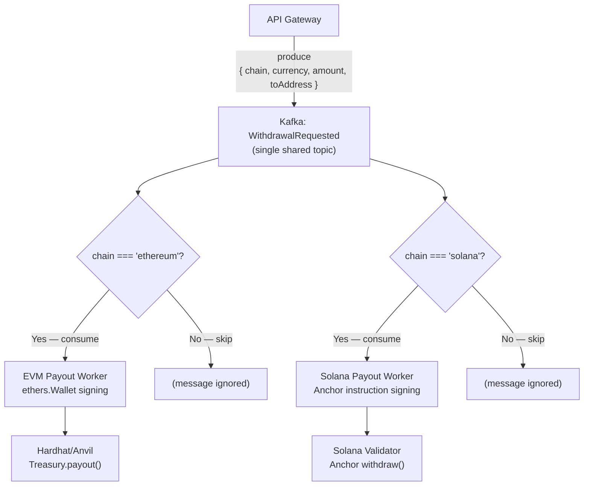
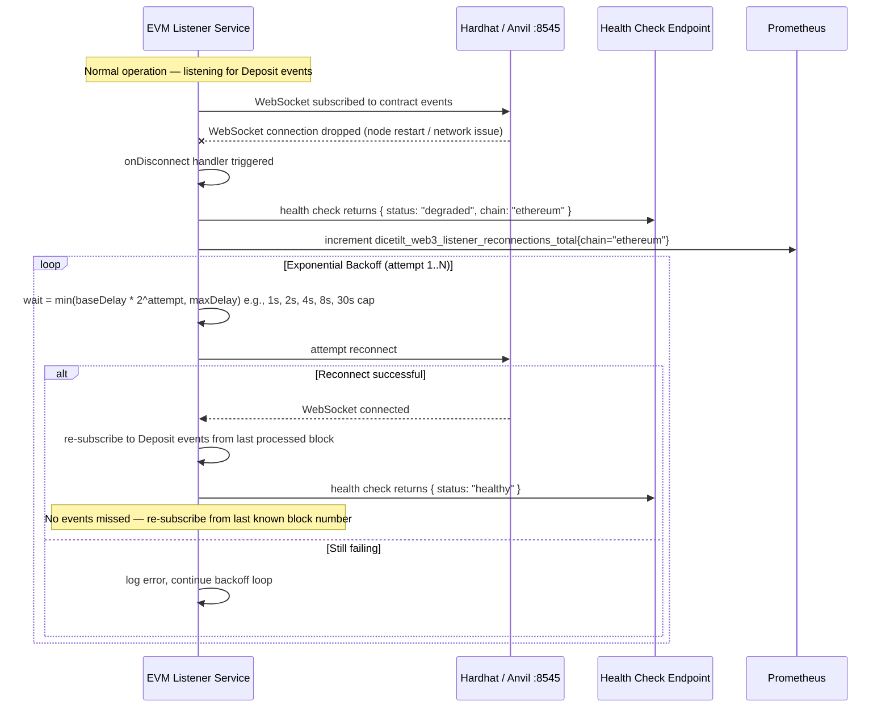
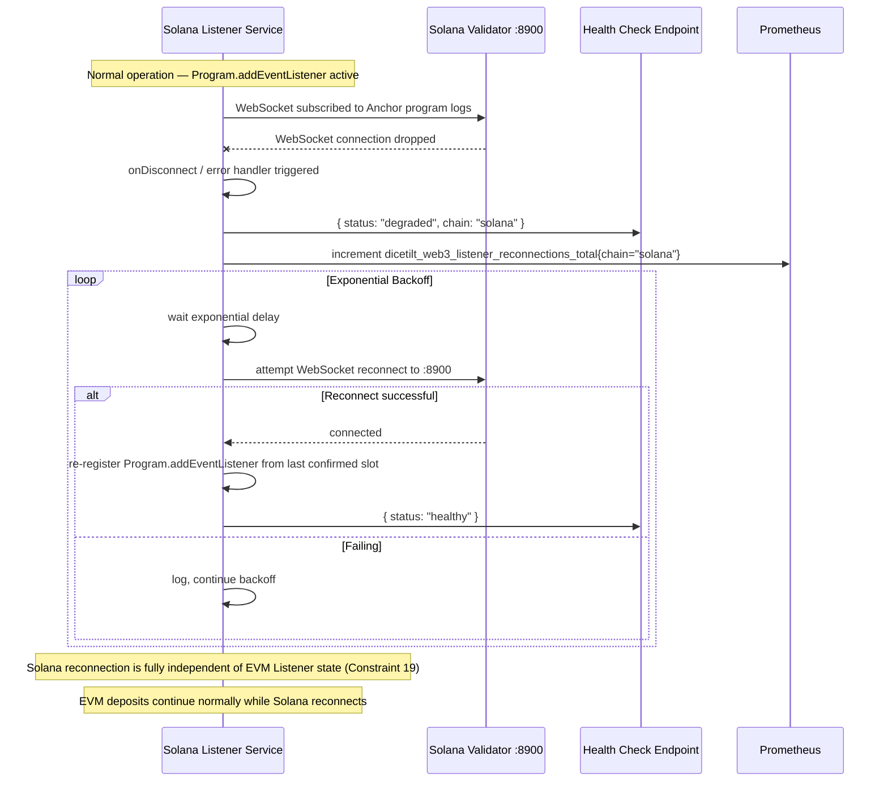

# DiceTilt — Blockchain Flows

**Audience:** Software architects, blockchain engineers.

All deposit and withdrawal flows for both EVM (Hardhat/Anvil) and Solana (solana-test-validator) chains. Both chains are fully local — no internet, no real assets, no faucet requests. For the auth and game loop flows, see `sequence-diagrams.md`.

---

## Flow Index

| # | Flow | Chain |
|---|---|---|
| 1 | EVM Deposit — Smart Contract to Balance Update | EVM |
| 2 | Solana Deposit — Anchor Program to Balance Update | Solana |
| 3 | Simultaneous Multi-Chain Deposits (Independence Proof) | Both |
| 4 | EVM Withdrawal — API to Signed On-Chain Transaction | EVM |
| 5 | Solana Withdrawal — API to Signed On-Chain Transaction | Solana |
| 6 | Withdrawal — Insufficient Balance Rejection | Both |
| 7 | Chain-Aware Withdrawal Routing Diagram | Both |
| 8 | EVM Listener — Reconnection with Exponential Backoff | EVM |
| 9 | Solana Listener — Reconnection with Exponential Backoff | Solana |

---

## Flow 1 — EVM Deposit (Smart Contract → Balance Update)

This flow documents the full architectural deposit pipeline. In the PoC demo, users start with default balances (10 ETH, 10 SOL) — the deposit flow is not part of the primary recruiter experience but remains fully implemented in the backend. The EVM Listener detects `Deposit` events and feeds them into the shared Kafka pipeline.



---

## Flow 2 — Solana Deposit (Anchor Program → Balance Update)

Mirrors Flow 1 using Solana-specific technology. The Anchor program emits `DepositEvent` which the Solana Listener decodes via the IDL and feeds into the same Kafka topic as the EVM Listener.



---

## Flow 3 — Simultaneous Multi-Chain Deposits (Independence Proof)

Demonstrates that the EVM and Solana deposit pipelines are completely independent. A failure in one chain's listener does not block the other.

```mermaid
sequenceDiagram
    participant B as Browser
    participant Anvil as Hardhat/Anvil
    participant SolVal as Solana Validator
    participant EL as EVM Listener
    participant SL as Solana Listener
    participant Kafka as Kafka (DepositReceived topic)
    participant LC as Ledger Consumer

    par EVM deposit
        B->>Anvil: Treasury.deposit(0.5 ETH)
        Anvil-->>EL: Deposit event emitted
        EL->>Kafka: produce { chain: "ethereum", amount: "0.5", currency: "ETH" }
    and Solana deposit (concurrent)
        B->>SolVal: deposit(0.5 SOL) instruction
        SolVal-->>SL: DepositEvent emitted
        SL->>Kafka: produce { chain: "solana", amount: "0.5", currency: "SOL" }
    end

    Note over Kafka: Both messages land on the same DepositReceived topic
    Note over LC: Ledger Consumer processes batches in parallel (eachBatch + Promise.all by user_id); 3 replicas = 3 partition processors

    LC->>Kafka: consume DepositReceived (ethereum, 0.5 ETH)
    LC->>LC: UPDATE wallets SET balance + 0.5 WHERE chain='ethereum'
    LC->>Kafka: consume DepositReceived (solana, 0.5 SOL)
    LC->>LC: UPDATE wallets SET balance + 0.5 WHERE chain='solana'

    Note over EL,SL: If Solana validator goes down, EVM deposits continue uninterrupted (Constraint 19)
    Note over EL,SL: If EVM node goes down, Solana deposits continue uninterrupted
    Note over EL,SL: Each listener has its own reconnection loop with exponential backoff
```

---

## Flow 4 — EVM Withdrawal (API → Signed On-Chain Transaction)

The API Gateway never holds a private key. It only emits a Kafka event. The isolated EVM Payout Worker — the only service with access to the treasury private key — signs and submits the transaction.

```mermaid
sequenceDiagram
    participant B as Browser
    participant N as Nginx
    participant API as API Gateway
    participant Redis as Redis
    participant Kafka as Kafka
    participant EPW as EVM Payout Worker
    participant Anvil as Hardhat / Anvil
    participant TSol as Treasury.sol

    B->>N: POST /api/v1/withdraw { amount: 0.5, chain: "ethereum", currency: "ETH" }  Bearer JWT
    N->>API: forward

    API->>API: jwt.verify + Redis session check
    API->>Redis: EVAL lua_balance_check_deduct(userId, "ethereum", "ETH", 0.5)
    Note over Redis: Atomic: check balance >= 0.5, deduct if sufficient
    Redis-->>API: { success: true, newBalance: 99.5 }

    API->>Kafka: produce WithdrawalRequested { withdrawalId: uuid, userId, amount: 0.5, chain: "ethereum", currency: "ETH", toAddress: "0x..." }
    Note over API: acks: 'all' — durable delivery guaranteed before HTTP response
    API-->>B: HTTP 202 { withdrawalId: "uuid", status: "PENDING" }

    Note over EPW: Consuming WithdrawalRequested — filters on chain === "ethereum"
    EPW->>Kafka: consume WithdrawalRequested (chain: "ethereum")
    EPW->>EPW: read TREASURY_OWNER_PRIVATE_KEY from env (PoC: deterministic Hardhat key from .env; production: Ansible Vault)
    EPW->>EPW: ethers.Wallet(privateKey, provider) → treasuryWallet
    EPW->>Anvil: treasuryContract.payout(toAddress, amount) — signed tx
    Anvil->>TSol: execute payout() — transfer ETH from contract to recipient
    TSol-->>Anvil: emit Payout(recipient, amount)
    Anvil-->>EPW: tx receipt { status: 1, txHash: "0xdef..." }

    EPW->>Kafka: produce WithdrawalCompleted { withdrawalId, userId, chain, amount, txHash, completedAt }
    EPW->>Kafka: commit offset

    Note over LC: Ledger Consumer consumes WithdrawalCompleted
    LC->>LC: record withdrawal (optional DB insert for audit)
    LC->>Redis: PUBLISH user:updates:{userId} { type: "withdrawal_completed", withdrawalId, txHash, chain, currency }
    Note over API: API Gateway receives Pub/Sub → pushes WITHDRAWAL_COMPLETED to WebSocket
    API->>B: WS push → { type: "WITHDRAWAL_COMPLETED", withdrawalId, txHash, chain, currency }
    Note over B: UI no longer shows "PENDING"

    Note over EPW: dicetilt_withdrawal_completions_total{chain="ethereum"} incremented
```

---

## Flow 5 — Solana Withdrawal (API → Signed On-Chain Transaction)

```mermaid
sequenceDiagram
    participant B as Browser
    participant API as API Gateway
    participant Redis as Redis
    participant Kafka as Kafka
    participant SPW as Solana Payout Worker
    participant SolVal as Solana Validator
    participant AT as Anchor Treasury Program

    B->>API: POST /api/v1/withdraw { amount: 1.0, chain: "solana", currency: "SOL" }  Bearer JWT
    API->>Redis: EVAL lua_balance_check_deduct(userId, "solana", "SOL", 1.0)
    Redis-->>API: { success: true, newBalance: 10.0 }

    API->>Kafka: produce WithdrawalRequested { ..., chain: "solana", currency: "SOL", toAddress: "HxK..." }
    API-->>B: HTTP 202 { withdrawalId, status: "PENDING" }

    Note over SPW: Consuming WithdrawalRequested — filters on chain === "solana"
    SPW->>Kafka: consume WithdrawalRequested (chain: "solana")
    SPW->>SPW: read SOLANA_TREASURY_KEYPAIR from env (PoC: pre-generated key from .env; production: Ansible Vault)
    SPW->>SPW: Keypair.fromSecretKey(secretKey) → treasuryKeypair
    SPW->>SPW: build withdraw(amount, recipient) Anchor instruction
    SPW->>SolVal: sendTransaction(signedWithdrawTx)
    SolVal->>AT: execute withdraw() — transfer SPL tokens to recipient ATA
    AT-->>SolVal: emit WithdrawEvent { recipient, amount, timestamp }
    SolVal-->>SPW: TransactionSignature "5Qr..."

    SPW->>Kafka: produce WithdrawalCompleted { withdrawalId, userId, chain, amount, txSignature, completedAt }
    SPW->>Kafka: commit offset

    Note over LC: Ledger Consumer consumes WithdrawalCompleted
    LC->>Redis: PUBLISH user:updates:{userId} { type: "withdrawal_completed", ... }
    Note over API: API Gateway pushes WITHDRAWAL_COMPLETED to WebSocket
    Note over SPW: dicetilt_withdrawal_completions_total{chain="solana"} incremented
```

---

## Flow 6 — Withdrawal, Insufficient Balance Rejection



---

## Flow 7 — Chain-Aware Withdrawal Routing Diagram

Both payout workers subscribe to the same `WithdrawalRequested` Kafka topic but each only processes messages matching their chain. No hardcoded routing logic exists in the API Gateway.



> **Design principle (Constraint 20):** The `chain` and `currency` fields are carried in the Kafka event payload — not derived from any gateway logic. Each payout worker is responsible for its own filtering. This enables adding new chains (e.g., Tron, Bitcoin Lightning) by deploying a new payout worker without modifying any existing service.

---

## Flow 8 — EVM Listener: Reconnection with Exponential Backoff

The EVM Listener operates as a long-running process. WebSocket connections to Hardhat/Anvil can drop. The listener must reconnect autonomously without human intervention (Constraint 19).



---

## Flow 9 — Solana Listener: Reconnection with Exponential Backoff

Identical pattern to Flow 8 but using the Solana JSON-RPC WebSocket connection.


