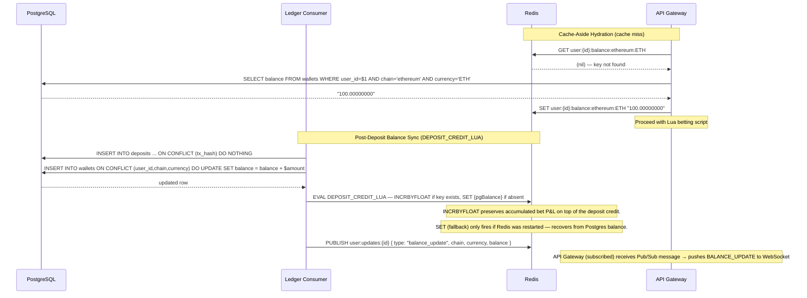
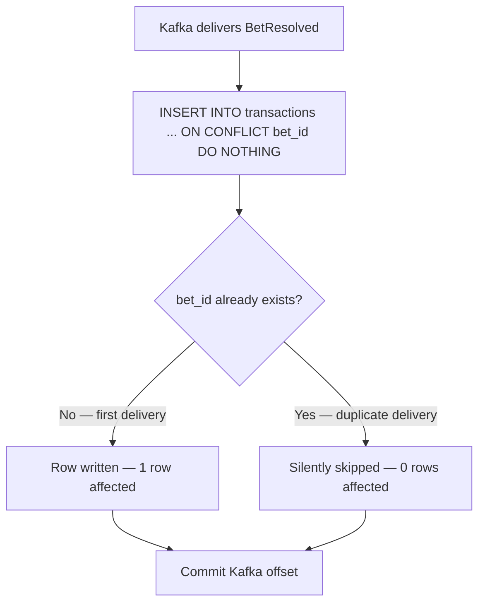

# DiceTilt — Database Schema Reference

**Audience:** Software architects, backend engineers, DBAs.

This document covers the full PostgreSQL relational schema including all tables, constraints, indexes, triggers, and rationale. It also covers the Redis key schema that mirrors and caches the canonical Postgres state.

---

## 1. Entity-Relationship Diagram

```mermaid
erDiagram
    USERS ||--o{ WALLETS : "owns"
    USERS ||--o{ TRANSACTIONS : "places"
    USERS ||--o{ DEPOSITS : "receives"
    USERS ||--o{ WITHDRAWALS : "initiates"
    USERS ||--o{ SEED_COMMITMENT_AUDIT : "has seed cycles"
    WALLETS {
        uuid   id              PK  "Surrogate PK"
        uuid   user_id         FK  "References users(id) CASCADE"
        varchar chain              "CHECK: ethereum | solana"
        varchar currency           "CHECK: ETH | SOL | USDC | USDT"
        numeric balance            "CHECK: >= 0  — available (non-escrowed) balance"
        numeric balance_escrowed   "CHECK: >= 0  — funds currently held in active bets"
        integer current_nonce      "CHECK: >= 0  — checkpoint, live nonce in Redis"
        varchar wallet_address     "EVM hex or Solana base58 address"
        timestamptz created_at
        timestamptz updated_at     "Auto-maintained by trigger"
        unique  UQ_user_chain_curr "UNIQUE(user_id, chain, currency)"
    }
    USERS {
        uuid   id              PK  "Primary Key — uuid_generate_v4()"
        varchar active_server_seed "Current hidden HMAC key — never exposed mid-cycle"
        varchar previous_server_seed "Revealed on rotation — client verification"
        timestamptz created_at
        timestamptz updated_at     "Auto-maintained by trigger"
    }
    SEED_COMMITMENT_AUDIT {
        bigint  id              PK  "BIGSERIAL — auto-increment"
        uuid    user_id         FK  "References users(id) RESTRICT"
        varchar seed_commitment     "SHA256(server_seed) — pre-image never stored here"
        timestamptz committed_at   "Immutable — set on INSERT, never updated"
        varchar revealed_seed      "NULL until rotation — the raw seed for PF verification"
        timestamptz revealed_at    "NULL until rotation"
    }
    TRANSACTIONS {
        uuid    bet_id         PK  "Idempotency key — supplied by API Gateway, NOT auto-generated"
        uuid    user_id        FK  "References users(id) RESTRICT"
        varchar chain              "CHECK: ethereum | solana"
        varchar currency           "CHECK: ETH | SOL | USDC | USDT"
        numeric wager_amount       "CHECK: > 0"
        numeric payout_amount      "CHECK: >= 0  — 0 on loss"
        integer game_result        "CHECK: BETWEEN 1 AND 100"
        varchar client_seed        "Player-provided entropy — stored for audit"
        integer nonce_used         "CHECK: >= 0  — snapshot of nonce at bet time"
        varchar outcome_hash       "HMAC-SHA256(ServerSeed:ClientSeed:Nonce)"
        timestamptz executed_at    "DEFAULT NOW() — immutable after insert"
    }
    DEPOSITS {
        uuid    deposit_id     PK  "Idempotency key — UUID from EVM Listener / Solana Listener"
        uuid    user_id        FK  "References users(id) RESTRICT"
        varchar chain              "CHECK: ethereum | solana"
        varchar currency           "CHECK: ETH | SOL | USDC | USDT"
        numeric amount             "Deposit amount, NUMERIC(30,8)"
        varchar wallet_address     "On-chain sender address"
        varchar tx_hash        UK  "UNIQUE — cross-restart deduplication key"
        bigint  block_number       "EVM block number or Solana slot"
        timestamptz deposited_at
    }
    WITHDRAWALS {
        uuid    withdrawal_id  PK  "Idempotency key — same UUID as WithdrawalRequested event"
        uuid    user_id        FK  "References users(id) RESTRICT"
        varchar chain              "CHECK: ethereum | solana — part of composite UQ"
        varchar currency           "CHECK: ETH | SOL | USDC | USDT"
        numeric amount             "Withdrawal amount, NUMERIC(30,8)"
        varchar to_address         "On-chain recipient address"
        varchar tx_hash            "Part of composite UQ(tx_hash, chain)"
        timestamptz completed_at   "Timestamp of on-chain confirmation"
        unique  UQ_tx_hash_chain   "UNIQUE(tx_hash, chain) — multi‑chain deduplication"
    }
```



---

## 2. Full `init.sql`

This file is mounted into the PostgreSQL container as an init script and executes on first boot. For existing databases (persisted volumes), run migrations in `db/migrations/` to apply schema changes.

```sql
-- =============================================================
-- DiceTilt PostgreSQL Schema
-- Mounted at: /docker-entrypoint-initdb.d/init.sql
-- Executes once on first container boot.
-- =============================================================

CREATE EXTENSION IF NOT EXISTS "uuid-ossp";

-- =============================================================
-- TABLE: users
-- =============================================================
CREATE TABLE IF NOT EXISTS users (
    id                   UUID         PRIMARY KEY DEFAULT uuid_generate_v4(),
    active_server_seed   VARCHAR(64)  NOT NULL,
    previous_server_seed VARCHAR(64),
    created_at           TIMESTAMPTZ  NOT NULL DEFAULT NOW(),
    updated_at           TIMESTAMPTZ  NOT NULL DEFAULT NOW()
);

-- =============================================================
-- TABLE: wallets
-- =============================================================
CREATE TABLE IF NOT EXISTS wallets (
    id                UUID          PRIMARY KEY DEFAULT uuid_generate_v4(),
    user_id           UUID          NOT NULL
                          REFERENCES users(id) ON DELETE CASCADE,
    chain             VARCHAR(20)   NOT NULL,
    currency          VARCHAR(10)   NOT NULL,
    balance           NUMERIC(30,8) NOT NULL DEFAULT 0,
    -- C3/H6 — Escrow: funds currently in active (in-play) bets.
    -- Authoritative live value is in Redis; this column is for audit/reconciliation.
    balance_escrowed  NUMERIC(30,8) NOT NULL DEFAULT 0,
    current_nonce     INTEGER       NOT NULL DEFAULT 0,
    wallet_address    VARCHAR(100)  NOT NULL,
    created_at        TIMESTAMPTZ   NOT NULL DEFAULT NOW(),
    updated_at        TIMESTAMPTZ   NOT NULL DEFAULT NOW(),

    CONSTRAINT chk_wallets_nonce_non_negative
        CHECK (current_nonce >= 0),
    CONSTRAINT chk_wallets_chain_valid
        CHECK (chain IN ('ethereum', 'solana')),
    CONSTRAINT chk_wallets_currency_valid
        CHECK (currency IN ('ETH', 'SOL', 'USDC', 'USDT')),
    CONSTRAINT chk_wallets_balance_non_negative
        CHECK (balance >= 0),
    CONSTRAINT chk_wallets_escrowed_non_negative
        CHECK (balance_escrowed >= 0),
    CONSTRAINT uq_user_chain_currency
        UNIQUE (user_id, chain, currency)
);

-- =============================================================
-- TABLE: seed_commitment_audit (H2/M9)
-- Immutable append-only audit trail of every server seed cycle.
-- committed_at is DB-set on INSERT and never updated.
-- revealed_seed / revealed_at are filled exactly once on rotation.
-- =============================================================
CREATE TABLE IF NOT EXISTS seed_commitment_audit (
    id              BIGSERIAL     PRIMARY KEY,
    user_id         UUID          NOT NULL REFERENCES users(id) ON DELETE RESTRICT,
    seed_commitment VARCHAR(64)   NOT NULL,
    committed_at    TIMESTAMPTZ   NOT NULL DEFAULT NOW(),
    revealed_seed   VARCHAR(64),
    revealed_at     TIMESTAMPTZ,
    CONSTRAINT revealed_pair_check
        CHECK ((revealed_seed IS NULL AND revealed_at IS NULL) OR (revealed_seed IS NOT NULL AND revealed_at IS NOT NULL))
);

CREATE INDEX IF NOT EXISTS idx_seed_audit_user_id
    ON seed_commitment_audit (user_id);
CREATE INDEX IF NOT EXISTS idx_seed_audit_committed_at
    ON seed_commitment_audit (committed_at DESC);

-- TRIGGER: prevent_audit_mutation — append-only with one-time reveal.
-- trg_seed_audit_no_delete, trg_seed_audit_no_update reject all DELETE and
-- any UPDATE except the single transition of revealed_seed/revealed_at from NULL to NOT NULL.
-- See db/init.sql for full trigger definition.

-- =============================================================
-- TABLE: deposits (idempotency for DepositReceived Kafka events)
-- =============================================================
CREATE TABLE IF NOT EXISTS deposits (
    deposit_id     UUID          PRIMARY KEY,
    user_id        UUID          NOT NULL REFERENCES users(id) ON DELETE RESTRICT,
    chain          VARCHAR(20)   NOT NULL,
    currency       VARCHAR(10)   NOT NULL,
    amount         NUMERIC(30,8) NOT NULL,
    wallet_address VARCHAR(100)  NOT NULL,
    tx_hash        VARCHAR(100)  NOT NULL,
    block_number   BIGINT        NOT NULL,
    deposited_at   TIMESTAMPTZ   NOT NULL,
    CONSTRAINT chk_deposits_chain_valid CHECK (chain IN ('ethereum', 'solana')),
    CONSTRAINT chk_deposits_currency_valid CHECK (currency IN ('ETH', 'SOL', 'USDC', 'USDT')),
    CONSTRAINT chk_deposits_amount_positive CHECK (amount > 0),
    CONSTRAINT uq_deposits_tx_hash UNIQUE (tx_hash)
);

CREATE INDEX IF NOT EXISTS idx_deposits_user_id ON deposits (user_id);

-- =============================================================
-- TABLE: withdrawals (idempotency for WithdrawalCompleted Kafka events)
CREATE TABLE IF NOT EXISTS withdrawals (
    withdrawal_id  UUID          PRIMARY KEY,
    user_id        UUID          NOT NULL REFERENCES users(id) ON DELETE RESTRICT,
    chain          VARCHAR(20)   NOT NULL,
    currency       VARCHAR(10)   NOT NULL,
    amount         NUMERIC(30,8) NOT NULL,
    to_address     VARCHAR(100)  NOT NULL,
    tx_hash        VARCHAR(100)  NOT NULL,
    completed_at   TIMESTAMPTZ   NOT NULL,
    CONSTRAINT chk_withdrawals_chain_valid CHECK (chain IN ('ethereum', 'solana')),
    CONSTRAINT chk_withdrawals_currency_valid CHECK (currency IN ('ETH', 'SOL', 'USDC', 'USDT')),
    CONSTRAINT chk_withdrawals_amount_positive CHECK (amount > 0),
    CONSTRAINT uq_withdrawals_tx_hash UNIQUE (tx_hash, chain)
);

CREATE INDEX IF NOT EXISTS idx_withdrawals_user_id ON withdrawals (user_id);

-- =============================================================
-- TABLE: transactions
-- Immutable append-only bet ledger. Never updated after insert.
-- bet_id is the Kafka-supplied UUID — NOT auto-generated.
-- =============================================================
CREATE TABLE IF NOT EXISTS transactions (
    bet_id        UUID          PRIMARY KEY,
    user_id       UUID          NOT NULL
                      REFERENCES users(id) ON DELETE RESTRICT,
    chain         VARCHAR(20)   NOT NULL,
    currency      VARCHAR(10)   NOT NULL,
    wager_amount  NUMERIC(30,8) NOT NULL,
    payout_amount NUMERIC(30,8) NOT NULL DEFAULT 0,
    game_result   INTEGER       NOT NULL,
    client_seed   VARCHAR(64)   NOT NULL,
    nonce_used    INTEGER       NOT NULL,
    outcome_hash  VARCHAR(128)  NOT NULL,
    executed_at   TIMESTAMPTZ   NOT NULL DEFAULT NOW(),

    CONSTRAINT chk_tx_chain_valid
        CHECK (chain IN ('ethereum', 'solana')),
    CONSTRAINT chk_tx_currency_valid
        CHECK (currency IN ('ETH', 'SOL', 'USDC', 'USDT')),
    CONSTRAINT chk_tx_wager_positive
        CHECK (wager_amount > 0),
    CONSTRAINT chk_tx_payout_non_negative
        CHECK (payout_amount >= 0),
    CONSTRAINT chk_tx_result_in_range
        CHECK (game_result BETWEEN 1 AND 100),
    CONSTRAINT chk_tx_nonce_non_negative
        CHECK (nonce_used >= 0)
);

-- =============================================================
-- INDEXES
-- =============================================================

CREATE INDEX IF NOT EXISTS idx_wallets_user_id
    ON wallets (user_id);

-- Prevents multiple users from sharing the same real wallet address on
-- the same chain. Partial: excludes the Solana placeholder used until
-- real Solana addresses are linked.
CREATE UNIQUE INDEX IF NOT EXISTS idx_wallets_unique_address_chain
    ON wallets (LOWER(wallet_address), chain)
    WHERE wallet_address != 'placeholder-solana-address';

CREATE INDEX IF NOT EXISTS idx_deposits_user_id
    ON deposits (user_id);

CREATE INDEX IF NOT EXISTS idx_withdrawals_user_id
    ON withdrawals (user_id);

CREATE INDEX IF NOT EXISTS idx_transactions_user_id
    ON transactions (user_id);

CREATE INDEX IF NOT EXISTS idx_transactions_executed_at
    ON transactions (executed_at DESC);

CREATE INDEX IF NOT EXISTS idx_transactions_user_executed
    ON transactions (user_id, executed_at DESC);

CREATE INDEX IF NOT EXISTS idx_users_active_seed
    ON users (active_server_seed);

-- =============================================================
-- TRIGGER: auto-maintain updated_at
-- =============================================================
CREATE OR REPLACE FUNCTION update_updated_at_column()
RETURNS TRIGGER AS $$
BEGIN
    NEW.updated_at = NOW();
    RETURN NEW;
END;
$$ LANGUAGE plpgsql;

CREATE TRIGGER trg_users_updated_at
    BEFORE UPDATE ON users
    FOR EACH ROW EXECUTE FUNCTION update_updated_at_column();

CREATE TRIGGER trg_wallets_updated_at
    BEFORE UPDATE ON wallets
    FOR EACH ROW EXECUTE FUNCTION update_updated_at_column();
```

---

## 3. Table Definitions & Constraint Rationale

### 3.1 `users`

| Column | Type | Constraints | Rationale |
|---|---|---|---|
| `id` | `UUID` | `PRIMARY KEY DEFAULT uuid_generate_v4()` | UUID avoids sequential ID enumeration attacks. Auto-generated on insert. |
| `active_server_seed` | `VARCHAR(64)` | `NOT NULL` | A 32-byte hex string (64 chars). Cannot be null — every authenticated user must have an active seed. |
| `previous_server_seed` | `VARCHAR(64)` | nullable | NULL until the first rotation. After rotation, holds the revealed seed the client can verify. |
| `created_at` | `TIMESTAMPTZ` | `NOT NULL DEFAULT NOW()` | Timezone-aware. Immutable after first insert. |
| `updated_at` | `TIMESTAMPTZ` | `NOT NULL DEFAULT NOW()` | Auto-maintained by `trg_users_updated_at`. Always reflects the last seed update. |

### 3.2 `wallets`

| Column | Type | Constraints | Rationale |
|---|---|---|---|
| `id` | `UUID` | `PRIMARY KEY DEFAULT uuid_generate_v4()` | Surrogate key. |
| `user_id` | `UUID` | `NOT NULL REFERENCES users(id) ON DELETE CASCADE` | `CASCADE` — deleting a user removes all their wallets. Referential integrity enforced at DB level. |
| `chain` | `VARCHAR(20)` | `CHECK IN ('ethereum', 'solana')` | Prevents invalid chain strings from entering the system. Adding new chains requires an explicit schema migration, not just a code change. |
| `currency` | `VARCHAR(10)` | `CHECK IN ('ETH', 'SOL', 'USDC', 'USDT')` | Same principle. Enforces supported currency list at the data layer. |
| `balance` | `NUMERIC(30,8)` | `NOT NULL DEFAULT 0`, `CHECK >= 0` | Available (spendable) balance. Does not include escrowed funds. `NUMERIC` (not `FLOAT`) prevents floating-point precision loss. |
| `balance_escrowed` | `NUMERIC(30,8)` | `NOT NULL DEFAULT 0`, `CHECK >= 0` | **(C3/H6)** Funds held in active bets. Authoritative live value is Redis `user:{id}:escrowed:{chain}:{currency}`; this column exists for audit and reconciliation. Non-negative enforced at DB level. |
| `current_nonce` | `INTEGER` | `NOT NULL DEFAULT 0`, `CHECK >= 0` | Checkpoint/recovery copy of the Provably Fair nonce for this chain+currency. The live nonce lives in Redis (`user:{id}:nonce:{chain}:{currency}`). Mirrors Redis exactly — one nonce per wallet, not a global user nonce. On Redis miss, hydrate from this column. |
| `wallet_address` | `VARCHAR(100)` | `NOT NULL` | EVM addresses are 42 chars (0x + 40 hex). Solana addresses are 44 chars (base58). 100 provides headroom. |
| *(composite)* | — | `UNIQUE (user_id, chain, currency)` | Prevents duplicate wallet rows for the same user+chain+currency. The Ledger Consumer upserts against this unique constraint on deposit. |

### 3.6 `seed_commitment_audit` (H2/M9)

Immutable append-only log of every server seed lifecycle. One row is inserted at user registration (committed), and exactly one `UPDATE` fills `revealed_seed`/`revealed_at` when the seed is rotated. The raw seed is stored only upon revelation so users can independently verify `SHA256(revealed_seed) === seed_commitment`. `revealed_pair_check` enforces that `revealed_seed` and `revealed_at` are always paired (both NULL or both NOT NULL). DB-level immutability is enforced by `prevent_audit_mutation` triggers (`trg_seed_audit_no_delete`, `trg_seed_audit_no_update`): all DELETE and any UPDATE except the one-time reveal (NULL → NOT NULL for `revealed_seed`/`revealed_at`) raise an exception.

| Column | Type | Constraints | Rationale |
|---|---|---|---|
| `id` | `BIGSERIAL` | `PRIMARY KEY` | Auto-increment surrogate — no UUID needed since rows are never referenced externally. |
| `user_id` | `UUID` | `NOT NULL REFERENCES users(id) ON DELETE RESTRICT` | `RESTRICT` — preserves audit trail even if the user record is soft-deleted. |
| `seed_commitment` | `VARCHAR(64)` | `NOT NULL` | SHA256 hex digest of the server seed. **The pre-image (raw seed) is never stored here until revealed.** |
| `committed_at` | `TIMESTAMPTZ` | `NOT NULL DEFAULT NOW()` | Set by the DB on INSERT. Never updated. Immutable timestamp of when the commitment was made public. |
| `revealed_seed` | `VARCHAR(64)` | nullable | `NULL` until seed rotation. Filled with the raw server seed so users can verify `SHA256(revealed_seed) === seed_commitment` for any historical bet. |
| `revealed_at` | `TIMESTAMPTZ` | nullable | `NULL` until rotation. The `UPDATE ... WHERE revealed_seed IS NULL` guard ensures idempotency — only the first rotation call fills these columns. |

### 3.3 `transactions`

| Column | Type | Constraints | Rationale |
|---|---|---|---|
| `bet_id` | `UUID` | `PRIMARY KEY` | **Supplied by API Gateway** — NOT `DEFAULT uuid_generate_v4()`. This is the Kafka message's idempotency key. The Ledger Consumer uses `ON CONFLICT (bet_id) DO NOTHING` for exactly-once DB writes. |
| `user_id` | `UUID` | `NOT NULL REFERENCES users(id) ON DELETE RESTRICT` | `RESTRICT` — prevents deleting a user who has transaction history. Financial audit trail must be preserved. |
| `wager_amount` | `NUMERIC(30,8)` | `NOT NULL`, `CHECK > 0` | Cannot be zero or negative. A zero-wager bet is a logic error. Enforced at DB level as a final safety net after Zod Layer 2 validation. |
| `payout_amount` | `NUMERIC(30,8)` | `NOT NULL DEFAULT 0`, `CHECK >= 0` | Zero on a loss (not NULL). Non-negative — a negative payout is a logic error. |
| `game_result` | `INTEGER` | `NOT NULL`, `CHECK BETWEEN 1 AND 100` | The dice roll outcome. Constraining the range at DB level ensures no corrupted result (e.g., 0 or 101) can be inserted even if application validation fails. |
| `nonce_used` | `INTEGER` | `NOT NULL`, `CHECK >= 0` | Snapshot of the wallet's nonce at bet time (live value from Redis `user:{id}:nonce:{chain}:{currency}`, checkpointed in `wallets.current_nonce`). Required for Provably Fair verification. |
| `outcome_hash` | `VARCHAR(128)` | `NOT NULL` | HMAC-SHA256 output is 64 hex chars. 128 provides headroom for algorithm variants. |
| `executed_at` | `TIMESTAMPTZ` | `NOT NULL DEFAULT NOW()` | Immutable timestamp. Never updated. Timezone-aware. |

### 3.4 `deposits`

Idempotency table for `DepositReceived` Kafka events. The EVM Listener (and future Solana Listener) writes one row per on-chain deposit transaction. The `UNIQUE(tx_hash)` constraint is the second deduplication layer — Layer 1 is the in-memory `seenTxHashes` Set in the listener process; Layer 2 is this DB check, which survives listener restarts and guards against Anvil replaying historical events on every new WS subscription.

| Column | Type | Constraints | Rationale |
|---|---|---|---|
| `deposit_id` | `UUID` | `PRIMARY KEY` | UUID supplied by the EVM Listener per detected event. Idempotency key for the Ledger Consumer insert. |
| `user_id` | `UUID` | `NOT NULL REFERENCES users(id) ON DELETE RESTRICT` | `RESTRICT` — preserves deposit history even if the user record is soft-deleted. |
| `chain` | `VARCHAR(20)` | `CHECK IN ('ethereum', 'solana')` | Matches the `DepositReceivedEvent.chain` field. |
| `currency` | `VARCHAR(10)` | `CHECK IN ('ETH', 'SOL', 'USDC', 'USDT')` | Currency of the deposited asset. |
| `amount` | `NUMERIC(30,8)` | `NOT NULL`, `CHECK > 0` | Deposit amount normalised to 8 decimal places. Zero or negative amounts rejected by `chk_deposits_amount_positive`. |
| `wallet_address` | `VARCHAR(100)` | `NOT NULL` | On-chain sender address. EVM: `0x`-prefixed hex; Solana: base58 public key. |
| `tx_hash` | `VARCHAR(100)` | `NOT NULL`, `UNIQUE` | On-chain transaction hash / Solana signature. **The deduplication key.** A second insert with the same `tx_hash` fails with a unique constraint violation, preventing double-credit. |
| `block_number` | `BIGINT` | `NOT NULL` | EVM block number or Solana slot. Used for audit and re-indexing. |
| `deposited_at` | `TIMESTAMPTZ` | `NOT NULL` | Timestamp of detection (ISO 8601 from the listener). |

### 3.5 `withdrawals`

Audit and idempotency table for `WithdrawalCompleted` Kafka events. One row is inserted by the Ledger Consumer after the EVM Payout Worker (or Solana Payout Worker) mines the on-chain payout transaction. The `UNIQUE (tx_hash, chain)` constraint ensures idempotency and **per-chain** deduplication (unlike deposits' cross-chain `UNIQUE (tx_hash)`).

| Column | Type | Constraints | Rationale |
|---|---|---|---|
| `withdrawal_id` | `UUID` | `PRIMARY KEY` | Same UUID as the originating `WithdrawalRequestedEvent`. Row identity. |
| `user_id` | `UUID` | `NOT NULL REFERENCES users(id) ON DELETE RESTRICT` | `RESTRICT` — preserves withdrawal history. |
| `chain` | `VARCHAR(20)` | `CHECK IN ('ethereum', 'solana')` | Chain the withdrawal was executed on. |
| `currency` | `VARCHAR(10)` | `CHECK IN ('ETH', 'SOL', 'USDC', 'USDT')` | Asset withdrawn. |
| `amount` | `NUMERIC(30,8)` | `NOT NULL` | Withdrawn amount. |
| `to_address` | `VARCHAR(100)` | `NOT NULL` | On-chain recipient address. |
| `tx_hash` | `VARCHAR(100)` | `NOT NULL`, part of `UNIQUE (tx_hash, chain)` | On-chain transaction hash / Solana signature produced by the payout worker. Part of the composite deduplication key with `chain`. A second insert with the same `(tx_hash, chain)` fails (or is skipped via `ON CONFLICT (tx_hash, chain) DO NOTHING`), preventing duplicate on-chain withdrawal records per chain. |
| `completed_at` | `TIMESTAMPTZ` | `NOT NULL` | Timestamp the payout worker confirmed the transaction. |

---

## 4. Index Strategy

| Index | Table | Columns | Type | Purpose |
|---|---|---|---|---|
| `idx_wallets_user_id` | `wallets` | `(user_id)` | B-tree | Balance hydration on cache miss: `SELECT balance FROM wallets WHERE user_id = $1 AND chain = $2 AND currency = $3` |
| `idx_wallets_unique_address_chain` | `wallets` | `(LOWER(wallet_address), chain)` | Partial unique | Prevents two users from registering the same wallet address on the same chain. Partial: excludes `'placeholder-solana-address'` which all users share until real Solana addresses are supported. |
| `idx_deposits_user_id` | `deposits` | `(user_id)` | B-tree | Lookup all deposits for a user (audit, balance reconciliation) |
| `idx_withdrawals_user_id` | `withdrawals` | `(user_id)` | B-tree | Lookup all withdrawals for a user (audit panel) |
| `idx_transactions_user_id` | `transactions` | `(user_id)` | B-tree | Fetch all bets for a user (Provably Fair audit panel) |
| `idx_transactions_executed_at` | `transactions` | `(executed_at DESC)` | B-tree | Time-series queries: recent platform-wide activity, admin dashboard |
| `idx_transactions_user_executed` | `transactions` | `(user_id, executed_at DESC)` | B-tree | Compound: user-specific history sorted by recency — most frequent query pattern |
| `idx_users_active_seed` | `users` | `(active_server_seed)` | B-tree | Provably Fair status checks: lookup current seed commitment by seed value |

> **Note on `transactions`:** The table is append-only and high-frequency. All writes are inserts (never updates or deletes). The primary workload is write-heavy (Ledger Consumer inserts) with infrequent full-history reads (audit). Indexes are intentionally minimal to avoid write amplification.
>
> **Note on `deposits.tx_hash`:** The `UNIQUE` constraint on `tx_hash` already provides an implicit index that the Ledger Consumer's `ON CONFLICT (tx_hash)` uses for deduplication lookups. The explicit `idx_deposits_user_id` is separate and covers user-scoped queries only.
>
> **Note on `withdrawals.tx_hash`:** Unlike deposits, withdrawals use `UNIQUE (tx_hash, chain)` for **per-chain** deduplication — the same `tx_hash` can exist on different chains (EVM vs Solana have separate address spaces). The Ledger Consumer must use `ON CONFLICT (tx_hash, chain) DO NOTHING` to match this constraint. Deposits use `UNIQUE (tx_hash)` for **cross-chain** deduplication (a single tx_hash is globally unique across all chains); deposits therefore use `ON CONFLICT (tx_hash) DO NOTHING`.

---

## 5. Redis Key Schema

Redis is the primary speed layer. All keys follow a structured naming convention for operational clarity. PostgreSQL is the canonical source of truth; Redis holds a cache copy.

| Key Pattern | Type | TTL | Written By | Read By | Purpose |
|---|---|---|---|---|---|
| `user:{userId}:balance:{chain}:{currency}` | `STRING` (NUMERIC) | None (persistent until eviction) | Ledger Consumer (deposit), API Gateway Lua (`ESCROW_BET_LUA` deducts, `SETTLE_BET_LUA` credits payout) | API Gateway Lua (balance check) | **Available** balance. Deducted atomically when a bet is escrowed; credited when a bet settles (payout). |
| `user:{userId}:escrowed:{chain}:{currency}` | `STRING` (NUMERIC) | None | API Gateway Lua (`ESCROW_BET_LUA` adds wager, `SETTLE_BET_LUA` / `RELEASE_ESCROW_LUA` deducts) | API Gateway (informational) | **(C3/H6) In-play** balance. Holds funds for the duration of an active bet (~<20ms). Zero when no bet is in flight. On re-auth, `initUserRedisState` only zeros escrow when it is already 0 (avoids racing with in-flight bets; settle/release handle non-zero escrow). |
| `user:{userId}:nonce:{chain}:{currency}` | `STRING` (integer) | None | API Gateway Lua (atomic INCR on bet via `ESCROW_BET_LUA`) | API Gateway Lua (read+increment in same EVAL as escrow) | **Master of Nonce** — Provably Fair nonce lives in Redis, not Postgres. Prevents duplicate nonces on Gateway restart or race conditions. |
| `user:{userId}:serverSeed` | `STRING` (hex) | None | API Gateway (on registration and seed rotation) | API Gateway (read before calling PF Worker) | Active server seed for Provably Fair. The PF Worker is stateless — the Gateway reads this key and passes the seed to the PF Worker on every `/calculate` call. Postgres `users.active_server_seed` is the canonical backup. |
| `user:updates:{userId}` | Pub/Sub channel | — | Ledger Consumer (PUBLISH) | API Gateway (SUBSCRIBE) | Real-time notifications. Ledger publishes after DepositReceived or WithdrawalCompleted; Gateway pushes BALANCE_UPDATE / WITHDRAWAL_COMPLETED to WebSocket. |
| `session:{userId}` | `STRING` (`"active"` marker) | 24h (configurable via `JWT_SESSION_TTL`) | API Gateway (on EIP-712 auth success) | API Gateway (on every authenticated request) | Session registry. Every request validates the JWT **and** this key's existence. Admin can delete the key to instantly revoke a session, regardless of JWT expiry. |
| `rate:{ip}` | `ZSET` (member=request UUID, score=epoch_ms) | Rolling (EXPIRE set per window) | API Gateway Lua (sliding window algorithm) | API Gateway Lua (`ZCOUNT` to check requests in window) | IP-level rate limiting. Members older than the window are pruned via `ZREMRANGEBYSCORE`. Atomic via Lua. |
| `rate:session:{userId}` | `ZSET` | Rolling | API Gateway Lua | API Gateway Lua | Session-level rate limiting (secondary limiter, per-wallet). |

### Redis ↔ Postgres Sync Points



> **Why `INCRBYFLOAT` instead of `SET`:** A plain `SET` would overwrite the Redis balance with the Postgres wallet balance, which only tracks deposits and withdrawals — **not** bet P&L. For example: a user bets their balance from 10 ETH down to 7.01 ETH (tracked only in Redis), then deposits 0.5 ETH (Postgres balance becomes 10.5). A plain `SET` would overwrite 7.01 with 10.5, silently crediting an extra 3 ETH. `INCRBYFLOAT` adds 0.5 to the existing Redis value (7.01 → 7.51), correctly composing the deposit credit with accumulated bet P&L.

---

## 6. Idempotency Pattern — `ON CONFLICT DO NOTHING`

The Ledger Consumer inserts every `BetResolved` and `DepositReceived` Kafka message using this pattern:

```sql
INSERT INTO transactions (bet_id, user_id, chain, currency, wager_amount, payout_amount,
                          game_result, client_seed, nonce_used, outcome_hash, executed_at)
VALUES ($1, $2, $3, $4, $5, $6, $7, $8, $9, $10, $11)
ON CONFLICT (bet_id) DO NOTHING;
```

**Why this matters:** Kafka guarantees at-least-once delivery. If the Ledger Consumer crashes after writing to Postgres but before committing the Kafka offset, the same message will be re-delivered on restart. Without `ON CONFLICT DO NOTHING`, this would create a duplicate transaction row. With it, the second insert silently succeeds (0 rows affected), and the Kafka offset is committed normally.


