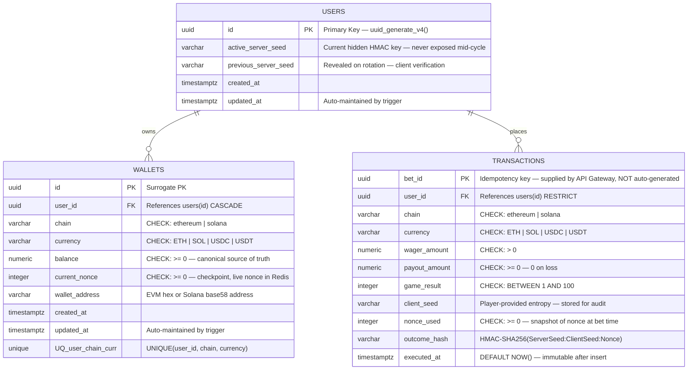
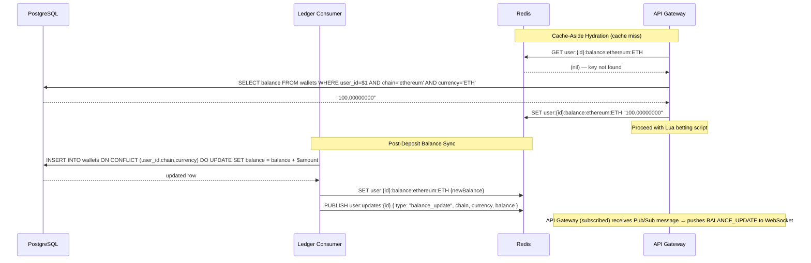
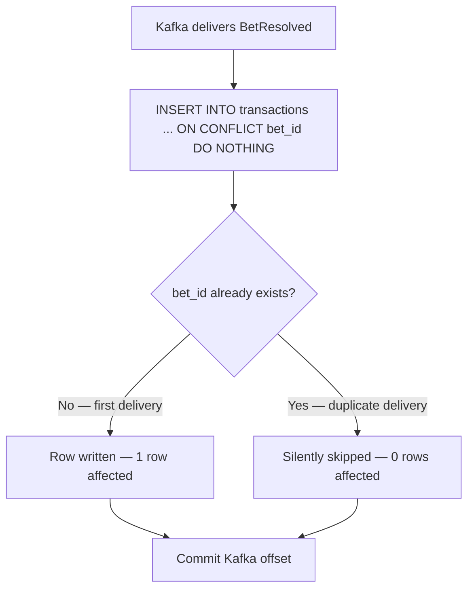

# DiceTilt — Database Schema Reference

**Audience:** Software architects, backend engineers, DBAs.

This document covers the full PostgreSQL relational schema including all tables, constraints, indexes, triggers, and rationale. It also covers the Redis key schema that mirrors and caches the canonical Postgres state.

---

## 1. Entity-Relationship Diagram



---

## 2. Full `init.sql`

This file is mounted into the PostgreSQL container as an init script and executes on first boot.

```sql
-- =============================================================
-- DiceTilt PostgreSQL Schema
-- Mounted at: /docker-entrypoint-initdb.d/init.sql
-- Executes once on first container boot.
-- All subsequent changes must be applied via numbered migrations.
-- =============================================================

-- Enable UUID generation
CREATE EXTENSION IF NOT EXISTS "uuid-ossp";

-- =============================================================
-- TABLE: users
-- One row per authenticated wallet. Tracks Provably Fair state.
-- =============================================================
CREATE TABLE IF NOT EXISTS users (
    id                   UUID         PRIMARY KEY DEFAULT uuid_generate_v4(),
    active_server_seed   VARCHAR(64)  NOT NULL,
    previous_server_seed VARCHAR(64),                    -- NULL until first seed rotation
    created_at           TIMESTAMPTZ  NOT NULL DEFAULT NOW(),
    updated_at           TIMESTAMPTZ  NOT NULL DEFAULT NOW()
);

COMMENT ON TABLE  users IS
    'Player identity and Provably Fair seed lifecycle state. '
    'One row per authenticated wallet address.';

COMMENT ON COLUMN users.active_server_seed IS
    'Hidden HMAC-SHA256 key for the current bet cycle. '
    'Never returned to the client mid-cycle. Revealed only on explicit rotation.';

COMMENT ON COLUMN users.previous_server_seed IS
    'The seed revealed after a rotation event. '
    'Client uses this to locally verify every outcome hash in the completed cycle.';


-- =============================================================
-- TABLE: wallets
-- Multi-chain canonical balance ledger.
-- One row per (user_id, chain, currency) combination.
-- Redis is a write-through cache of the balance column.
-- =============================================================
CREATE TABLE IF NOT EXISTS wallets (
    id             UUID          PRIMARY KEY DEFAULT uuid_generate_v4(),
    user_id        UUID          NOT NULL
                       REFERENCES users(id) ON DELETE CASCADE,
    chain          VARCHAR(20)   NOT NULL,
    currency       VARCHAR(10)   NOT NULL,
    balance        NUMERIC(30,8) NOT NULL DEFAULT 0,
    current_nonce  INTEGER       NOT NULL DEFAULT 0,
    wallet_address VARCHAR(100)  NOT NULL,
    created_at     TIMESTAMPTZ   NOT NULL DEFAULT NOW(),
    updated_at     TIMESTAMPTZ   NOT NULL DEFAULT NOW(),

    CONSTRAINT chk_wallets_nonce_non_negative
        CHECK (current_nonce >= 0),

    CONSTRAINT chk_wallets_chain_valid
        CHECK (chain IN ('ethereum', 'solana')),

    CONSTRAINT chk_wallets_currency_valid
        CHECK (currency IN ('ETH', 'SOL', 'USDC', 'USDT')),

    CONSTRAINT chk_wallets_balance_non_negative
        CHECK (balance >= 0),

    CONSTRAINT uq_user_chain_currency
        UNIQUE (user_id, chain, currency)
);

COMMENT ON TABLE  wallets IS
    'Multi-chain balance and nonce ledger. Canonical source of truth. '
    'Redis mirrors wallet.balance keyed by user:{id}:balance:{chain}:{currency} '
    'and wallet.current_nonce keyed by user:{id}:nonce:{chain}:{currency}. '
    'Synced by Ledger Consumer on every DepositReceived or BetResolved event.';

COMMENT ON COLUMN wallets.current_nonce IS
    'Checkpoint/recovery copy of the Provably Fair nonce for this chain+currency. '
    'The live nonce counter lives in Redis (user:{id}:nonce:{chain}:{currency}) '
    'for atomic Lua script access. On Redis cache miss, hydrate from this column. '
    'Recovery query: SELECT MAX(nonce_used) FROM transactions WHERE user_id=$1 AND chain=$2 AND currency=$3.';

COMMENT ON COLUMN wallets.balance IS
    'The authoritative balance. Redis caches this value for sub-millisecond bet resolution. '
    'On Redis cache miss, the API Gateway reads this column to hydrate Redis before betting.';

COMMENT ON COLUMN wallets.chain IS
    'Blockchain identifier. Constrained to supported chains. '
    'Extend to new chains (e.g., tron, bitcoin) via ALTER TABLE and CHECK constraint update.';

COMMENT ON COLUMN wallets.wallet_address IS
    'EVM: 0x-prefixed 20-byte hex address. '
    'Solana: Base58-encoded 32-byte public key.';

-- =============================================================
-- TABLE: transactions
-- Immutable append-only bet ledger. Never updated after insert.
-- bet_id is the Kafka-supplied UUID — NOT auto-generated.
-- This is the idempotency key enabling ON CONFLICT DO NOTHING.
-- =============================================================
CREATE TABLE IF NOT EXISTS transactions (
    bet_id        UUID          PRIMARY KEY,            -- Supplied by API Gateway, NOT uuid_generate_v4()
    user_id       UUID          NOT NULL
                      REFERENCES users(id) ON DELETE RESTRICT,
    chain         VARCHAR(20)   NOT NULL,
    currency      VARCHAR(10)   NOT NULL,
    wager_amount  NUMERIC(30,8) NOT NULL,
    payout_amount NUMERIC(30,8) NOT NULL DEFAULT 0,
    game_result   INTEGER       NOT NULL,
    client_seed   VARCHAR(64)   NOT NULL,
    nonce_used    INTEGER       NOT NULL,
    outcome_hash  VARCHAR(128)  NOT NULL,
    executed_at   TIMESTAMPTZ   NOT NULL DEFAULT NOW(),

    CONSTRAINT chk_tx_chain_valid
        CHECK (chain IN ('ethereum', 'solana')),

    CONSTRAINT chk_tx_currency_valid
        CHECK (currency IN ('ETH', 'SOL', 'USDC', 'USDT')),

    CONSTRAINT chk_tx_wager_positive
        CHECK (wager_amount > 0),

    CONSTRAINT chk_tx_payout_non_negative
        CHECK (payout_amount >= 0),

    CONSTRAINT chk_tx_result_in_range
        CHECK (game_result BETWEEN 1 AND 100),

    CONSTRAINT chk_tx_nonce_non_negative
        CHECK (nonce_used >= 0)
);

COMMENT ON TABLE  transactions IS
    'Immutable bet ledger. Append-only: rows are never updated or deleted. '
    'The Ledger Consumer inserts rows using ON CONFLICT (bet_id) DO NOTHING. '
    'If Kafka re-delivers the same message (offset not committed), the second insert is silently skipped.';

COMMENT ON COLUMN transactions.bet_id IS
    'Idempotency key. Generated by the API Gateway as a UUID v4 per bet. '
    'Passed through Kafka to the Ledger Consumer. '
    'ON CONFLICT (bet_id) DO NOTHING guarantees exactly-once DB writes '
    'even under at-least-once Kafka delivery.';

COMMENT ON COLUMN transactions.payout_amount IS
    '0 on a loss. Equal to wager_amount * multiplier on a win. '
    'The win condition is game_result < playerTarget (configurable per game variant).';

COMMENT ON COLUMN transactions.outcome_hash IS
    'HMAC-SHA256(activeServerSeed : clientSeed : nonceUsed). '
    'Cryptographic proof of a predetermined, unmanipulated outcome. '
    'Verifiable by the client after seed rotation reveals activeServerSeed.';

COMMENT ON COLUMN transactions.client_seed IS
    'Player-provided entropy string. Stored verbatim. '
    'Allows the player to prove their own contribution to the outcome hash.';

-- =============================================================
-- INDEXES
-- =============================================================

-- wallet lookup by user (balance hydration, wallet list)
CREATE INDEX IF NOT EXISTS idx_wallets_user_id
    ON wallets (user_id);

-- bet history by user (Provably Fair audit, admin view)
CREATE INDEX IF NOT EXISTS idx_transactions_user_id
    ON transactions (user_id);

-- time-series queries (recent bets, admin dashboard)
CREATE INDEX IF NOT EXISTS idx_transactions_executed_at
    ON transactions (executed_at DESC);

-- compound: user bet history sorted by time (most common query pattern)
CREATE INDEX IF NOT EXISTS idx_transactions_user_executed
    ON transactions (user_id, executed_at DESC);

-- seed lookup during Provably Fair status check
CREATE INDEX IF NOT EXISTS idx_users_active_seed
    ON users (active_server_seed);

-- =============================================================
-- TRIGGER: auto-maintain updated_at
-- =============================================================
CREATE OR REPLACE FUNCTION update_updated_at_column()
RETURNS TRIGGER AS $$
BEGIN
    NEW.updated_at = NOW();
    RETURN NEW;
END;
$$ LANGUAGE plpgsql;

CREATE TRIGGER trg_users_updated_at
    BEFORE UPDATE ON users
    FOR EACH ROW EXECUTE FUNCTION update_updated_at_column();

CREATE TRIGGER trg_wallets_updated_at
    BEFORE UPDATE ON wallets
    FOR EACH ROW EXECUTE FUNCTION update_updated_at_column();
```

---

## 3. Table Definitions & Constraint Rationale

### 3.1 `users`

| Column | Type | Constraints | Rationale |
|---|---|---|---|
| `id` | `UUID` | `PRIMARY KEY DEFAULT uuid_generate_v4()` | UUID avoids sequential ID enumeration attacks. Auto-generated on insert. |
| `active_server_seed` | `VARCHAR(64)` | `NOT NULL` | A 32-byte hex string (64 chars). Cannot be null — every authenticated user must have an active seed. |
| `previous_server_seed` | `VARCHAR(64)` | nullable | NULL until the first rotation. After rotation, holds the revealed seed the client can verify. |
| `created_at` | `TIMESTAMPTZ` | `NOT NULL DEFAULT NOW()` | Timezone-aware. Immutable after first insert. |
| `updated_at` | `TIMESTAMPTZ` | `NOT NULL DEFAULT NOW()` | Auto-maintained by `trg_users_updated_at`. Always reflects the last seed update. |

### 3.2 `wallets`

| Column | Type | Constraints | Rationale |
|---|---|---|---|
| `id` | `UUID` | `PRIMARY KEY DEFAULT uuid_generate_v4()` | Surrogate key. |
| `user_id` | `UUID` | `NOT NULL REFERENCES users(id) ON DELETE CASCADE` | `CASCADE` — deleting a user removes all their wallets. Referential integrity enforced at DB level. |
| `chain` | `VARCHAR(20)` | `CHECK IN ('ethereum', 'solana')` | Prevents invalid chain strings from entering the system. Adding new chains requires an explicit schema migration, not just a code change. |
| `currency` | `VARCHAR(10)` | `CHECK IN ('ETH', 'SOL', 'USDC', 'USDT')` | Same principle. Enforces supported currency list at the data layer. |
| `balance` | `NUMERIC(30,8)` | `NOT NULL DEFAULT 0`, `CHECK >= 0` | `NUMERIC` (not `FLOAT`) prevents floating-point precision loss in financial calculations. 30 digits total, 8 decimal places. Non-negative prevents accidental debt states. |
| `current_nonce` | `INTEGER` | `NOT NULL DEFAULT 0`, `CHECK >= 0` | Checkpoint/recovery copy of the Provably Fair nonce for this chain+currency. The live nonce lives in Redis (`user:{id}:nonce:{chain}:{currency}`). Mirrors Redis exactly — one nonce per wallet, not a global user nonce. On Redis miss, hydrate from this column. |
| `wallet_address` | `VARCHAR(100)` | `NOT NULL` | EVM addresses are 42 chars (0x + 40 hex). Solana addresses are 44 chars (base58). 100 provides headroom. |
| *(composite)* | — | `UNIQUE (user_id, chain, currency)` | Prevents duplicate wallet rows for the same user+chain+currency. The Ledger Consumer upserts against this unique constraint on deposit. |

### 3.3 `transactions`

| Column | Type | Constraints | Rationale |
|---|---|---|---|
| `bet_id` | `UUID` | `PRIMARY KEY` | **Supplied by API Gateway** — NOT `DEFAULT uuid_generate_v4()`. This is the Kafka message's idempotency key. The Ledger Consumer uses `ON CONFLICT (bet_id) DO NOTHING` for exactly-once DB writes. |
| `user_id` | `UUID` | `NOT NULL REFERENCES users(id) ON DELETE RESTRICT` | `RESTRICT` — prevents deleting a user who has transaction history. Financial audit trail must be preserved. |
| `wager_amount` | `NUMERIC(30,8)` | `NOT NULL`, `CHECK > 0` | Cannot be zero or negative. A zero-wager bet is a logic error. Enforced at DB level as a final safety net after Zod Layer 2 validation. |
| `payout_amount` | `NUMERIC(30,8)` | `NOT NULL DEFAULT 0`, `CHECK >= 0` | Zero on a loss (not NULL). Non-negative — a negative payout is a logic error. |
| `game_result` | `INTEGER` | `NOT NULL`, `CHECK BETWEEN 1 AND 100` | The dice roll outcome. Constraining the range at DB level ensures no corrupted result (e.g., 0 or 101) can be inserted even if application validation fails. |
| `nonce_used` | `INTEGER` | `NOT NULL`, `CHECK >= 0` | Snapshot of the wallet's nonce at bet time (live value from Redis `user:{id}:nonce:{chain}:{currency}`, checkpointed in `wallets.current_nonce`). Required for Provably Fair verification. |
| `outcome_hash` | `VARCHAR(128)` | `NOT NULL` | HMAC-SHA256 output is 64 hex chars. 128 provides headroom for algorithm variants. |
| `executed_at` | `TIMESTAMPTZ` | `NOT NULL DEFAULT NOW()` | Immutable timestamp. Never updated. Timezone-aware. |

---

## 4. Index Strategy

| Index | Table | Columns | Type | Purpose |
|---|---|---|---|---|
| `idx_wallets_user_id` | `wallets` | `(user_id)` | B-tree | Balance hydration on cache miss: `SELECT balance FROM wallets WHERE user_id = $1 AND chain = $2 AND currency = $3` |
| `idx_transactions_user_id` | `transactions` | `(user_id)` | B-tree | Fetch all bets for a user (Provably Fair audit panel) |
| `idx_transactions_executed_at` | `transactions` | `(executed_at DESC)` | B-tree | Time-series queries: recent platform-wide activity, admin dashboard |
| `idx_transactions_user_executed` | `transactions` | `(user_id, executed_at DESC)` | B-tree | Compound: user-specific history sorted by recency — most frequent query pattern |
| `idx_users_active_seed` | `users` | `(active_server_seed)` | B-tree | Provably Fair status checks: lookup current seed commitment by seed value |

> **Note on `transactions`:** The table is append-only and high-frequency. All writes are inserts (never updates or deletes). The primary workload is write-heavy (Ledger Consumer inserts) with infrequent full-history reads (audit). Indexes are intentionally minimal to avoid write amplification.

---

## 5. Redis Key Schema

Redis is the primary speed layer. All keys follow a structured naming convention for operational clarity. PostgreSQL is the canonical source of truth; Redis holds a cache copy.

| Key Pattern | Type | TTL | Written By | Read By | Purpose |
|---|---|---|---|---|---|
| `user:{userId}:balance:{chain}:{currency}` | `STRING` (NUMERIC) | None (persistent until eviction) | Ledger Consumer (deposit), API Gateway Lua (bet deduction/credit) | API Gateway Lua (balance check) | Atomic balance operations. The Lua script reads and writes this key in a single `EVAL` block, preventing race conditions. |
| `user:{userId}:nonce:{chain}:{currency}` | `STRING` (integer) | None | API Gateway Lua (atomic INCR on bet) | API Gateway Lua (read+increment in same EVAL as balance deduct) | **Master of Nonce** — Provably Fair nonce lives in Redis, not Postgres. Prevents duplicate nonces on Gateway restart or race conditions. |
| `user:{userId}:serverSeed` | `STRING` (hex) | None | API Gateway (on registration and seed rotation) | API Gateway (read before calling PF Worker) | Active server seed for Provably Fair. The PF Worker is stateless — the Gateway reads this key and passes the seed to the PF Worker on every `/calculate` call. Postgres `users.active_server_seed` is the canonical backup. |
| `user:updates:{userId}` | Pub/Sub channel | — | Ledger Consumer (PUBLISH) | API Gateway (SUBSCRIBE) | Real-time notifications. Ledger publishes after DepositReceived or WithdrawalCompleted; Gateway pushes BALANCE_UPDATE / WITHDRAWAL_COMPLETED to WebSocket. |
| `session:{userId}` | `STRING` (`"active"` marker) | 24h (configurable via `JWT_SESSION_TTL`) | API Gateway (on EIP-712 auth success) | API Gateway (on every authenticated request) | Session registry. Every request validates the JWT **and** this key's existence. Admin can delete the key to instantly revoke a session, regardless of JWT expiry. |
| `rate:{ip}` | `ZSET` (member=request UUID, score=epoch_ms) | Rolling (EXPIRE set per window) | API Gateway Lua (sliding window algorithm) | API Gateway Lua (`ZCOUNT` to check requests in window) | IP-level rate limiting. Members older than the window are pruned via `ZREMRANGEBYSCORE`. Atomic via Lua. |
| `rate:session:{userId}` | `ZSET` | Rolling | API Gateway Lua | API Gateway Lua | Session-level rate limiting (secondary limiter, per-wallet). |

### Redis ↔ Postgres Sync Points



---

## 6. Idempotency Pattern — `ON CONFLICT DO NOTHING`

The Ledger Consumer inserts every `BetResolved` and `DepositReceived` Kafka message using this pattern:

```sql
INSERT INTO transactions (bet_id, user_id, chain, currency, wager_amount, payout_amount,
                          game_result, client_seed, nonce_used, outcome_hash, executed_at)
VALUES ($1, $2, $3, $4, $5, $6, $7, $8, $9, $10, $11)
ON CONFLICT (bet_id) DO NOTHING;
```

**Why this matters:** Kafka guarantees at-least-once delivery. If the Ledger Consumer crashes after writing to Postgres but before committing the Kafka offset, the same message will be re-delivered on restart. Without `ON CONFLICT DO NOTHING`, this would create a duplicate transaction row. With it, the second insert silently succeeds (0 rows affected), and the Kafka offset is committed normally.


