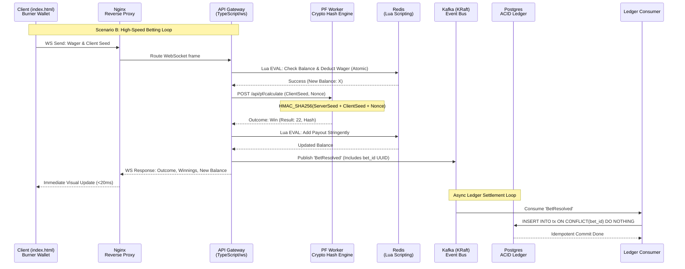
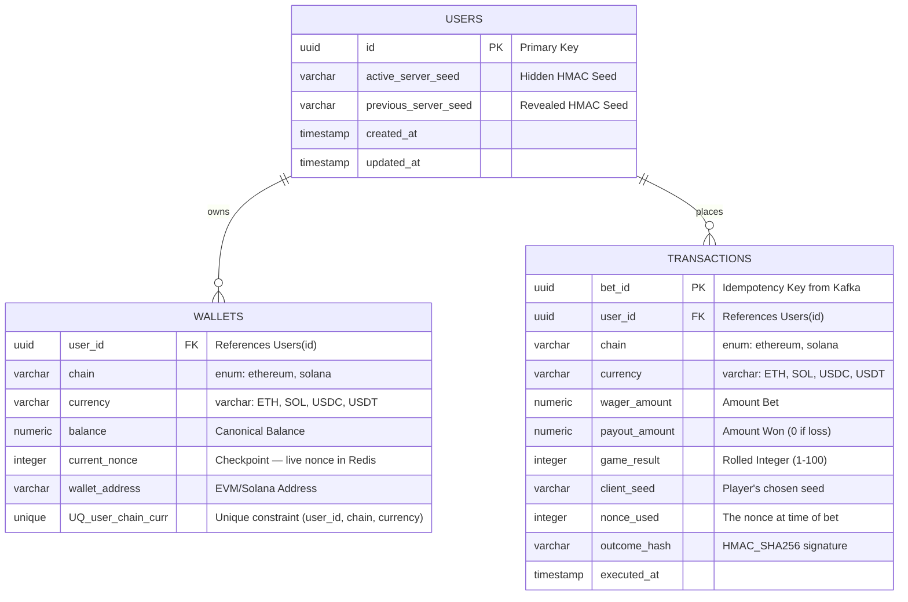

# DiceTilt - Hybrid Web2/Web3 Crypto Casino PoC - Implementation Plan
This document outlines the architecture, microservices design, and technical deliverables for the Hybrid Web2/Web3 Crypto Casino Proof of Concept. The goal is to provide a comprehensive structural template and development guide without pre-generating all the code syntax.
## 1. System Architecture Design
The backend is strictly decoupled into containerized microservices to guarantee scalability, fault isolation, and enterprise-grade messaging. It operates completely sovereignly on a local Web3 environment for ultra-fast, zero-friction recruiter demonstrations.
```mermaid
graph TD
    Client[frontend/index.html<br>Recruiter UI]
    
    subgraph "API Ingress & Proxy Layer"
        Nginx[Reverse Proxy<br>Nginx/Traefik]
        API[API / Gateway Service<br>TypeScript, Express, ws]
    end
    
    subgraph "Messaging & Cache Layer"
        Redis[(Redis Cache<br>Session/Balances)]
        Kafka[Apache Kafka in KRaft mode<br>Event Bus]
        Postgres[(PostgreSQL<br>ACID Ledger)]
    end
    
    subgraph "Internal Processing Workers"
        PF[Provably Fair Worker<br>TypeScript, gRPC/REST]
        Ledger[Ledger / Kafka Consumer<br>TypeScript]
        Payout[Payout Worker<br>TypeScript]
    end
    
    subgraph "Sovereign Web3 Environment (Local EVM Node)"
        Web3[EVM Listener Service<br>ethers.js]
        LocalEth((Local EVM Node<br>Hardhat/Anvil port 8545))
        Treasury((EVM Treasury<br>Local Deploy))
    end
    subgraph "Sovereign Web3 Environment (Local Solana Node)"
        SolListener[Solana Listener Service<br>@solana/web3.js]
        LocalSol((Local Solana Validator<br>solana-test-validator localhost:8899))
        SolTreasury((Anchor Treasury<br>Rust/Anchor))
    end
    subgraph "Observability Layer"
        Prom[Prometheus<br>Metrics Engine]
        Grafana[Grafana<br>Pre-Provisioned Dashboard]
        RedisExp[Redis Exporter<br>port 9121]
        PGExp[Postgres Exporter<br>port 9187]
        KafkaExp[Kafka JMX Exporter<br>port 5556]
    end
    %% Flow Connections
    Client <-->|HTTP/WS| Nginx
    Nginx <-->|Routes /ws, /api, /api/pf| API
    API <-->|Internal: PF_AUTH_TOKEN| PF
    
    API <-->|Lua Atomic Deductions| Redis
    API <-->|Request SHA-256 Hash| PF
    API -->|Produces 'BetResolved'| Kafka
    Ledger -->|Consumes 'BetResolved'| Kafka
    Ledger -->|Idempotent Inserts| Postgres
    Ledger <-->|Sync| Redis
    
    Web3 -->|Listens to 'Deposit'| LocalEth
    LocalEth <--> Treasury
    Web3 -->|Produces 'DepositReceived'| Kafka
    SolListener -->|Listens to 'Deposit'| LocalSol
    LocalSol <--> SolTreasury
    SolListener -->|Produces 'DepositReceived'| Kafka
    
    API -->|Produces 'WithdrawalRequested'| Kafka
    Payout -->|Consumes 'WithdrawalRequested' (EVM)| Kafka
    Payout -->|Signs Tx| LocalEth
    SolPayout[Solana Payout Worker<br>TypeScript] -->|Consumes 'WithdrawalRequested' (Solana)| Kafka
    SolPayout -->|Signs Tx| LocalSol

    Prom -->|Scrapes /metrics| API
    Prom -->|Scrapes /metrics| PF
    Prom -->|Scrapes /metrics| Ledger
    Prom -->|Scrapes| RedisExp
    Prom -->|Scrapes| PGExp
    Prom -->|Scrapes| KafkaExp
    RedisExp -.->|Queries| Redis
    PGExp -.->|Queries| Postgres
    KafkaExp -.->|JMX| Kafka
    Grafana -->|PromQL| Prom
```
### 1.1 Multi-Chain Architecture Extension
Introduce Solana support alongside the existing EVM layer:
*   A local Solana test validator (`solana-test-validator`) running alongside Hardhat/Anvil as a second blockchain environment.
*   A simple Anchor-based Treasury program (Rust/Anchor) deployed on the local Solana validator that handles deposits and withdrawals using SPL tokens, mirroring the functionality of the existing EVM `Treasury.sol`.
*   A new **Solana Listener Service** (TypeScript using `@solana/web3.js`) that monitors the local Solana validator for deposit events from the Anchor program — this service feeds into the same Kafka `DepositReceived` topic that the existing EVM Web3 Listener uses.
*   A new **Solana Payout Worker** that consumes `WithdrawalRequested` events where the withdrawal target is a Solana wallet, signs transactions using the treasury keypair, and submits them to the local Solana validator.
### 1.2 MEV-Aware Trade Routing Layer
For a production trading product (Tilt Trade), Warlock Labs-style MEV technology would integrate with this architecture. This is a production extension beyond the PoC scope but architecturally planned for:
*   A new **Trade Execution Router** service concept that sits between the user's trade request and the blockchain submission layer. For Solana, it would find optimal execution paths across DEX liquidity sources (Raydium, Orca, Jupiter) and submit transactions through Jito bundles to prevent front-running and sandwich attacks. For EVM chains, it would use Flashbots-style private transaction submission.
*   The router's MEV protection works by: (a) keeping user trade intents private until execution, (b) bundling transactions through Jito (Solana) or Flashbots (Ethereum) to guarantee atomic execution ordering, and (c) using smart order routing across multiple liquidity pools to minimize slippage and price impact.
*   This router connects to the existing event-driven pipeline — trade settlements detected by the blockchain listeners flow through Kafka into the ledger consumer and update player balances in the unified wallet, exactly like the existing bet resolution and deposit flows.
*   This architecture mirrors the Warlock Labs acquisition by MonkeyTilt, where MEV extraction technology was repurposed as a best-in-class execution router for user-facing trading.
### 1.3 Observability Stack
Every TypeScript microservice exposes a `/metrics` HTTP endpoint instrumented via `prom-client`. A Prometheus instance scrapes all service endpoints and three community infrastructure exporters. Grafana loads a pre-built dashboard JSON from a Docker volume mount at boot — zero manual setup. The full list of instrumented metrics and their justifications is defined in Constraint 22. The stack components in `docker-compose.yml`:
*   **`prom/prometheus:latest`** — Central metrics scrape engine. Targets all TypeScript service `/metrics` endpoints plus the three exporters below.
*   **`oliver006/redis_exporter:v1.75.0`** (port 9121) — Exposes Redis keyspace hit rate, memory usage, and connection pool metrics to Prometheus.
*   **`prometheuscommunity/postgres-exporter:latest`** (port 9187) — Exposes PostgreSQL connection counts, query duration, and cache hit ratio.
*   **`solsson/kafka-prometheus-jmx-exporter:latest`** (port 5556) — Exposes Kafka broker throughput and consumer group lag per topic.
*   **`grafana/grafana:latest`** — Visualization layer. Dashboard provisioned at boot via `/grafana/provisioning/` and `/grafana/dashboards/dicetilt.json`. No manual datasource or dashboard creation required by the recruiter. Must be configured with `GF_SECURITY_ALLOW_EMBEDDING=true` and `GF_AUTH_ANONYMOUS_ENABLED=true` so the `dashboard.html` iframe loads without a login prompt.
---
## 2. Microservice Components Definition
We decouple the monolith into specific, single-purpose workers that scale independently. All services must be written in **TypeScript**, with the exception of the Trade Router and Solana Treasury which must use **Rust**.
| Service Name | Description & Purpose | Creation Instructions |
| --- | --- | --- |
| **Reverse Proxy (Nginx/Traefik)** | The single unified entry point for the frontend to prevent hardcoded ports. | Configure a reverse proxy container to handle CORS, routing all traffic (`/ws`, `/api`, `/api/pf`) to the API Gateway. The Gateway forwards PF requests internally to the PF Worker. |
| **API / Gateway Service** | The primary ingress layer. Handles inbound REST requests, WebSocket upgrades, EIP-712 auth, and dictates the high-speed game loop. | Create an Express/WS app in **TypeScript**. Run via **Node.js cluster** (one worker per CPU core) to parallelise EIP-712 verification and request handling (Constraint 24). Integrate `ioredis` to execute Lua scripts for balance checks. Publish outcomes to Kafka. |
| **Provably Fair Worker** | An isolated, **stateless** cryptographic engine. Computes HMAC-SHA256 hashes and generates seeds. Never reads from Postgres or Redis — the API Gateway passes all inputs (including the server seed). | Build an internal REST service in **TypeScript**. Use a **piscina** Worker Threads pool for HMAC-SHA256 computation (Constraint 24). Pure computation only — no database access, no state. |
| **Ledger / Kafka Consumer** | The asynchronous persistent state worker. Protects the PostgreSQL database from high-frequency lockups by bulk-inserting from the Kafka topic. | Use **TypeScript** and `kafkajs`. Use **`eachBatch`** with messages grouped by `user_id` and `Promise.all` across groups for parallel DB inserts (Constraint 24). Deploy 3 replicas for 3-partition parallelism. Execute PostgreSQL inserts using `ON CONFLICT DO NOTHING` on UUID primary keys. |
| **EVM Web3 Listener Service** | The blockchain observer. Listens to the local Ethereum network for real-world smart contract deposits to fund the Web2 player balances. | Run a headless **TypeScript** loop using `ethers.js`. Attach to `http://localhost:8545` and listen for `Deposit` contract events using pre-funded deterministic accounts. |
| **EVM Payout Worker** | The sovereign Web3 withdrawal operator. Totally isolated from the public API, it waits for verified withdrawal requests to sign and broadcast outbound transactions. | Consume `WithdrawalRequested` Kafka events. Initialize an `ethers.Wallet` in **TypeScript** via the private key from `.env` (PoC) or Ansible Vault (production) and sign `payout()` logic to the local Treasury Contract. |
| **Local Ethereum Node (Hardhat/Anvil)** | A zero-latency, pre-funded blockchain environment enabling seamless PoC execution without testnet friction or wait times. | Mount a container running a local Hardhat/Anvil network. Configure a deployment pipeline to compile and deploy `Treasury.sol` on boot. |
| **Solana Listener Service** | Monitors the local Solana test validator for Treasury program events using `@solana/web3.js`. | Produces `DepositReceived` events to the shared Kafka topic with `chain: solana` metadata using **TypeScript**. |
| **Solana Payout Worker** | Consumes `WithdrawalRequested` events where `chain: solana`. | Signs transactions in **TypeScript** using the treasury keypair from `.env` (PoC) or Ansible Vault (production) and submits to the local Solana validator. |
| **Local Solana Validator** | A zero-latency, fully local Solana environment (`solana-test-validator`) running at `localhost:8899` (HTTP RPC) / `localhost:8900` (WebSocket RPC). Completely self-contained — no internet access, no public testnet, no airdrop requests required. Accounts are pre-funded via CLI flags at startup, mirroring Hardhat's deterministic account behavior. | The **pre-compiled** Anchor Treasury `.so` artifact is committed to the repo at `/contracts/solana/target/treasury.so`. The Docker image copies this artifact and deploys it via `solana-test-validator --bpf-program <program-id> treasury.so`. This avoids a 10–20 minute `cargo build-bpf` during `docker compose up`. Rust source code remains in the repo for audit; recompile manually via `make build-solana` if the program changes. |
| **Trade Execution Router (Production Stub)** | An architectural placeholder for MEV-aware trade routing. In the PoC, this is documented but not implemented. | Built in **Rust** (not TypeScript) — Tokio's multi-thread runtime enables MEV path computation at parallelism levels Node.js event-loop workers cannot achieve (Constraint 24). Would integrate Jupiter aggregator for Solana DEX routing and Jito for MEV-protected transaction submission in production. |
| **Prometheus** | Central metrics scrape engine. Polls all TypeScript service `/metrics` endpoints and the three infrastructure exporters on a configurable interval. | Deploy `prom/prometheus:latest` with a mounted `prometheus.yml` config file defining scrape targets for each service and exporter. |
| **Grafana** | Pre-provisioned visualization layer. Displays the four-row DiceTilt dashboard at boot with no manual setup. | Deploy `grafana/grafana:latest`. Mount `/grafana/provisioning/` for datasource and dashboard provider configs, and `/grafana/dashboards/dicetilt.json` for the pre-built dashboard definition. |
| **Redis Exporter** | Translates Redis internal metrics into Prometheus format. Exposes keyspace hit rate, memory usage, evictions, and connection pool statistics. | Deploy `oliver006/redis_exporter:v1.75.0` pointed at the Redis container via `REDIS_ADDR`. No configuration beyond the connection string required. |
| **Postgres Exporter** | Translates PostgreSQL statistics into Prometheus format. Exposes active connections, query duration, and table cache hit ratios. | Deploy `prometheuscommunity/postgres-exporter:latest` with `DATA_SOURCE_NAME` pointing to the PostgreSQL container. |
| **Kafka JMX Exporter** | Translates Kafka JMX broker metrics into Prometheus format. Exposes message throughput per topic and consumer group lag — the critical financial settlement health indicator. | Deploy `solsson/kafka-prometheus-jmx-exporter:latest`. Configure Kafka to expose JMX on a dedicated port via `KAFKA_OPTS` with the javaagent flag. |
---
## 3. Critical Engineering Constraints
You must strictly enforce the following enterprise constraints to prevent race conditions, ensure fault tolerance, and secure the financial environment:
> [!IMPORTANT]
> **1. Double-Spend Prevention (Redis Lua)**
> 
> Do not perform sequential Redis GET and SET operations for user balances. To prevent high-frequency race conditions during betting, write an atomic Redis Lua Script (via `EVAL`) that simultaneously evaluates if the user's balance is sufficient and deducts the wager amount in a single blocking operation before the game logic executes.
> [!IMPORTANT]
> **2. Idempotency & Database Schema Versioning**
> 
> Microservices require strict schema versioning. The PostgreSQL database must define a strict SQL schema mounted via an `init.sql` script on boot:
> - `users` table: Tracking canonical balances and active Provably Fair nonces.
> - `transactions` table: Enforcing a unique `bet_id` UUID primary key. 
> The Ledger Kafka Consumer must utilize the `ON CONFLICT (bet_id) DO NOTHING` SQL pattern to prevent duplicate DB updates if Kafka offsets fail to commit.
> [!IMPORTANT]
> **3. Safe Startup: Kafka Topic Initialization**
> 
> TypeScript services will crash if they attempt to interact with non-existent topics. An initialization script (`init-kafka.sh`) must be mounted to the Kafka container to explicitly execute the `kafka-topics.sh` command. This pre-creates `BetResolved`, `DepositReceived`, `WithdrawalRequested`, `WithdrawalCompleted`, `TradeExecuted`, and per-topic DLQs (`BetResolved-DLQ`, `DepositReceived-DLQ`, `WithdrawalCompleted-DLQ`) as mandated by Constraint 12.
> [!IMPORTANT]
> **4. Secrets Management & Vaulting (Critical Security)**
> 
> Private keys and JWT secrets must never be hardcoded in source code. The repository must utilize a `.env.example` structure.
>
> **PoC mode (local demo):** The `.env.example` file ships with a pre-filled **deterministic Hardhat/Anvil private key** (e.g., Hardhat account #0: `0xac0974bec39a17e36ba4a6b4d238ff944bacb478cbed5efcae784d7bf4f2ff80`) and a pre-generated Solana treasury keypair. `docker-compose up` loads these automatically via `env_file:` — **zero manual steps, no password prompt, no vault unlock**. This is safe because the local blockchain has no real value.
>
> **Production mode:** The Ansible configuration incorporates **Ansible Vault (`secrets.yml`)** to securely encrypt the Payout Worker's Web3 private key at rest, dynamically injecting it into the Docker environment during deployment. The `.env.example` is replaced by Vault-injected environment variables. 
> [!IMPORTANT]
> **5. The Withdrawal Pipeline Isolation**
> 
> The API Gateway must never hold private keys or sign transactions. It simply produces a `WithdrawalRequested` Kafka event. The Payout Worker, isolated on a backend subnet, consumes this event, initializes the `ethers` instance via the Vault-injected private key, and safely signs the outbound blockchain transaction.
> [!CAUTION]
> **6. Cryptographic Authentication (EIP-712)**
> 
> The API Gateway must contain an endpoint where the user submits an EIP-712 cryptographic signature proving wallet ownership. Use `ethers.utils.verifyMessage` to validate the signature against the wallet address before issuing a session JWT. The WebSocket upgrade must reject connections lacking a valid JWT.
> [!TIP]
> **7. Accurate Provably Fair Mechanics & Lifecycle**
> 
> Generate a persistent Server Seed and maintain a `Nonce` counter that increments per bet per user. **The nonce is the "Master of Nonce" and must live in Redis** — key `user:{userId}:nonce:{chain}:{currency}` — not in Postgres or in-memory. The API Gateway Lua script atomically reads and increments the nonce during the bet flow. This prevents duplicate nonces on Gateway restart or race conditions; if two bets used the same nonce, Provably Fair math would fail and outcomes would be identical. The UI Audit section must show testing against this ongoing Nonce: `Hash(ServerSeed + ClientSeed + Nonce)`. The Server Seed remains hidden across multiple bets until the user explicitly hits a "Rotate Seed" endpoint, revealing the active seed for mathematical verification of the entire cycle.
> [!TIP]
> **8. Event-Driven Ansible (EDA) Configuration**
> 
> The architecture must explicitly define how the Event-Driven Ansible controller receives alerts. The rulebook must leverage a specific source plugin, such as `ansible.eda.alertmanager` or `ansible.eda.kafka`, to actively listen to the cluster's health metrics from Prometheus. Only upon detecting a broker dropping offline will it trigger the automated remediation playbook.
> [!IMPORTANT]
> **9. Frictionless Recruiter UX (In-Browser Burner Wallet)**
> 
> The frontend UI must absolutely not require the user to install MetaMask. The client-side JavaScript must utilize `ethers.Wallet.createRandom()` on page load to generate a temporary local session wallet. The entire EIP-712 auth flow (challenge → sign → verify → JWT → WebSocket) must execute **automatically and silently** on page load — the recruiter sees only a brief loading spinner before the game floor appears. No manual "Connect" button. No on-chain deposit step. **Every user starts with a default PoC balance** (10 ETH, 10 SOL) in both chains at registration, so the recruiter can immediately play without waiting for blockchain transactions. The on-chain deposit and withdrawal flows remain architecturally complete and documented but are not part of the primary PoC demo path.
> [!IMPORTANT]
> **10. Enterprise Testing Discipline (Jest)**
> 
> Do not generate the PoC without a test suite. Include a `/tests` directory configured with Jest. You must write explicit unit tests verifying the mathematical accuracy of the Provably Fair hash generation, the seed rotation logic, and a mock test validating the Redis Lua double-spend prevention logic.
> [!IMPORTANT]
> **11. Advanced Cache Lifecycle & Hydration**
> 
> The Redis caching strategy must account for volatility. Implement a "Lazy Loading / Cache-Aside" hydration pattern in the API Gateway. If a user's balance key does not exist in Redis (e.g., upon first login or container restart), the Gateway must pause, query the PostgreSQL `wallets` table for the canonical balance (and `current_nonce`), and populate Redis before executing the Lua betting script. Additionally, utilize Redis to implement a basic rate-limiting middleware (e.g., max 50 requests per second per IP/Wallet) to prevent API abuse.
> [!IMPORTANT]
> **12. Enterprise Kafka Reliability (DLQs & Acks)**
> 
> Financial messaging requires strict delivery guarantees. The TypeScript Kafka Producers (in the API Gateway and Web3 Listener) must be explicitly configured with `acks: 'all'` and idempotent production enabled to ensure zero data loss. Furthermore, the Ledger Consumer must implement a Dead Letter Queue (DLQ) pattern. If a message fails to process after a defined number of retries (e.g., due to a Postgres connection drop or malformed payload), the consumer must not crash; it must route the failed message to a `BetResolved-DLQ` topic for auditing.
> [!IMPORTANT]
> **13. Nginx Protocol Switching (WebSocket Support)**
> 
> A standard Nginx proxy will drop the persistent game loop connection. The `nginx.conf` file must be explicitly configured to support WebSocket protocol upgrades. Ensure the `/ws` location block includes `proxy_http_version 1.1;`, `proxy_set_header Upgrade $http_upgrade;`, and `proxy_set_header Connection "Upgrade";` to allow the bi-directional traffic to reach the API Gateway.
> [!IMPORTANT]
> **14. Graceful Teardown & Connection Draining**
> 
> Enterprise microservices cannot crash ungracefully during container orchestration. Every TypeScript worker must implement `SIGINT` and `SIGTERM` process listeners. Upon receiving a termination signal, the services must stop accepting new HTTP/WS traffic, commit final Kafka offsets, gracefully disconnect the `kafkajs` consumer/producer instances, and cleanly close the `pg` and `ioredis` connection pools before exiting the process.
> [!CAUTION]
> **15. Container Race Condition Prevention (Healthchecks)**
> 
> The `docker-compose.yml` must implement strict service startup orders. PostgreSQL, Kafka, and Redis must have explicitly defined `healthcheck:` blocks in their container configurations. Furthermore, all TypeScript microservices must use `depends_on:` with a `condition: service_healthy` strict mapping to ensure they do not attempt to boot, connect, and crash before the data and messaging layers are fully ready to accept persistent connections.
> [!IMPORTANT]
> **16. Microservice Configuration & Environment Architecture**
> 
> A monolithic `.env` is strongly discouraged for independent workers. The architecture must implement a strict separation of concerns utilizing a root `.env` for orchestrator-level network binds, and dedicated `.env` configs per microservice injected at build/boot.
> 
> **Root Repository `/.env` (Infrastructure Level):**
> *   `DB_PASS`: Master password injected into the initial Postgres container boot.
> *   `KAFKA_CLUSTER_ID`: Unique ID for KRaft mode formatting.
> *   `LOCAL_ETH_PORT`: Binds the Anvil/Hardhat container to the host (e.g., 8545).
> *   `REDIS_PORT`: Exposes Redis to the overlay network.
> 
> **API Gateway (`/services/api-gateway/.env`):**
> *   `PORT`: The Express HTTP ingress port (e.g., 3000).
> *   `JWT_SECRET`: The symmetric key used for EIP-712 session signing.
> *   `REDIS_URI`: Internal Docker DNS (e.g., `redis://redis:6379`).
> *   `KAFKA_BROKERS`: Internal Kafka DNS (e.g., `kafka:29092`).
> *   `PF_WORKER_URL`: The internal REST/gRPC URL to call the isolated hash engine.
> 
> **Provably Fair Worker (`/services/provably-fair/.env`):**
> *   `PORT`: The internal binding port (e.g., 3001).
> *   `PF_AUTH_TOKEN`: An internal service-to-service auth token to ensure only the Gateway can request game hashes, rejecting arbitrary hits.
> 
> **Ledger Consumer (`/services/ledger-consumer/.env`):**
> *   `KAFKA_BROKERS`: Broker list to subscribe to.
> *   `KAFKA_GROUP_ID`: Specific consumer group string (e.g., `ledger-persistent-group`).
> *   `DATABASE_URL`: The full Postgres connection string mapping to the db container.
> 
> **Web3 Listener (`/services/web3-listener/.env`):**
> *   `RPC_WS_URL`: The WebSocket RPC to connect to (e.g., `ws://local-node:8545`).
> *   `TREASURY_CONTRACT_ADDRESS`: The deployed local hex address of the Treasury to monitor.
> *   `KAFKA_BROKERS`: Used to produce the `DepositReceived` event.
> 
> **Payout Worker (`/services/payout-worker/.env`):**
> *   `KAFKA_BROKERS`: Broker list to subscribe to `WithdrawalRequested` and produce `WithdrawalCompleted`.
> *   `RPC_HTTP_URL`: HTTP payload URL for submitting signed transactions.
> *   `TREASURY_CONTRACT_ADDRESS`: Target contract logic.
> *   `TREASURY_OWNER_PRIVATE_KEY`: **CRITICAL**. In PoC, this is the deterministic Hardhat account #0 key pre-filled in `.env.example`. In production, it must be encrypted via Ansible Vault or Docker Secrets. This key must *only* exist in this isolated worker's environment.
> [!IMPORTANT]
> **17. Stateful Session Management (Redis Persistence)**
> 
> Do not rely solely on stateless JWT verification. The API Gateway must maintain a 'Session Registry' in Redis. Upon authentication, a session key must be created with a TTL. Every subsequent request must validate the JWT against the presence of this Redis session key to enable instant administrative session revocation.
> [!IMPORTANT]
> **17a. Redis Pub/Sub — Real-Time Balance & Withdrawal Updates**
> 
> The Ledger Consumer and API Gateway run in separate processes. The API Gateway holds the WebSocket connection; the Ledger Consumer cannot notify it directly. **Implement Redis Pub/Sub:** (a) Ledger Consumer, after updating Postgres and Redis (on `DepositReceived` or `WithdrawalCompleted`), **PUBLISH** to channel `user:updates:{userId}` with payload `{ type, chain, currency, balance?, withdrawalId?, txHash? }`; (b) API Gateway **SUBSCRIBE** to `user:updates:*` (or per-user channels) and, on message, push `BALANCE_UPDATE` or `WITHDRAWAL_COMPLETED` to the user's WebSocket. Without this, balance would not update after a deposit until the user places a bet or refreshes.
> [!IMPORTANT]
> **17b. Initial Wallet Generation (Both Chains at Registration)**
> 
> At the moment of EIP-712 registration, **automatically create wallet rows for both Ethereum and Solana** in the `wallets` table. Each row must have a **default PoC balance** (e.g., 10 ETH, 10 SOL) so the recruiter can run through the full flow without waiting for deposits. If the user authenticates with an Ethereum wallet, create `(user_id, ethereum, ETH, balance=10, wallet_address)` and `(user_id, solana, SOL, balance=10, wallet_address)` — the Solana `wallet_address` can be a placeholder until the user connects a Solana keypair, or the same auth flow can support both. The Ledger Consumer expects these rows to exist for `DepositReceived` upserts.
> [!IMPORTANT]
> **18. High-Precision Rate Limiting (Sliding Window)**
> 
> Protect the API Gateway from bot abuse using a sliding window algorithm implemented via Redis Sorted Sets (ZSET). The limiter must be atomic (via Lua script) and enforce a configurable threshold (e.g., 60 requests per minute). Denied requests must return a standard HTTP 429 'Too Many Requests' response.
> [!IMPORTANT]
> **19. Multi-Chain Listener Resilience**
> 
> Each blockchain listener (EVM and Solana) must operate independently. If the Solana validator goes down, EVM deposits must continue processing uninterrupted. Listeners must implement independent health checks and reconnection logic with exponential backoff.
> [!IMPORTANT]
> **20. Chain-Aware Withdrawal Routing**
> 
> The API Gateway must never decide which payout worker handles a withdrawal based on hardcoded logic. The `WithdrawalRequested` Kafka event must carry explicit `chain` and `currency` metadata. Each payout worker subscribes to the same topic but only processes events matching its chain, using Kafka consumer filtering or application-level message routing.
> [!CAUTION]
> **21. MEV Protection as a Design Principle**
>
> In production, no user trade transaction should ever be submitted to a public mempool or transaction pipeline without MEV protection. All trade submissions must route through the Trade Execution Router, which uses private transaction channels (Jito on Solana, Flashbots on Ethereum) to prevent value extraction from user transactions.
> [!IMPORTANT]
> **22. Observability & Metrics (Prometheus + Grafana)**
>
> Every TypeScript microservice must expose a `/metrics` HTTP endpoint using `prom-client`. The following custom business and operational metrics must be instrumented:
> - `dicetilt_bets_total{outcome="win|loss"}` (Counter) — Core game throughput KPI. The rate of this counter is the "bets per second" figure.
> - `dicetilt_bet_processing_duration_ms` (Histogram, buckets: 1, 5, 10, 20, 50, 100ms) — **Direct empirical proof for the sub-20ms performance claim.** P95 must display below 20ms in Grafana. Without this, the claim is unverifiable.
> - `dicetilt_provably_fair_hash_duration_ms` (Histogram, buckets: 0.1, 0.5, 1, 2, 5ms) — Isolates the cryptographic hash cost on the betting hot path to confirm the PF Worker is not the bottleneck.
> - `dicetilt_redis_lua_execution_duration_ms` (Histogram) — Isolates the atomic Lua script latency to confirm the double-spend prevention adds negligible overhead.
> - `dicetilt_wager_volume_total{chain, currency}` (Counter) — Total volume wagered broken out by chain and currency. Visually demonstrates the multi-chain architecture is live simultaneously.
> - `dicetilt_active_websocket_connections` (Gauge) — Real-time active player count. The most immediately legible business KPI for a non-technical audience.
> - `dicetilt_double_spend_rejections_total` (Counter) — Every increment is live proof the Redis Lua atomic check caught a potential race condition. Can be triggered live during a demo by clicking "Roll" in rapid succession.
> - `dicetilt_rate_limit_rejections_total{limiter_type}` (Counter) — Proves both the sliding window (Constraint 18) and session limiters are active.
> - `dicetilt_auth_failures_total` (Counter) — EIP-712 signature validation failures. A spike indicates a bug or probing attempt.
> - `dicetilt_on_chain_deposits_total{chain}` (Counter) — Multi-chain deposit pipeline health. Both listeners must increment independently, proving chain isolation (Constraint 19).
> - `dicetilt_withdrawal_requests_total{chain}` / `dicetilt_withdrawal_completions_total{chain}` (Counter) — Delta between these exposes payout pipeline lag. In a healthy system they converge.
> - `dicetilt_kafka_dlq_messages_total{source_topic}` (Counter) — Any increment here is a critical financial settlement failure. This counter must be zero during normal operation; it is the primary alert signal for the DLQ pattern defined in Constraint 12.
>
> Infrastructure metrics are collected via community exporters: `oliver006/redis_exporter` (Redis keyspace hit rate, memory, evictions), `prometheuscommunity/postgres-exporter` (connection count, query duration, cache hit ratio), and `solsson/kafka-prometheus-jmx-exporter` (consumer group lag per topic — a non-zero growing lag means ACID settlement is falling behind the Redis state).
>
> The Grafana instance must auto-provision the pre-built `dicetilt.json` dashboard at boot via Docker volume mount, organized into four rows:
> 1. **Game Floor** — Active players (gauge), bets/sec (rate), win rate % (ratio), total volume by chain (bar gauge).
> 2. **Performance Proof** — Bet processing latency histogram (P50/P95/P99), PF hash latency, Lua script latency.
> 3. **Infrastructure Health** — Kafka consumer lag (ledger-persistent-group), Redis hit rate %, Redis memory used, Postgres active connections, DLQ message count.
> 4. **Security & Integrity** — Double-spend rejections, rate limit hits, auth failures, deposit pipeline by chain.
> [!IMPORTANT]
> **23. Three-Layer Input Validation**
>
> Input validation must be enforced at three distinct layers with no single layer relied upon exclusively:
>
> **Layer 1 — Frontend (UX Guard):** Client-side JavaScript performs lightweight validation before transmitting WebSocket messages: `wagerAmount > 0`, `wagerAmount <= currentDisplayedBalance`, `target` between 2–98, `direction` is `'over'` or `'under'`, and selected `chain`/`currency` matches an available wallet. This is purely for user experience smoothness and carries no security guarantee, as client-side validation is always bypassable.
>
> **Layer 2 — API Gateway (Security Boundary, Zod):** Every REST request body and every incoming WebSocket frame must be parsed and validated against a Zod schema **before any business logic executes**. Zod schemas are defined in `packages/shared-types/src/validation.ts` and imported by the Gateway. Failures return HTTP `400` or a WebSocket `ERROR` frame with code `INVALID_PAYLOAD` immediately. Field validations: `clientSeed` non-empty string max 64 chars; `wagerAmount` positive finite number; `target` integer 2–98; `direction` enum `'over'|'under'`; `chain` enum `'ethereum'|'solana'`; `currency` enum `'ETH'|'SOL'|'USDC'|'USDT'`. The Provably Fair Worker must also validate its internal inputs (`clientSeed`, `nonce`, `serverSeed`) from the Gateway as defense in depth, even though traffic is internal.
>
> **Layer 3 — PostgreSQL Schema (Safety Net):** The `init.sql` must include SQL-level `CHECK` constraints as a final guard if anything slips through the application layers:
> - `CHECK (wager_amount > 0)`
> - `CHECK (payout_amount >= 0)`
> - `CHECK (game_result BETWEEN 1 AND 100)`
> - `CHECK (nonce_used >= 0)`
> - `CHECK (chain IN ('ethereum', 'solana'))`
> [!IMPORTANT]
> **24. Concurrency & Parallelism (TypeScript on Node.js Runtime)**
>
> TypeScript compiles to JavaScript and runs on the Node.js runtime (V8 + libuv event loop). The single-threaded event loop limits CPU-bound parallelism. The following constraints enforce explicit parallelism where needed:
>
> - **Provably Fair Worker:** Do not use synchronous `crypto.createHmac` on the main thread under concurrent load. Use a **piscina** Worker Threads pool so hash computation runs in parallel across concurrent requests. This prevents the PF Worker from becoming a bottleneck during high-frequency betting.
> - **API Gateway:** Run as a **Node.js cluster** — one worker process per CPU core. This parallelises EIP-712 signature verification and request handling across cores. A single Node.js process cannot utilise multiple cores for CPU-bound work.
> - **Ledger Consumer:** Do not process messages sequentially with `eachMessage`. Use **`eachBatch`** with messages grouped by `user_id`, then `Promise.all` across groups to perform parallel DB inserts for different users while preserving per-user ordering. Sequential processing limits throughput under load.
> - **Kafka partitions:** `BetResolved` and `DepositReceived` topics use 3 partitions. Deploy **3 Ledger Consumer replicas** in the same consumer group so each partition is processed in parallel by a dedicated replica. Document this explicitly in Kafka topology docs.
> - **Trade Router (Rust):** The Trade Router is implemented in Rust (not TypeScript) because MEV path computation (Jito/Flashbots routing, multi-pool optimisation) is CPU-intensive and benefits from Tokio's multi-thread runtime. Node.js event-loop workers cannot achieve the same parallelism for this workload.
>
> [!IMPORTANT]
> **25. Monorepo Workspace Strategy (pnpm Workspaces)**
>
> The repository must use **pnpm workspaces** as the monorepo package manager. pnpm is chosen over npm workspaces for three specific reasons relevant to this architecture:
> - **Strict dependency isolation**: Services cannot accidentally access packages not declared in their own `package.json`, enforcing true service boundaries at the dependency level.
> - **`pnpm deploy`**: Generates a self-contained deployment bundle per service with only its own declared dependencies, producing smaller Docker images with better layer caching.
> - **Performance**: Significantly faster installs via hard links and symlinks — critical when eight-plus services each pull hundreds of transitive dependencies.
>
> A root `pnpm-workspace.yaml` declares workspace members: `["packages/*", "services/*"]`. Each service's `package.json` declares `"@dicetilt/shared-types": "workspace:*"` as a dependency. The root `package.json` contains **only development tooling** (TypeScript, ESLint, Prettier, Jest) — no runtime dependencies. Each service Dockerfile uses a two-stage approach: Stage 1 copies the root `pnpm-lock.yaml` and `pnpm-workspace.yaml` then runs `pnpm install --frozen-lockfile --filter <service-name>...`. Stage 2 copies the compiled output into a minimal production image.
---
## 4. Required Application Programming Interfaces (APIs)
This modular architecture will require the following interfaces, all unified behind the Nginx Reverse Proxy.
### External APIs (Gateway, routed via Reverse Proxy)
*   **`POST /api/v1/auth/challenge`**: Returns a secure, randomly generated EIP-712 nonce string for the user's burner wallet to sign (no MetaMask — Constraint 9).
*   **`POST /api/v1/auth/verify`**: Accepts the User's Wallet Address and the signed EIP-712 payload. Validates it via `ethers` and returns a secure JWT.
*   **`WS /ws`**: The high-frequency WebSocket connection. Reads the JWT and remains open for ultra-fast bi-directional game rolls and balance updates.
*   **`POST /api/v1/withdraw`**: Deducts balance (via Redis Lua atomic lock) and fires a `WithdrawalRequested` Kafka event to the Payout Worker.
### WebSocket Message Protocol
All WebSocket messages are JSON-serialized objects. Every message carries a mandatory `type` discriminator string field. Schemas are formally typed in `packages/shared-types/src/websocket.ts` and enforced by Zod at the API Gateway before any business logic executes. The WebSocket connection remains open after non-fatal errors — only authentication failures (`SESSION_REVOKED`) require re-connection.

**Client → Server Messages:**

| `type` | Additional Fields | Description |
| --- | --- | --- |
| `BET_REQUEST` | `wagerAmount: number`, `clientSeed: string`, `chain: 'ethereum'\|'solana'`, `currency: 'ETH'\|'SOL'\|'USDC'\|'USDT'`, `target: number (2–98)`, `direction: 'over'\|'under'` | Player places a dice bet. The `chain` and `currency` fields select which wallet balance to wager from. `target` is the dice threshold (2–98). `direction` determines win condition: `'under'` wins if `gameResult < target`, `'over'` wins if `gameResult > target`. Payout multiplier = `99 / winChance%` (1% house edge). Validated by Zod before the Redis Lua script executes. |
| `PING` | *(none)* | Keep-alive heartbeat. The Gateway must respond with a `PONG` frame immediately. |

**Dice Game Mechanics:**

The core game is a provably fair dice roll (1–100). The player chooses a `target` threshold and a `direction`:
- **Roll Under:** Win if `gameResult < target`. Win chance = `(target - 1)%`. Multiplier = `99 / (target - 1)`.
- **Roll Over:** Win if `gameResult > target`. Win chance = `(100 - target)%`. Multiplier = `99 / (100 - target)`.
- The `99` numerator reflects a **1% house edge** (probability × multiplier = 0.99, not 1.0).
- Example: Target 50, Under → 49% chance, 2.0204× multiplier. Target 25, Under → 24% chance, 4.125× multiplier.
- `payoutAmount = wagerAmount × multiplier` on win; `0` on loss.

**Server → Client Messages:**

| `type` | Additional Fields | Description |
| --- | --- | --- |
| `BET_RESULT` | `betId: string`, `gameResult: number (1–100)`, `gameHash: string`, `nonce: number`, `wagerAmount: number`, `payoutAmount: number`, `target: number`, `direction: 'over'\|'under'`, `multiplier: number`, `newBalance: number`, `chain: string`, `currency: string`, `timestamp: string` | Emitted after every bet resolves. Carries the full cryptographic audit trail required for the UI's Provably Fair history list. `payoutAmount` is `0` on a loss. |
| `BALANCE_UPDATE` | `balance: number`, `chain: string`, `currency: string` | Pushed when the API Gateway receives a Redis Pub/Sub message on `user:updates:{userId}` (after Ledger Consumer processes DepositReceived). Updates the UI balance in real time without requiring a bet. |
| `WITHDRAWAL_COMPLETED` | `withdrawalId: string`, `chain: string`, `currency: string`, `txHash: string`, `amount: string` | Pushed when the API Gateway receives a Redis Pub/Sub message (after Ledger Consumer processes WithdrawalCompleted from Payout Worker). Closes the withdrawal loop so the UI no longer shows "PENDING". |
| `ERROR` | `code: ErrorCode`, `message: string` | Signals a processing failure. Connection remains open for non-fatal codes. |
| `PONG` | *(none)* | Response to a client `PING` frame. |
| `SESSION_REVOKED` | *(none)* | Emitted when an administrator invalidates the Redis session key (Constraint 17). Client must re-authenticate via EIP-712. |

**`ErrorCode` Enum (`packages/shared-types/src/websocket.ts`):**
```typescript
enum WebSocketErrorCode {
  INSUFFICIENT_BALANCE = 'INSUFFICIENT_BALANCE', // Redis Lua balance check failed
  INVALID_PAYLOAD      = 'INVALID_PAYLOAD',       // Zod schema validation failed
  RATE_LIMITED         = 'RATE_LIMITED',           // Sliding window limiter triggered
  SEED_REQUIRED        = 'SEED_REQUIRED',          // clientSeed field missing or empty
  INTERNAL_ERROR       = 'INTERNAL_ERROR',         // Unhandled server-side exception
}
```
### Internal APIs (Provably Fair Worker — Stateless Crypto Engine)
The PF Worker is a **pure computation service** with zero state. The API Gateway passes all required inputs (including the server seed) so the PF Worker never needs to access Postgres or Redis. All endpoints are internal-only, protected by `PF_AUTH_TOKEN`. Nginx routes `/api/pf/*` to the API Gateway (not directly to the PF Worker); the Gateway attaches the server seed and forwards internally.
*   **`POST /api/pf/generate-seed`**: Generates a new random server seed (`crypto.randomBytes(32).toString('hex')`) and returns `{ serverSeed, commitment: SHA256(serverSeed) }`. Called during user registration. No database access.
*   **`POST /api/pf/calculate`**: Accepts `{ clientSeed, nonce, serverSeed }`. Computes `HMAC-SHA256(serverSeed : clientSeed : nonce)`, derives `gameResult` (1–100) from the hash output, and returns `{ gameResult, gameHash }`. Pure function — no side effects.
*   **`POST /api/pf/rotate-seed`**: Accepts `{ currentServerSeed }`. Generates a new server seed and returns `{ revealedSeed: currentServerSeed, newServerSeed, newCommitment: SHA256(newServerSeed) }`. The Gateway is responsible for persisting the new seed to Postgres and updating Redis.
*   **`GET /api/pf/status?chain={chain}&currency={currency}`**: Handled by the **API Gateway directly** (not forwarded to PF Worker). Gateway fetches the server seed from Redis/Postgres, computes `SHA256(serverSeed)`, reads the nonce for the specified chain/currency from Redis (`user:{id}:nonce:{chain}:{currency}`), and returns `{ serverCommitment, currentNonce }`. The `chain` and `currency` query params are required — each wallet has its own nonce counter.
---
## 5. User Interface (UI) Behavior Flow & Audit History Lifecycle
The single-page HTML application (`index.html`) is designed so a non-technical recruiter opens `localhost:80` and immediately sees a live, playable game floor — no manual login, no wallet setup, no deposit required.

### 5.1 Auto-Login on Page Load (Invisible to Recruiter)
On page load, client-side JavaScript silently performs the full EIP-712 authentication flow in the background:
1. Generate a burner wallet (`ethers.Wallet.createRandom()`) — stored in memory only.
2. Call `POST /api/v1/auth/challenge` → receive nonce.
3. Sign the EIP-712 typed data with the burner wallet.
4. Call `POST /api/v1/auth/verify` → receive JWT. Server creates user with wallets (10 ETH, 10 SOL default balance).
5. Open WebSocket (`WS /ws`) with the JWT.
6. The UI transitions from a loading spinner to the game floor. The recruiter never sees a login screen.

### 5.2 Game Floor — Dice Roll (Primary Demo Surface)
The game floor is the first and primary screen the recruiter interacts with. Layout:
*   **Wallet Selector (dropdown):** The user selects which currency to bet with (e.g., `ETH` on Ethereum, `SOL` on Solana). Balances for all wallets are displayed. The selected wallet determines the `chain` and `currency` fields sent with every `BET_REQUEST`.
*   **Bet Controls:**
    *   **Bet Amount** — numeric input with quick-select buttons (e.g., ×2, ½, MAX).
    *   **Target Slider** — a slider from 2 to 98 representing the dice threshold.
    *   **Direction Toggle** — "Roll Under" / "Roll Over" buttons. Determines win condition.
    *   **Multiplier & Win Chance** — dynamically calculated and displayed as the user adjusts target/direction. E.g., Target 50 + Under = 49% chance, 2.02× payout.
*   **Roll Button** — sends the `BET_REQUEST` over WebSocket. Result appears in < 20ms.
*   **Result Display** — shows the rolled number (1–100), win/loss outcome, payout amount, and updated balance.

### 5.3 Provably Fair Audit Panel
A collapsible panel below the game floor visualises the Provably Fair progression:
1.  **Client Seed** — auto-generated once per session via `crypto.getRandomValues()` on page load. Displayed as a read-only text field (e.g., `"x7k9m2..."`). The user can click an edit icon to type a custom seed if they want to supply their own entropy. All subsequent bets use this seed until the user changes it.
2.  **Server Commitment** — the SHA-256 hash of the hidden server seed, displayed before the first roll. Proves the server pre-committed to outcomes. Refreshed via `GET /api/pf/status?chain={chain}&currency={currency}` when the wallet selector changes.
3.  **Bet History List** — each bet appends a row: `Nonce | Target | Direction | Result | Hash | Win/Loss`. Builds up as the user plays.
4.  **"Rotate Seed & Verify" Button** — triggers seed rotation. The server reveals the old server seed. Client-side JS loops through the bet history, recomputing `HMAC_SHA256(RevealedServerSeed : ClientSeed : Nonce)` for every bet to mathematically verify every past outcome was pre-determined and unmanipulated.
5.  **Verification Status** — green checkmarks next to each verified bet, or a summary "All N outcomes verified ✓".

### 5.4 Navigation — Dashboard Button
A prominent **"Dashboard"** button in the header/nav bar of `index.html` navigates to `/dashboard.html` — the observability page.

### 5.5 Observability Page (`dashboard.html`)
A second frontend page served by Nginx at `/dashboard.html`. It embeds the pre-provisioned Grafana dashboard (`localhost:3001`) in a full-width `<iframe>` so the recruiter can view live infrastructure metrics without leaving the DiceTilt UI or manually navigating to a separate port.

Layout:
*   **Header** — matches `index.html` styling. Contains a **"Back to Game"** button that navigates back to `index.html`, and the page title "System Dashboard".
*   **Iframe** — `<iframe src="http://localhost:3001/d/dicetilt/dicetilt?orgId=1&kiosk" width="100%" height="100%">`. The `kiosk` query parameter hides Grafana's own nav chrome for a clean embedded experience.
*   The four Grafana dashboard rows (Game Floor, Performance Proof, Infrastructure Health, Security & Integrity) are visible and update in real time as bets are placed on the game page.

> **Nginx note:** Grafana is exposed on host port 3001. The iframe `src` points to `localhost:3001` (direct host access), not through the Nginx proxy. This avoids adding Grafana reverse-proxy complexity to the Nginx config. The Grafana container must be configured with `GF_SECURITY_ALLOW_EMBEDDING=true` and `GF_AUTH_ANONYMOUS_ENABLED=true` (anonymous read-only access) so the iframe loads without a login prompt.
---
## 6. Application Code Flows & Technical Architecture
The following sequence diagrams illustrate the specific interactions, constraints, and data flows between the microservices across the core functional paths of the application.
### Scenario A: Automatic Onboarding & Authentication (Invisible to Recruiter)
All steps execute silently on page load — the recruiter sees only a brief loading spinner.
1. **Client Load:** User opens `index.html`. Client JS immediately generates a burner wallet (`ethers.Wallet.createRandom()`) in memory. No MetaMask, no extension, no user interaction.
2. **Challenge Request:** Client calls `POST /api/v1/auth/challenge`. API Gateway returns a randomized crypto nonce.
3. **Signature:** Client uses the burner wallet to sign the nonce via EIP-712 and sends it to `POST /api/v1/auth/verify`.
4. **Verification & User Init:** API Gateway validates the signature using `ethers.utils.verifyMessage`. On success, it creates the user, **initializes wallets for both Ethereum and Solana with default PoC balances** (10 ETH, 10 SOL), seeds Redis with balance and nonce keys, generates a JWT, and returns it.
5. **WebSocket Upgrade:** Client connects to `WS /ws` passing the JWT. Gateway validates token and establishes the persistent bi-directional session.
6. **Game Floor Displayed:** UI transitions from loading to the dice game floor showing 10 ETH and 10 SOL balances.
### Scenario B: The High-Speed Betting Loop (Sub-20ms Execution)
1. **Bet Placed:** Client transmits `BET_REQUEST { wagerAmount, clientSeed, chain, currency, target, direction }` over the active WebSocket.
2. **Atomic Lock (Redis Lua):** Gateway executes `EVAL` Lua script against Redis. The script atomically: (a) checks `IF balance >= wagerAmount`, (b) deducts the wager, (c) **reads and increments** `user:{userId}:nonce:{chain}:{currency}` (the nonce lives in Redis — Constraint 7), and returns the new balance and nonce. If insufficient balance, it aborts immediately.
3. **Cryptographic Generation:** Gateway fetches the user's `activeServerSeed` from Redis/Postgres, then calls the PF Worker: `POST /api/pf/calculate { clientSeed, nonce, serverSeed }`. The PF Worker is stateless — the Gateway passes all inputs (Q5 decision).
4. **Hash & Outcome:** PF Worker computes `HMAC-SHA256(serverSeed : clientSeed : nonce)`, derives `gameResult` (1–100) from the hash, and returns `{ gameResult, gameHash }`.
5. **Win/Loss Resolution:** Gateway evaluates the bet: if `direction === 'under'` and `gameResult < target` → WIN; if `direction === 'over'` and `gameResult > target` → WIN; else LOSS. On WIN, `payoutAmount = wagerAmount × (99 / winChance%)`. Gateway credits the Redis balance via Lua.
6. **Async Persistence:** Gateway fires a `BetResolved` event (including `bet_id`, `user_id`, `chain`, `currency`, `wager`, `payout`, `result`, `hash`, `nonce`, `clientSeed`) to Kafka.
7. **Client Notification:** Gateway immediately pushes `BET_RESULT` (including `gameResult`, `target`, `direction`, `multiplier`, `payoutAmount`, `newBalance`) back down the WebSocket (entire cycle < 20ms).
8. **ACID Settlement:** Independently, the Ledger Consumer reads the Kafka event and executes an idempotent `INSERT INTO transactions ON CONFLICT (bet_id) DO NOTHING` into PostgreSQL.
### Scenario C: Provably Fair Audit & Seed Rotation
1. **Request Rotation:** Client hits `POST /api/pf/rotate-seed` via the API Gateway.
2. **Gateway Fetches Seed:** The API Gateway reads the user's current `activeServerSeed` from Redis.
3. **PF Worker Generates New Seed:** Gateway calls the stateless PF Worker with `{ currentServerSeed }`. The PF Worker generates a new random seed and returns `{ revealedSeed, newServerSeed, newCommitment }`.
4. **Gateway Persists:** The Gateway updates Postgres (`UPDATE users SET active_server_seed = newSeed, previous_server_seed = revealedSeed`) and Redis (`SET user:{id}:serverSeed newSeed`, reset nonces).
5. **Reveal to Client:** Gateway returns `{ revealedServerSeed, newCommitment }` to the browser.
6. **Local Browser Verification:** The Client JS iterates through its local bet history `(clientSeed, Nonce, Result)` tuples, executing `HMAC_SHA256(RevealedServerSeed : ClientSeed : Nonce)` in the browser to mathematically prove every past outcome was pre-determined and unmanipulated.
### Scenario D: Asynchronous Web3 Settlements (Deposits & Payouts)
> **PoC Note:** Users start with default balances (10 ETH, 10 SOL) — on-chain deposit is not part of the primary demo flow. These flows document the full architectural capability and remain implemented in the backend services.

*   **Fund Injection (Deposit):** 
    1. User clicks "Deposit" (if exposed in a future UI iteration), signing a smart contract call to the Local `Treasury.sol` on Anvil/Hardhat.
    2. The Web3 Listener Service detects the `Deposit(user, amount)` event and fires `DepositReceived` to Kafka.
    3. Ledger Consumer applies to Postgres, updates Redis, and **PUBLISHes** to Redis channel `user:updates:{userId}`.
    4. API Gateway (subscribed to that channel) receives the message and pushes `BALANCE_UPDATE` to the user's WebSocket — real-time balance update without refresh.
*   **Web3 Payout (Withdrawal):** 
    1. User submits `Withdraw(amount)`.
    2. Gateway verifies balance via Redis Lua, deducts it, and publishes `WithdrawalRequested` to Kafka.
    3. The isolated **Payout Worker** consumes the event, signs the tx, and broadcasts to the Local Node. After the tx is mined, it produces **`WithdrawalCompleted`** to Kafka.
    4. Ledger Consumer consumes `WithdrawalCompleted`, records it, and **PUBLISHes** to `user:updates:{userId}`.
    5. API Gateway receives the Pub/Sub message and pushes `WITHDRAWAL_COMPLETED` to the WebSocket — the UI no longer shows "PENDING".
### Core Flow Sequence Diagram

### 6.5 PostgreSQL Relational Schema Diagram
The Ledger component strictly enforces ACID constraints. The `init.sql` mounted to the PostgreSQL instance must generate the following relational structure:

*Note: The Redis caching strategy must be updated to key balances by `user:{id}:balance:{chain}:{currency}` instead of a single balance key, and update the Lua scripts accordingly.*
### 6.6 Solana Anchor Treasury Program IDL
The `SolanaListener` and `SolanaPayout` services reference the Anchor IDL to decode on-chain events and construct transactions without hard-coding byte offsets. The IDL file is committed to `/contracts/solana/programs/treasury/treasury.json` and loaded at runtime via `@coral-xyz/anchor`'s `Program` class.

**Instructions:**
- **`deposit(amount: u64)`** — Transfers SPL tokens from the player's Associated Token Account to the Treasury Token Account. Requires the player to sign. Emits a `DepositEvent`.
- **`withdraw(amount: u64, recipient: PublicKey)`** — Callable only by the treasury `authority`. Transfers SPL tokens from the Treasury Token Account to the recipient's Associated Token Account. Emits a `WithdrawEvent`.

**Account — `TreasuryState`:**
```json
{
  "name": "TreasuryState",
  "type": {
    "kind": "struct",
    "fields": [
      { "name": "authority",             "type": "publicKey" },
      { "name": "tokenMint",             "type": "publicKey" },
      { "name": "treasuryTokenAccount",  "type": "publicKey" },
      { "name": "totalDeposited",        "type": "u64" },
      { "name": "totalWithdrawn",        "type": "u64" },
      { "name": "bump",                  "type": "u8" }
    ]
  }
}
```

**Events:**
```json
[
  {
    "name": "DepositEvent",
    "fields": [
      { "name": "player",    "type": "publicKey", "index": false },
      { "name": "amount",    "type": "u64",       "index": false },
      { "name": "timestamp", "type": "i64",       "index": false }
    ]
  },
  {
    "name": "WithdrawEvent",
    "fields": [
      { "name": "recipient", "type": "publicKey", "index": false },
      { "name": "amount",    "type": "u64",       "index": false },
      { "name": "timestamp", "type": "i64",       "index": false }
    ]
  }
]
```
The `SolanaListener` service subscribes to `DepositEvent` emissions via `Program.addEventListener()`. On each event it produces a `DepositReceived` Kafka message carrying `{ chain: 'solana', currency: 'SOL', userId, amount, txSignature }` to the shared topic — identical in shape to the EVM listener's output, ensuring the Ledger Consumer handles both chains without branching logic.
---
## 7. Infrastructure Project Scaffolding Overview
When built, the project should adhere to the following directory template:
| Path | Purpose / Description |
| --- | --- |
| `/docker-compose.yml` | Container orchestration outlining Postgres, Kafka (KRaft mode), Redis, Nginx, Local Eth Node, and all TypeScript microservice networks. |
| `/package.json` | Root `package.json` for the **pnpm monorepo**. Contains only development tooling dependencies (TypeScript, ESLint, Prettier, Jest). No runtime dependencies. Workspace members are declared in `pnpm-workspace.yaml`. |
| `/.env.example` | Root template demonstrating the required environment variables (e.g., JWT_SECRET, DB_PASS, KAFKA_BROKERS, LOCAL_RPC_URL) without risking real credentials. |
| `/contracts/` | Hardhat or Foundry directory containing `Treasury.sol`, test suites, and the automated local node deployment scripts (`deploy.js`). |
| `/contracts/solana/target/treasury.so` | **Pre-compiled** Anchor Treasury program artifact. Committed to the repo to avoid 10–20 minute `cargo build-bpf` during Docker build. Deployed via `solana-test-validator --bpf-program`. Recompile manually via `make build-solana` if the Rust source changes. |
| `/db/init.sql` | The PostgreSQL database migration schema defining the `users`, `wallets`, and `transactions` tables to be mounted to the Postgres container on boot. |
| `/docker/init-kafka.sh` | Bash script executed on Kafka cluster boot utilizing `kafka-topics.sh` to pre-create all required topics: `BetResolved`, `DepositReceived`, `WithdrawalRequested`, `WithdrawalCompleted`, `TradeExecuted`, `BetResolved-DLQ`, `DepositReceived-DLQ`, `WithdrawalCompleted-DLQ`. |
| `/docker/nginx.conf` | Configuration for the unified ingress routing. Must serve `/frontend/index.html` on `/`, `/frontend/dashboard.html` on `/dashboard.html`, and any static assets in `/frontend/`. Proxy `/ws` with WebSocket upgrade headers (Constraint 13), and proxy `/api` to the API Gateway. Must explicitly define CORS response headers and handle `OPTIONS` preflight requests with `204`. |
| `/frontend/index.html` | The Recruiter UI — dice game floor, wallet selector, provably fair audit panel. Contains a "Dashboard" nav button linking to `dashboard.html`. |
| `/frontend/dashboard.html` | Observability page embedding the Grafana dashboard in a full-width iframe (`localhost:3001` with `kiosk` mode). Contains a "Back to Game" nav button linking to `index.html`. |
| `/services/api-gateway/` | The REST and WebSocket server logic. |
| `/services/provably-fair/` | Stateless cryptographic engine — HMAC-SHA256 hash computation and seed generation. No database access; all inputs passed by the API Gateway. |
| `/services/ledger-consumer/` | The Kafka consumer parsing events and connecting via `pg` to lock in ACID transactions. |
| `/services/web3-listener/` | The headless blockchain hook tracking local Ethereum events on localhost:8545. |
| `/services/payout-worker/` | Isolated EVM withdrawal signer. Uses deterministic Hardhat key from `.env` in PoC; Ansible Vault in production. |
| `/contracts/solana/programs/treasury/src/lib.rs` | The Solana Treasury program written in **Rust** using the Anchor framework. Handles SPL token deposits/withdrawals. |
| `/services/solana-listener/` | **TypeScript** blockchain event listener monitoring the local validator for Treasury program events. |
| `/services/solana-payout-worker/` | Isolated **TypeScript** Solana withdrawal signer using the treasury keypair. |
| `/services/trade-router/` | (Stubbed for production) MEV-aware trade execution routing service written in **Rust** with Jito and Jupiter integration points. |
| `/ansible/deploy.yml` | Standard Ansible playbook defining the Docker deployment logic for enterprise automation. |
| `/ansible/secrets.yml` | Ansible Vault encrypted credentials file demonstrating how to vault private keys in production. **Not required for the PoC** — the local demo uses deterministic keys from `.env.example`. Kept as documentation of the production secret management pattern. |
| `/ansible/kafka_health.yml` | Event-Driven Ansible (EDA) rulebook actively utilizing the `ansible.eda.alertmanager` source plugin to monitor Kafka cluster health and auto-restart sick broker nodes. |
| `/tests/unit/` | Jest unit tests verifying Provably Fair hash math, seed rotation logic, and Redis Lua double-spend prevention (mocked). |
| `/tests/load/` | k6 load test scripts targeting the WebSocket betting loop with configurable concurrent virtual users. Outputs P50/P95/P99 latency results — the empirical evidence for the sub-20ms performance claim. |
| `/contracts/test/Treasury.test.ts` | Hardhat test suite for `Treasury.sol` covering: `deposit()` success and balance tracking, `deposit()` with zero amount (expected revert), `payout()` from the owner (success), `payout()` from a non-owner (expected revert), `payout()` exceeding treasury balance (expected revert), and event emission validation for both `Deposit` and `Payout` events. |
| `/contracts/solana/programs/treasury/treasury.json` | Anchor IDL file defining the `deposit` and `withdraw` instruction interfaces, the `TreasuryState` account structure, and `DepositEvent`/`WithdrawEvent` schemas. Used by the TypeScript Solana Listener and Payout Worker to decode on-chain events and construct transactions. See Section 6.6 for the full definition. |
| `/packages/shared-types/` | pnpm workspace package (`@dicetilt/shared-types`). Exports: typed Kafka event interfaces (`kafka-events.ts`), WebSocket message schemas and `WebSocketErrorCode` enum (`websocket.ts`), REST request/response types (`api.ts`), DB entity types (`database.ts`), chain/currency enums and Zod validation schemas (`validation.ts`). All TypeScript microservices declare this as a `workspace:*` dependency. |
| `/pnpm-workspace.yaml` | pnpm workspace member declaration: `["packages/*", "services/*"]`. Enables monorepo-style dependency management with strict per-service isolation enforced by pnpm's linker. |
| `/tsconfig.base.json` | Root TypeScript base configuration with `strict: true`, `noImplicitAny`, `strictNullChecks`, `noUnusedLocals`, `exactOptionalPropertyTypes`, `noImplicitReturns`, and `noFallthroughCasesInSwitch` enabled. Extended by each service's own `tsconfig.json` via `"extends": "../../tsconfig.base.json"`. |
| `/.eslintrc.json` | ESLint configuration with `@typescript-eslint/recommended` and `@typescript-eslint/strict` rule sets applied across all workspace packages. |
| `/.prettierrc` | Prettier formatting configuration ensuring consistent code style across all TypeScript services. |
| `/openapi.yaml` | OpenAPI 3.1 specification formally defining all REST endpoints (`/api/v1/auth/challenge`, `/api/v1/auth/verify`, `/api/v1/withdraw`, `/api/pf/calculate`, `/api/pf/rotate-seed`, `/api/pf/status`) with request/response schemas, authentication requirements (Bearer JWT), and error response codes. |
| `/README.md` | Project documentation for both technical and non-technical reviewers. Contains: embedded architecture diagram, prerequisites (Docker, Node, pnpm), one-command launch (`docker-compose up --build` → open `localhost`), a three-phase recruiter walkthrough (Web3 onboarding → game floor → provably fair audit), the Tilt Trade/Warlock Labs MEV architectural narrative, and links to the Grafana dashboard (`localhost:3001`) and Prometheus (`localhost:9090`). |
| `/grafana/provisioning/datasources/prometheus.yaml` | Grafana provisioning config automatically connecting Grafana to the Prometheus datasource at container boot. Zero manual datasource setup required. |
| `/grafana/provisioning/dashboards/dashboards.yaml` | Grafana dashboard provider config pointing to the `/grafana/dashboards/` directory for auto-loading. |
| `/grafana/dashboards/dicetilt.json` | Pre-built Grafana dashboard JSON definition for the four-row DiceTilt dashboard (Game Floor, Performance Proof, Infrastructure Health, Security & Integrity). Committed to the repo and auto-provisioned at Grafana boot. |
