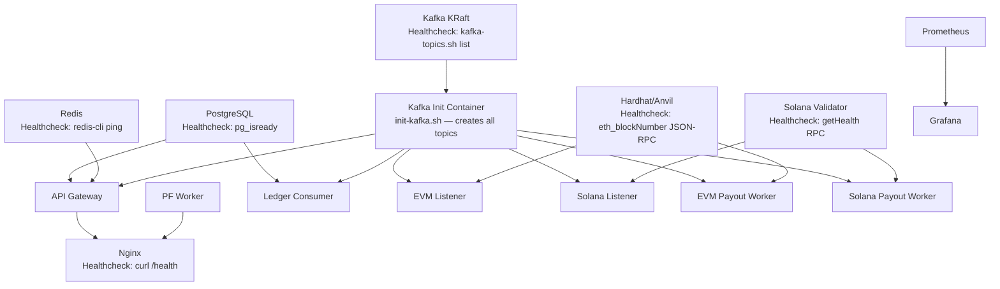
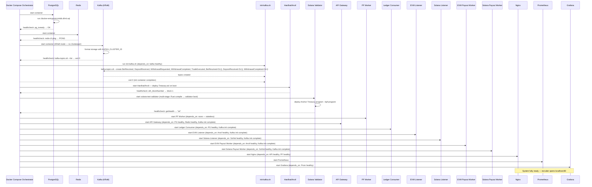
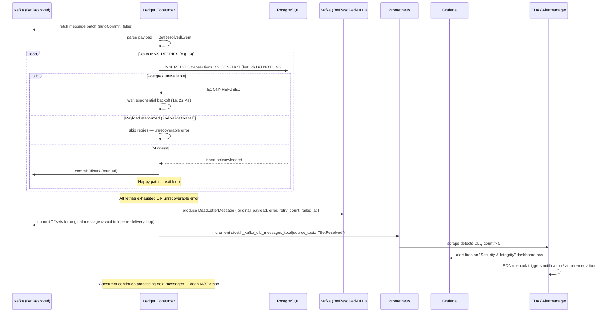
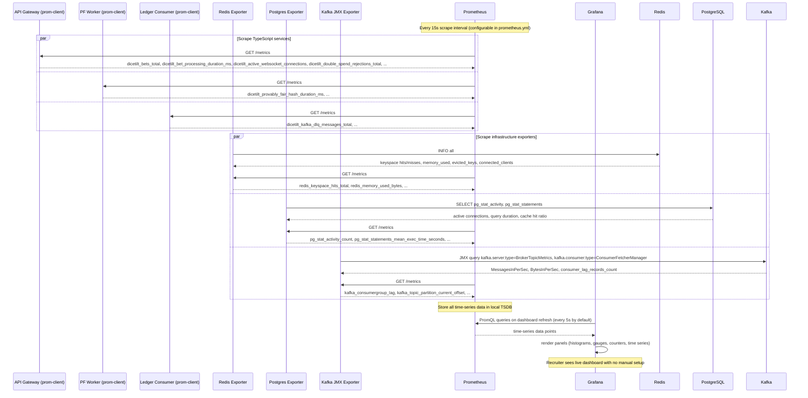
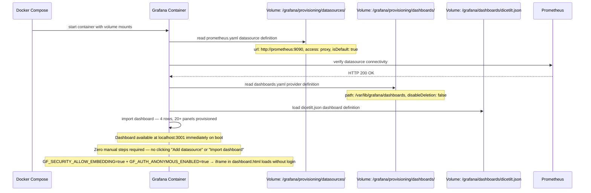
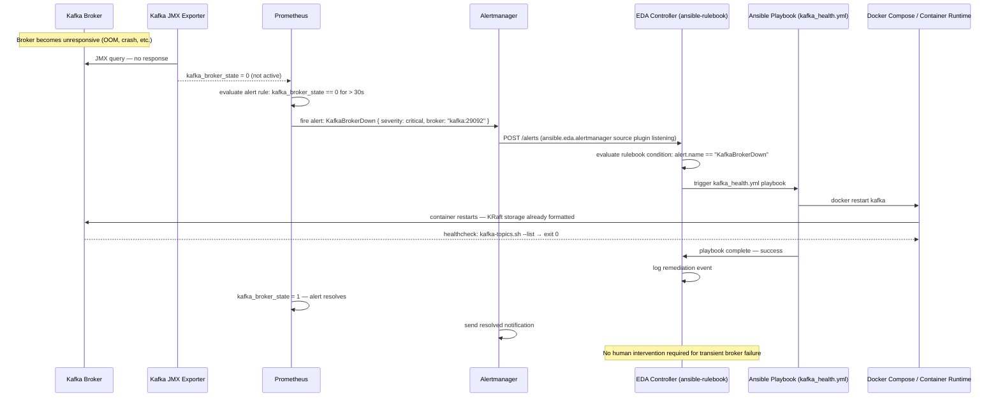
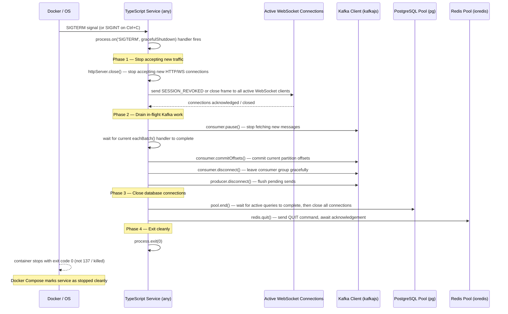

# DiceTilt — Infrastructure & Operational Flows

**Audience:** Platform engineers, DevOps, software architects.

This document covers system-level operational flows: Docker startup ordering, service health checks, graceful shutdown, DLQ handling, blockchain listener resilience, observability metrics collection, and Event-Driven Ansible (EDA) automated remediation.

---

## Flow Index

| # | Flow |
|---|---|
| 1 | Docker Startup Dependency Ordering |
| 2 | Service Startup Sequence (Ordered) |
| 3 | Container Health Check Specifications |
| 4 | Ledger Consumer — DLQ Failure and Recovery |
| 5 | Observability Metrics Collection Pipeline |
| 6 | Grafana Dashboard Auto-Provisioning |
| 7 | Event-Driven Ansible (EDA) — Kafka Broker Remediation |
| 8 | Graceful SIGTERM Shutdown — All TypeScript Services |

---

## Flow 1 — Docker Startup Dependency Ordering

No TypeScript service may attempt to boot until its data/messaging dependencies pass their health checks. All `depends_on` entries use `condition: service_healthy`.

> **Critical constraint (Constraint 15):** TypeScript services connect to Redis, Postgres, and Kafka on boot. If these are not ready, the connection attempt throws and the process exits. `condition: service_healthy` prevents this race condition entirely.

---

## Flow 2 — Service Startup Sequence (Ordered)

---

## Flow 3 — Container Health Check Specifications

| Service | Health Check Command | Interval | Timeout | Retries | Start Period |
|---|---|---|---|---|---|
| PostgreSQL | `pg_isready -U ${POSTGRES_USER} -d ${POSTGRES_DB}` | 5s | 5s | 5 | 10s |
| Redis | `redis-cli ping` | 5s | 3s | 5 | 5s |
| Kafka | `kafka-topics.sh --bootstrap-server localhost:9092 --list` | 10s | 10s | 10 | 30s |
| Hardhat/Anvil | `curl -sf -X POST -d '{"method":"eth_blockNumber","params":[],"id":1,"jsonrpc":"2.0"}' http://localhost:8545` | 5s | 5s | 5 | 15s |
| Solana Validator | `curl -sf -X POST -d '{"jsonrpc":"2.0","id":1,"method":"getHealth"}' http://localhost:8899` | 5s | 5s | 10 | 60s |
| API Gateway | `curl -sf http://localhost:3000/health` | 10s | 5s | 3 | 15s |
| PF Worker | `curl -sf http://localhost:3001/health` | 10s | 5s | 3 | 10s |
| Nginx | `curl -sf http://localhost:80/health` | 10s | 5s | 3 | 15s |
| Prometheus | `curl -sf http://localhost:9090/-/healthy` | 10s | 5s | 3 | 10s |

> **Start Period:** Docker does not count health check failures during the start period. This allows services with slow initialisation (Kafka formatting, Solana compilation) to fully boot before failing the health check and triggering a container restart.

---

## Flow 4 — Ledger Consumer: DLQ Failure and Recovery

---

## Flow 5 — Observability Metrics Collection Pipeline

---

## Flow 6 — Grafana Dashboard Auto-Provisioning

---

## Flow 7 — Event-Driven Ansible (EDA): Kafka Broker Remediation

When Prometheus detects a Kafka broker health degradation, an alert fires. The EDA controller receives the alert and automatically executes a remediation playbook to restart the broker.

---

## Flow 8 — Graceful SIGTERM Shutdown (All TypeScript Services)

Every TypeScript service must handle `SIGINT` and `SIGTERM` without losing in-flight work or leaving dangling connections. This is critical for zero-downtime container restarts (e.g., during `docker-compose up --build` redeploys).

> **Why this matters:** A forced kill (`SIGKILL` / exit code 137) can leave Kafka consumer group partitions in an unclean state, delaying rebalance and causing message processing gaps. A graceful shutdown commits offsets, leaves the consumer group cleanly, and allows the Kafka coordinator to immediately reassign partitions — minimising settlement lag during deployments.
