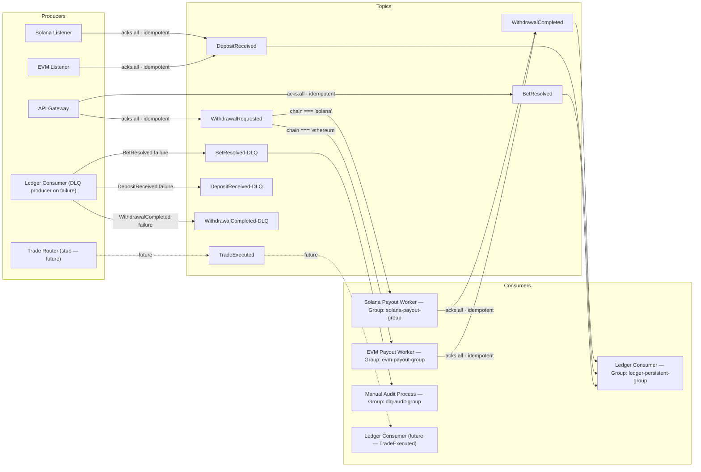
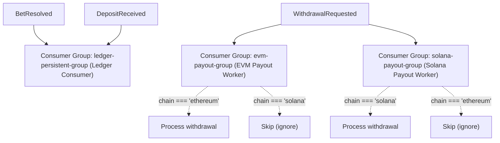
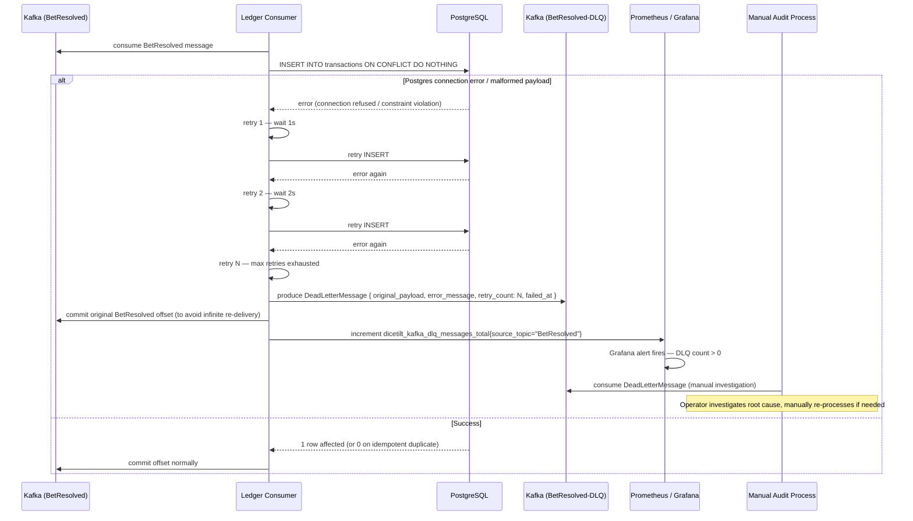

# DiceTilt — Kafka Event Topology

**Audience:** Software architects, backend engineers.

This document covers the complete Kafka event bus design: topic routing, producer/consumer matrix, typed message schemas, consumer group strategy, DLQ flow, and reliability configuration.

---

## 1. Topic Routing Diagram



---

## 2. Producer / Consumer Matrix

| Topic | Producers | Consumers | Consumer Group | Notes |
|---|---|---|---|---|
| `BetResolved` | API Gateway | Ledger Consumer | `ledger-persistent-group` | High-frequency. Every bet produces one event. Idempotent inserts via `bet_id` PK. |
| `DepositReceived` | EVM Listener, Solana Listener | Ledger Consumer | `ledger-persistent-group` | Both chains share one topic. `chain` field differentiates. |
| `WithdrawalRequested` | API Gateway | EVM Payout Worker, Solana Payout Worker | `evm-payout-group`, `solana-payout-group` | Each worker reads all messages; application-level filtering on `chain` field. |
| `WithdrawalCompleted` | EVM Payout Worker, Solana Payout Worker | Ledger Consumer | `ledger-persistent-group` | Produced after on-chain tx is mined. Ledger Consumer records it, updates Redis, PUBLISHes to `user:updates:{userId}` so API Gateway can push WITHDRAWAL_COMPLETED to WebSocket. |
| `TradeExecuted` | Trade Router *(future)* | Ledger Consumer *(future)* | `ledger-persistent-group` | Pre-created topic. No active producers or consumers in PoC. Reserved for Tilt Trade. |
| `BetResolved-DLQ` | Ledger Consumer *(on failure)* | Manual audit process | `dlq-audit-group` | Failed `BetResolved` settlements. Must be zero in normal operation. |
| `DepositReceived-DLQ` | Ledger Consumer *(on failure)* | Manual audit process | `dlq-audit-group` | Failed deposit settlements. |
| `WithdrawalCompleted-DLQ` | Ledger Consumer *(on failure)* | Manual audit process | `dlq-audit-group` | Failed withdrawal completion recordings. |

---

## 3. Message Schemas (TypeScript Interfaces)

Defined in `packages/shared-types/src/kafka-events.ts`. All Kafka messages are JSON-serialised.

```typescript
// ─────────────────────────────────────────────
// BetResolved — produced by: API Gateway
// consumed by: Ledger Consumer
// ─────────────────────────────────────────────
interface BetResolvedEvent {
  bet_id:        string;   // UUID v4 — idempotency key (used as transactions.bet_id PK)
  user_id:       string;   // UUID — references users(id)
  chain:         'ethereum' | 'solana';
  currency:      'ETH' | 'SOL' | 'USDC' | 'USDT';
  wager_amount:  string;   // NUMERIC string — avoids float precision loss
  payout_amount: string;   // "0" on loss
  game_result:   number;   // 1–100 (dice roll outcome)
  client_seed:   string;   // player-provided entropy
  nonce_used:    number;   // snapshot of wallets.current_nonce (live value from Redis) at bet time
  outcome_hash:  string;   // HMAC-SHA256(serverSeed:clientSeed:nonce)
  executed_at:   string;   // ISO 8601 timestamp
}

// ─────────────────────────────────────────────
// DepositReceived — produced by: EVM Listener, Solana Listener
// consumed by: Ledger Consumer
// ─────────────────────────────────────────────
interface DepositReceivedEvent {
  deposit_id:    string;   // UUID v4 — idempotency key
  user_id:       string;   // UUID — derived from wallet_address lookup
  chain:         'ethereum' | 'solana';
  currency:      'ETH' | 'SOL' | 'USDC' | 'USDT';
  amount:        string;   // NUMERIC string — normalised to 8 decimal places
  wallet_address: string;  // EVM: 0x-prefixed hex; Solana: base58 public key
  tx_hash:       string;   // on-chain transaction hash / Solana signature
  block_number:  number;   // EVM block number OR Solana slot number
  deposited_at:  string;   // ISO 8601 timestamp
}

// ─────────────────────────────────────────────
// WithdrawalRequested — produced by: API Gateway
// consumed by: EVM Payout Worker (chain:ethereum), Solana Payout Worker (chain:solana)
// ─────────────────────────────────────────────
interface WithdrawalRequestedEvent {
  withdrawal_id: string;   // UUID v4 — idempotency key
  user_id:       string;
  chain:         'ethereum' | 'solana';
  currency:      'ETH' | 'SOL' | 'USDC' | 'USDT';
  amount:        string;   // NUMERIC string
  to_address:    string;   // destination wallet address
  requested_at:  string;   // ISO 8601 timestamp
}

// ─────────────────────────────────────────────
// WithdrawalCompleted — produced by: EVM Payout Worker, Solana Payout Worker
// consumed by: Ledger Consumer
// ─────────────────────────────────────────────
interface WithdrawalCompletedEvent {
  withdrawal_id: string;   // same as WithdrawalRequested
  user_id:       string;
  chain:         'ethereum' | 'solana';
  currency:      'ETH' | 'SOL' | 'USDC' | 'USDT';
  amount:        string;
  to_address:    string;
  tx_hash:       string;   // on-chain transaction hash / Solana signature
  completed_at:  string;   // ISO 8601 timestamp
}

// ─────────────────────────────────────────────
// TradeExecuted — produced by: Trade Router (future)
// consumed by: Ledger Consumer (future)
// ─────────────────────────────────────────────
interface TradeExecutedEvent {
  trade_id:       string;  // UUID v4
  user_id:        string;
  chain:          'ethereum' | 'solana';
  trade_pair:     string;  // e.g., "SOL/USDC"
  input_amount:   string;
  output_amount:  string;
  execution_price: string;
  slippage_bps:   number;  // basis points
  mev_savings_usd: string; // value protected by Jito/Flashbots routing
  jito_bundle_id?: string; // Solana only
  executed_at:    string;
}

// ─────────────────────────────────────────────
// DeadLetterMessage — produced by: Ledger Consumer (on failure)
// consumed by: Manual audit / alerting
// ─────────────────────────────────────────────
interface DeadLetterMessage {
  original_topic:   string;          // e.g., "BetResolved" | "DepositReceived" | "WithdrawalCompleted"
  original_payload: BetResolvedEvent | DepositReceivedEvent | WithdrawalCompletedEvent;
  error_message:    string;          // exception message
  error_stack?:     string;          // stack trace
  retry_count:      number;          // number of retries before DLQ routing
  failed_at:        string;          // ISO 8601 timestamp
}
```

---

## 4. Consumer Group Strategy



**Rationale for separate consumer groups on `WithdrawalRequested`:**

Both payout workers subscribe to `WithdrawalRequested` using *different consumer groups*. This means each worker receives **every** message in the topic. Workers then filter on the `chain` field at the application level. This pattern was chosen over Kafka header-based filtering because:

1. It requires no Kafka admin configuration changes when adding a new chain — just deploy a new worker with a new consumer group.
2. It is explicit and auditable — the filter logic lives in application code, not Kafka configuration.
3. Both workers commit their offsets independently, so a Solana payout failure does not block EVM payouts.

**Payout worker in-session idempotency (`completedThisRun` Set):**

Each payout worker maintains an ephemeral in-memory `Set<string>` (`completedThisRun`) of `withdrawal_id` values paid in the current process session. Before processing a message, the worker checks this Set and skips if the ID was already paid. This **only** prevents within-process/session redeliveries of `WithdrawalRequested` (e.g., Kafka at-least-once redelivery before offset commit). The Set is cleared on restart and **cannot** protect against duplicates after a restart.

**Cross-restart idempotency status:** The current system does **not** implement cross-restart idempotency. The Treasury contract has no withdrawal-id tracking or on-chain nonce/sequence checks for payouts. The payout worker performs no pre-send validation (no DB lookup to `withdrawals` and no on-chain state check before submitting transactions). If the worker restarts after sending a payout but before committing the `WithdrawalRequested` offset, Kafka will redeliver the message and the worker will submit a **duplicate on-chain payout**.

> **⚠️ PRODUCTION WARNING:** The current system **cannot prevent duplicate payouts across restarts**. Do not use in production without implementing one or more of the following mitigations:
> 1. **On-chain nonce/sequence checks** — Extend the Treasury contract to track a per-recipient or global payout sequence and reject duplicates.
> 2. **Withdrawal-id tracking in contract** — Add a `mapping(bytes32 => bool) paidWithdrawals` (or similar) and require `withdrawal_id` in `payout()`; revert if already paid.
> 3. **Pre-send validation** — Before calling `contract.payout()`, query the `withdrawals` table (or on-chain state) to confirm this `withdrawal_id` has not already been paid; skip if already recorded.

**Ledger Consumer idempotency (`ON CONFLICT DO NOTHING`):**

The Ledger Consumer's `INSERT INTO withdrawals ... ON CONFLICT (tx_hash) DO NOTHING` protects the **Ledger Consumer** from duplicate `WithdrawalCompleted` events (e.g., Kafka redelivery of the same event). It does **not** protect the payout worker from submitting duplicate on-chain transactions — that is a separate concern handled (or not) by the payout worker's own idempotency measures.

---

## 5. Dead Letter Queue (DLQ) Flow



---

## 6. Kafka Reliability Configuration

Applied to all TypeScript Kafka producers and consumers. Defined in each service's KafkaJS configuration.

### Producer Configuration

```typescript
const producer = kafka.producer({
  idempotent: true,        // Prevents duplicate messages on retry (Kafka exactly-once production)
  transactionTimeout: 30000,
});

await producer.send({
  topic: 'BetResolved',
  acks: -1,               // acks: 'all' — leader + all in-sync replicas must acknowledge
  messages: [{ value: JSON.stringify(event) }],
});
```

| Setting | Value | Rationale |
|---|---|---|
| `idempotent: true` | enabled | Kafka assigns a sequence number to each producer message. Broker deduplicates retries. Prevents duplicate events if the producer retries after a network partition. |
| `acks: -1` (`'all'`) | all in-sync replicas | A financial event must be acknowledged by all replicas before the producer considers it written. Sacrifices some throughput for zero data loss. |

### Consumer Configuration

The Ledger Consumer must use **`eachBatch`** to enable parallel DB inserts across users. Messages are grouped by `user_id`; each group is processed sequentially to preserve per-user ordering, but groups run in parallel via `Promise.all` (Constraint 24).

```typescript
const consumer = kafka.consumer({
  groupId: 'ledger-persistent-group',
  sessionTimeout: 30000,
  heartbeatInterval: 3000,
  maxWaitTimeInMs: 50,
});

await consumer.run({
  autoCommit: false,
  eachBatch: async ({ batch, heartbeat }) => {
    const byUser = groupBy(batch.messages, m => JSON.parse(m.value).user_id);
    await Promise.all(
      Object.values(byUser).map(msgs =>
        processUserBatch(msgs)  // sequential per user, parallel across users
      )
    );
    await heartbeat();
    // commit offsets after all inserts succeed
  },
});
```

| Setting | Value | Rationale |
|---|---|---|
| `eachBatch`| batch processing | Enables grouping by `user_id` and `Promise.all` across groups — parallel DB inserts for different users while preserving per-user order. Sequential `eachMessage` limits throughput. |
| `autoCommit: false` | manual | Offsets are committed only after the Postgres insert succeeds. If the service crashes mid-insert, the message is re-delivered — protected by `ON CONFLICT DO NOTHING`. |
| `maxWaitTimeInMs: 50` | 50ms | Low fetch wait time ensures the Ledger Consumer processes messages with minimal lag. Async settlement should not lag behind the game loop. |
| `sessionTimeout: 30000` | 30s | Kafka considers the consumer dead after 30s without a heartbeat, triggering a rebalance. |

---

## 7. Topic Configuration (`init-kafka.sh`)

```bash
#!/bin/bash
# Executed on Kafka container boot via entrypoint hook
# All topics must exist before any TypeScript service starts

KAFKA_TOPICS=(
  "BetResolved"
  "DepositReceived"
  "WithdrawalRequested"
  "WithdrawalCompleted"
  "TradeExecuted"
  "BetResolved-DLQ"
  "DepositReceived-DLQ"
  "WithdrawalCompleted-DLQ"
)

for topic in "${KAFKA_TOPICS[@]}"; do
  kafka-topics.sh \
    --bootstrap-server kafka:29092 \
    --create \
    --if-not-exists \
    --topic "$topic" \
    --partitions 3 \
    --replication-factor 1  # Single broker in PoC; set to 3 in production
  echo "Topic created or already exists: $topic"
done
```

> **Note on partitions:** `BetResolved` uses 3 partitions, keyed by `user_id`. This ensures all bets for the same user are processed by the same Ledger Consumer partition, preserving per-user ordering. `WithdrawalRequested` also uses `user_id` as the partition key for the same reason.
>
> **Parallelism:** Deploy **3 Ledger Consumer replicas** in the same consumer group (`ledger-persistent-group`). With 3 partitions, each replica processes exactly one partition — yielding **3 parallel partition processors**. This is an explicit architecture constraint (see `implementation_plan.md` Constraint 24).
