# DiceTilt — Sequence Diagrams

**Audience:** Software architects, senior engineers.

All user-facing and session-related interaction flows. For blockchain-specific deposit and withdrawal flows, see `blockchain-flows.md`. For infrastructure and operational flows, see `infrastructure-flows.md`.

---

## Flow Index

| # | Flow | Category |
|---|---|---|
| 1 | Burner Wallet Creation + EIP-712 Authentication | Auth |
| 2 | WebSocket Connection Upgrade | Auth |
| 3 | User Logout (Explicit Session Invalidation) | Auth |
| 4 | Session Expiry (TTL-based Automatic Invalidation) | Auth |
| 5 | Session Revocation (Admin-Initiated) | Auth |
| 6 | Bet — WIN Path (Full end-to-end) | Game Loop |
| 7 | Bet — LOSS Path | Game Loop |
| 8 | Bet — Insufficient Balance (Lua Rejection) | Game Loop |
| 9 | Bet — Rate Limited (Sliding Window Triggered) | Game Loop |
| 10 | Bet — Invalid Payload (Zod Rejection) | Game Loop |
| 11 | Bet Amount Adjustment (Client-Side Only) | Game Loop |
| 12 | Provably Fair — Status Check | Provably Fair |
| 13 | Provably Fair — Seed Rotation + Client Verification | Provably Fair |
| 14 | Caching — Balance Cache MISS (Hydration from Postgres) | Caching |
| 15 | Caching — Balance Cache HIT (Normal Path) | Caching |
| 16 | Caching — Balance Eviction Recovery | Caching |
| 17 | WebSocket PING / PONG Keep-Alive | Infrastructure |
| 18 | WebSocket Connection State Machine | Infrastructure |
| 19 | Developer & Testing Infrastructure (TEST_MODE + /?demo=1) | Developer Tools |

---

## Flow 1 — Burner Wallet Creation + EIP-712 Authentication

No MetaMask required. The client generates a local burner wallet on page load and uses it to sign the EIP-712 challenge.

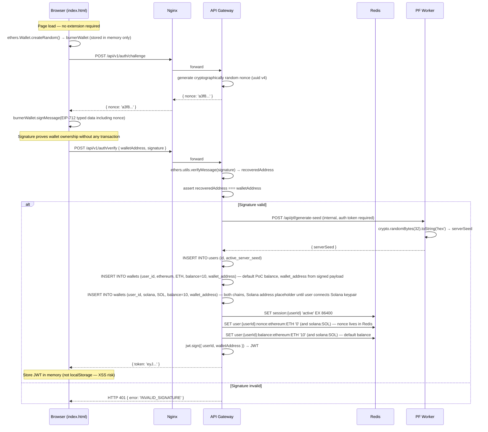

---

## Flow 2 — WebSocket Connection Upgrade

After obtaining a JWT, the client upgrades to a persistent WebSocket connection. The JWT is **never** placed in the URL or HTTP headers — it is sent as the first WebSocket frame after the connection is established, preventing the token from appearing in Nginx access logs or browser history.

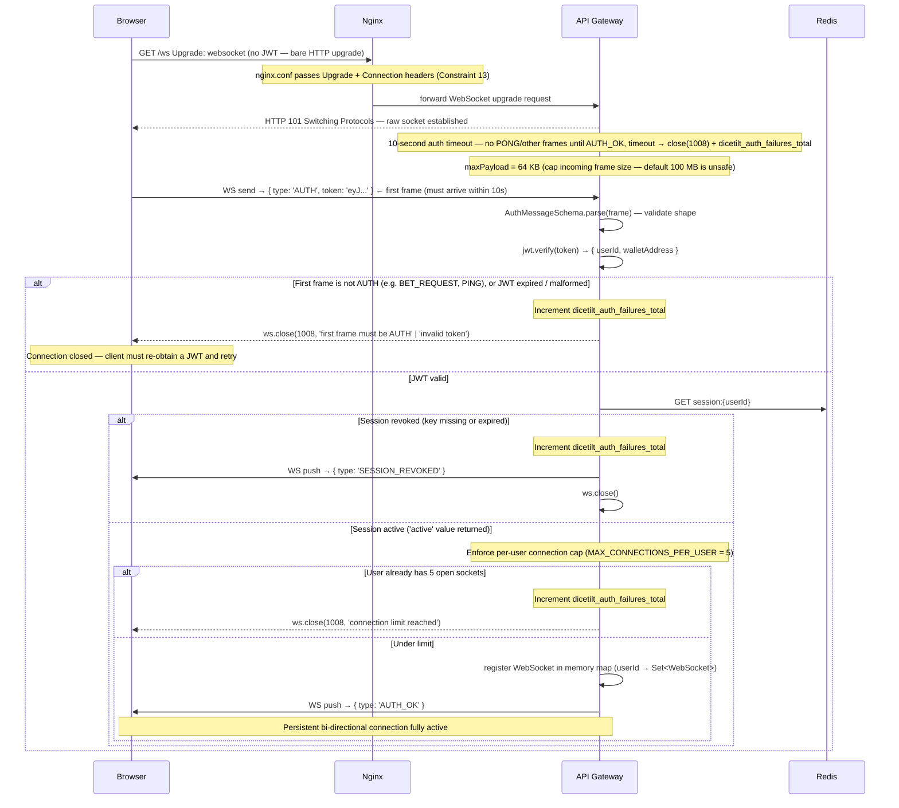

---

## Flow 3 — User Logout (Explicit Session Invalidation)

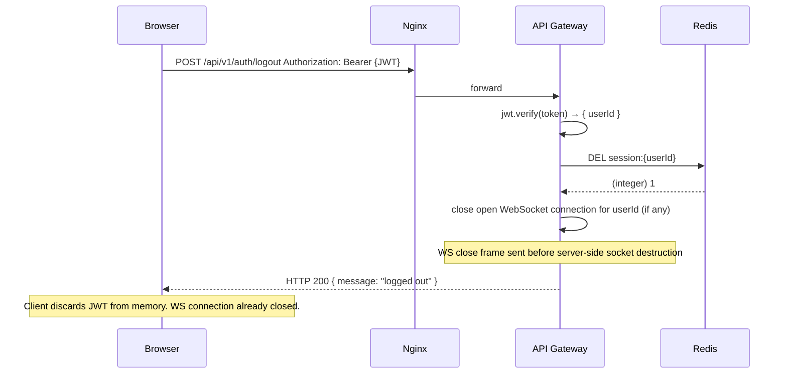

---

## Flow 4 — Session Expiry (TTL-Based Automatic Invalidation)

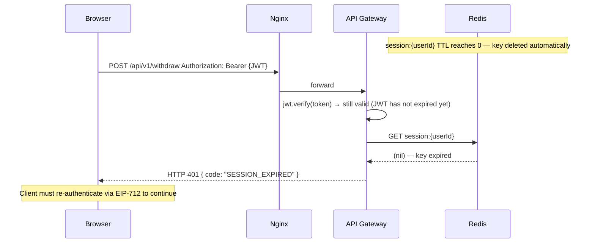

---

## Flow 5 — Session Revocation (Admin-Initiated)

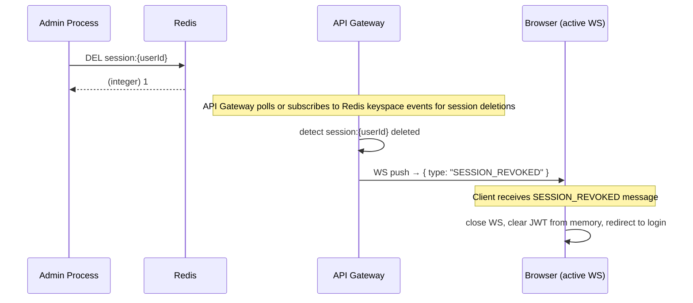

---

## Flow 6 — Bet, WIN Path (Full End-to-End)

The complete betting loop showing synchronous resolution (<20ms) and asynchronous ACID settlement.

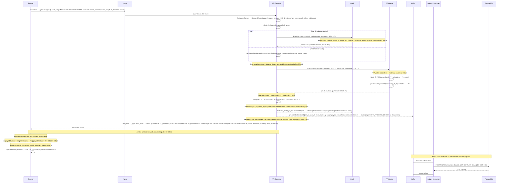

### Reliability notes

**lua_credit_payout (settleBetAsync):** Fire-and-forget for latency; not awaited before WS send. `settleBetAsync` retries up to `creditMaxAttempts` (default 3) on transient Redis errors. On final failure it logs `REDIS_CREDIT_ERROR` and returns — funds remain in escrow until manual reconciliation or a future retry worker. The `WS send → { ... newBalance ... }` uses `optimisticBalance` (post-escrow, pre-credit); the frontend compensates with `displayedBalance = msg.newBalance + msg.payoutAmount`.

**BetResolved:** Fire-and-forget for latency. `.catch()` logs `KAFKA_PRODUCE_ERROR` with `betId` and `userId`; there is no durable retry. If produce fails, the Ledger Consumer never receives the event; reconciliation: API Gateway audit log has `BET_RESOLVED` for the bet; compare `transactions` table to audit logs to identify missing rows. **Recommended future:** RPUSH failed events to a Redis list (e.g. `kafka:bet_resolved:retry`) and a worker republishes with at-least-once semantics; or use Kafka producer with `acks: -1` and retries (currently used) plus a dead-letter queue for failed sends.

---

## Flow 7 — Bet, LOSS Path

Identical to Flow 6 up to payout calculation. Shown abbreviated for the key difference.

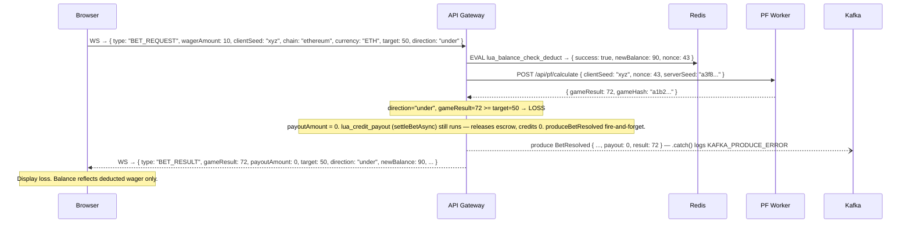

---

## Flow 8 — Bet, Insufficient Balance (Lua Rejection)

The atomic Lua script prevents any double-spend. The flow is aborted before game logic executes.

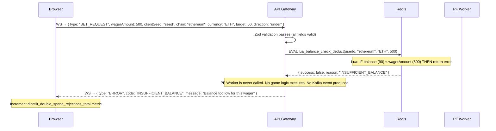

---

## Flow 9 — Bet, Rate Limited (Sliding Window Triggered)

The sliding window rate limiter is **fully wired** into the WS bet handler. It is checked before any balance operation — rejections are cheap and do not touch Redis balance keys.

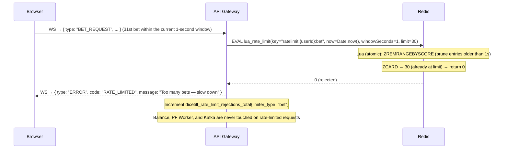

> **Implementation:** `checkRateLimit(userId, 'bet', 1, 30)` — 30 bets per second per user. The Lua script uses a Redis ZSET keyed `ratelimit:{userId}:bet`. `dicetilt_rate_limit_rejections_total{limiter_type="bet"}` is incremented **only** when the rate-limit check succeeds and returns a rejection (limit exceeded). If the Redis call itself fails, the handler **fails closed** — reject the bet with `INTERNAL_ERROR`, increment `dicetilt_redis_error_rejections_total` (not `dicetilt_rate_limit_rejections_total`), and log `REDIS_UNAVAILABLE`.

---

## Flow 10 — Bet, Invalid Payload (Zod Rejection)

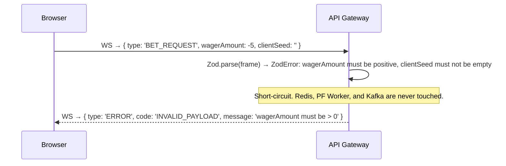

---

## Flow 11 — Bet Amount Adjustment (Client-Side Only)

> **Note:** There is no server-side "reduce bet" concept. Each `BET_REQUEST` message is an independent, atomic wager. The client simply changes the wager input field value before clicking Roll. No server communication occurs until the next `BET_REQUEST` is sent.

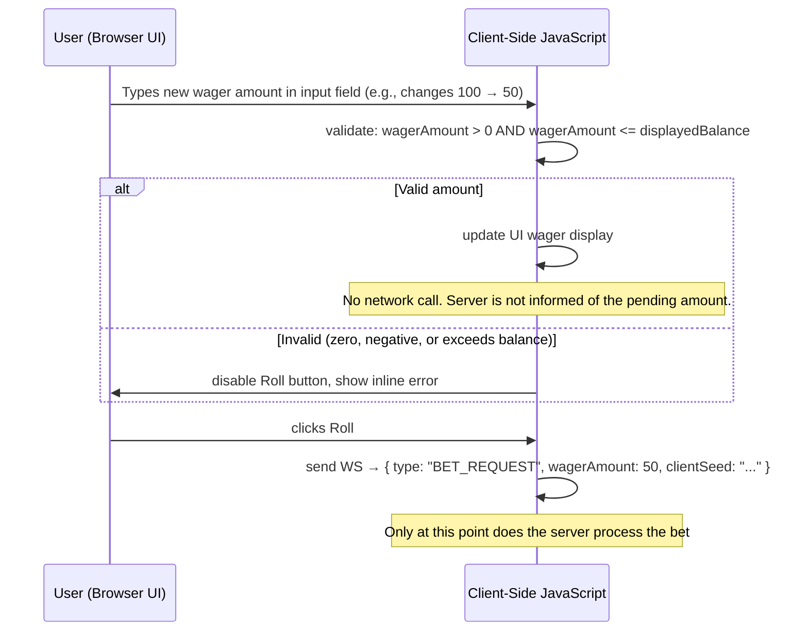

---

## Flow 12 — Provably Fair Status Check

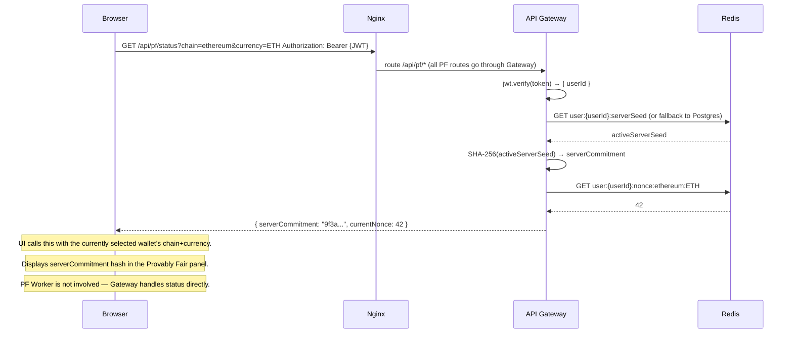

---

## Flow 13 — Provably Fair Seed Rotation + Client Browser Verification

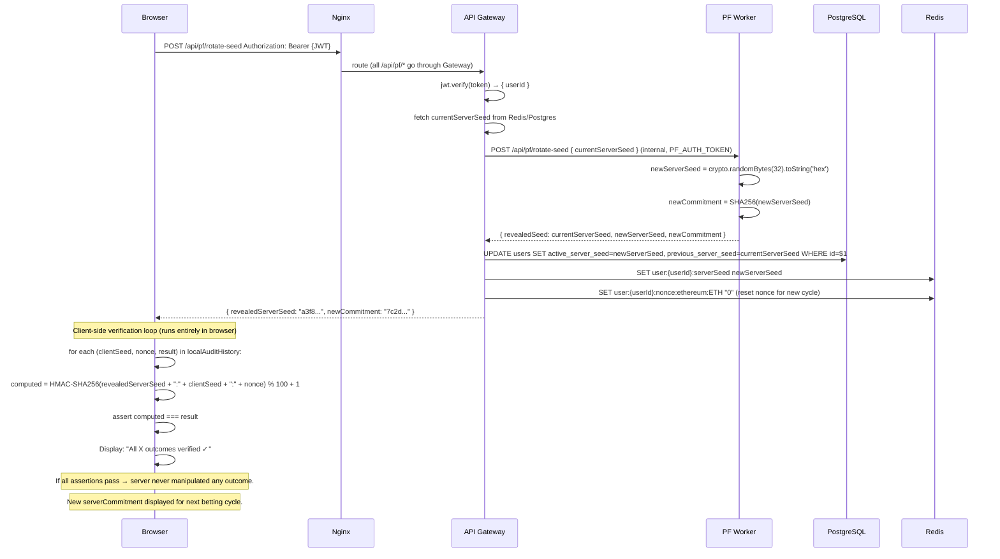

---

## Flow 14 — Caching: Balance Cache MISS (Hydration from Postgres)

Occurs on first login or after a Redis eviction. The API Gateway hydrates Redis before the Lua betting script runs.

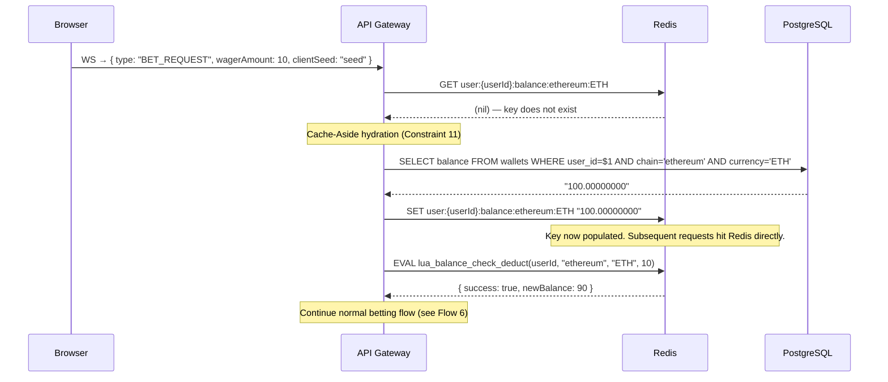

---

## Flow 15 — Caching: Balance Cache HIT (Normal Path)

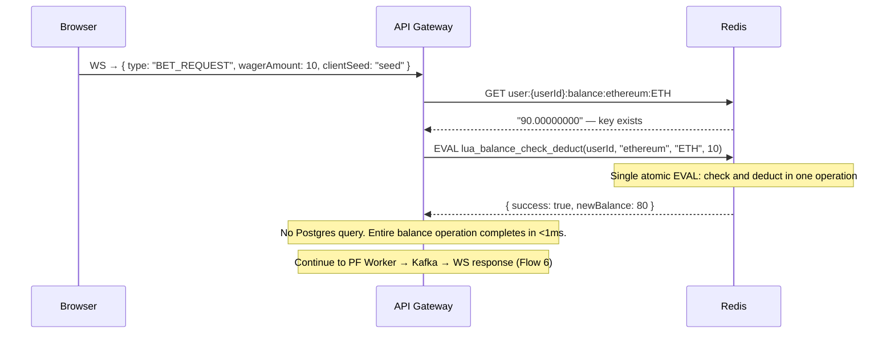

---

## Flow 16 — Caching: Balance Eviction Recovery

When Redis evicts a balance key under memory pressure, the next bet triggers hydration before proceeding.

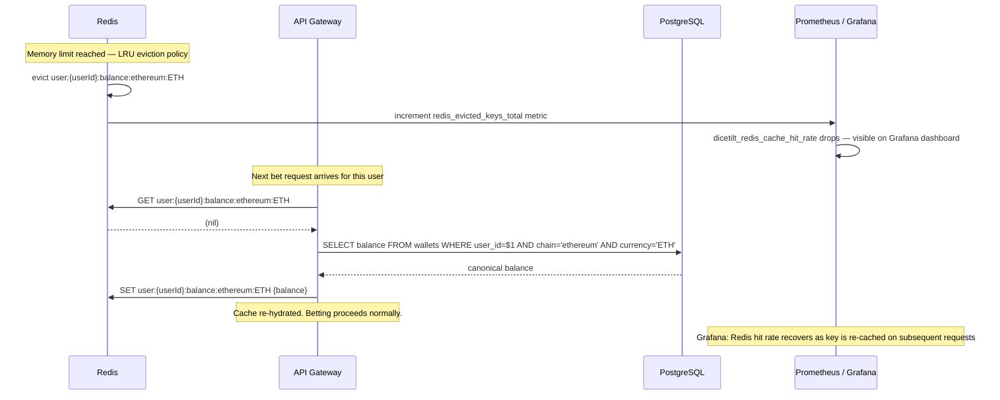

---

## Flow 17 — WebSocket PING / PONG Keep-Alive

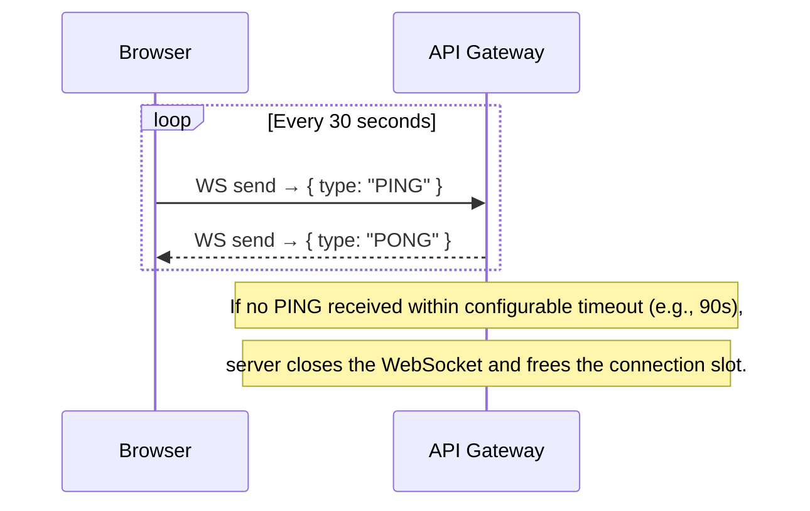

---

## Flow 18 — WebSocket Connection State Machine

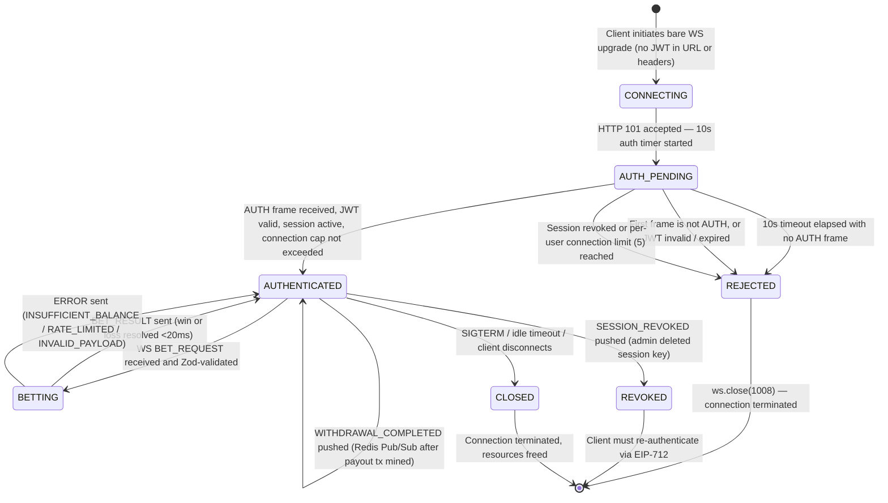

---

## Flow 19 — Developer & Testing Infrastructure

### 19.1 `TEST_MODE` Dev Token Endpoint

When `TEST_MODE=true` (set in `docker-compose.yml`), the API Gateway exposes an additional route that bypasses EIP-712 wallet signing. This is used by the k6 load tests to authenticate programmatically without a real wallet.

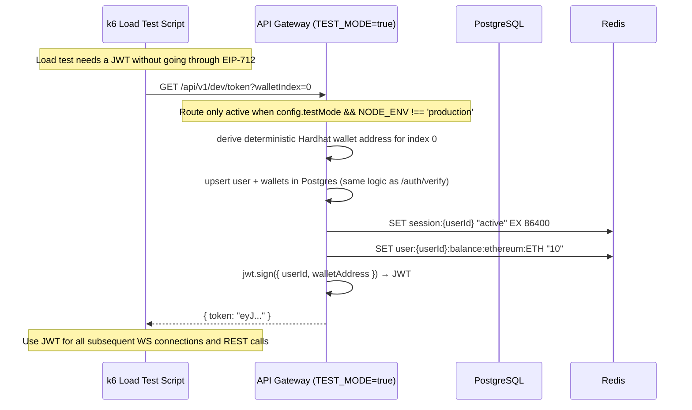

> **Security:** This endpoint is guarded by `config.testMode && process.env.NODE_ENV !== 'production'`; otherwise it returns 404. A startup sanity check exits the process if `TEST_MODE=true` while `NODE_ENV=production` to catch misconfiguration early. The `TEST_MODE` env var is explicitly set to `"true"` only in `docker-compose.yml` and only for the PoC demo stack.

---

### 19.2 `/?demo=1` Frontend Shortcut

Opening the frontend at `http://localhost/?demo=1` pre-loads Hardhat account #1 (index 1) as the burner wallet instead of generating a random one. This account is pre-funded on Anvil and makes it easy to test the Deposit flow without manually copying a private key.

**Security:** Demo mode is gated by `DEMO_MODE = isLocalhost() && params.get('demo') === '1'`. The test mnemonic is only used when the hostname is `localhost`, `127.0.0.1`, or `*.local`; on production domains, `?demo=1` is ignored and `ethers.Wallet.createRandom()` is used. For production builds, run `BUILD_ENV=production node scripts/build-frontend.js` to strip the mnemonic entirely — output goes to `frontend/dist/`. API/WS URLs use `location.origin` / `location.host`, so demo is implicitly limited to the page's origin (localhost when testing locally).

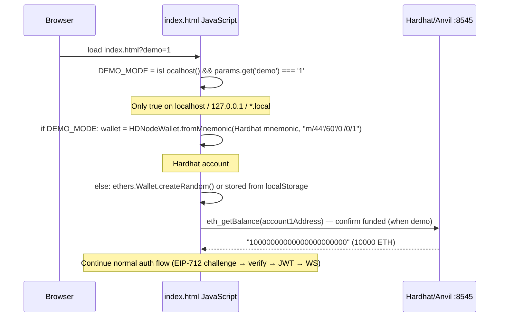

> **Purpose:** Simplifies recruiter demos of the Deposit feature. Hardhat account #1's wallet address is already known to the system after a normal auth flow, and its large ETH balance makes it easy to demonstrate multiple on-chain deposits without running out of test ETH.
