# DiceTilt — Sequence Diagrams

**Audience:** Software architects, senior engineers.

All user-facing and session-related interaction flows. For blockchain-specific deposit and withdrawal flows, see `blockchain-flows.md`. For infrastructure and operational flows, see `infrastructure-flows.md`.

---

## Flow Index

| # | Flow | Category |
|---|---|---|
| 1 | Burner Wallet Creation + EIP-712 Authentication | Auth |
| 2 | WebSocket Connection Upgrade | Auth |
| 3 | User Logout (Explicit Session Invalidation) | Auth |
| 4 | Session Expiry (TTL-based Automatic Invalidation) | Auth |
| 5 | Session Revocation (Admin-Initiated) | Auth |
| 6 | Bet — WIN Path (Full end-to-end) | Game Loop |
| 7 | Bet — LOSS Path | Game Loop |
| 8 | Bet — Insufficient Balance (Lua Rejection) | Game Loop |
| 9 | Bet — Rate Limited (Sliding Window Triggered) | Game Loop |
| 10 | Bet — Invalid Payload (Zod Rejection) | Game Loop |
| 11 | Bet Amount Adjustment (Client-Side Only) | Game Loop |
| 12 | Provably Fair — Status Check | Provably Fair |
| 13 | Provably Fair — Seed Rotation + Client Verification | Provably Fair |
| 14 | Caching — Balance Cache MISS (Hydration from Postgres) | Caching |
| 15 | Caching — Balance Cache HIT (Normal Path) | Caching |
| 16 | Caching — Balance Eviction Recovery | Caching |
| 17 | WebSocket PING / PONG Keep-Alive | Infrastructure |
| 18 | WebSocket Connection State Machine | Infrastructure |

---

## Flow 1 — Burner Wallet Creation + EIP-712 Authentication

No MetaMask required. The client generates a local burner wallet on page load and uses it to sign the EIP-712 challenge.

```mermaid
sequenceDiagram
    participant B as Browser (index.html)
    participant N as Nginx
    participant API as API Gateway
    participant Redis as Redis
    participant PF as PF Worker

    Note over B: Page load — no extension required
    B->>B: ethers.Wallet.createRandom() → burnerWallet (stored in memory only)

    B->>N: POST /api/v1/auth/challenge
    N->>API: forward
    API->>API: generate cryptographically random nonce (uuid v4)
    API-->>N: { nonce: "a3f8..." }
    N-->>B: { nonce: "a3f8..." }

    B->>B: burnerWallet.signMessage(EIP-712 typed data including nonce)
    Note over B: Signature proves wallet ownership without any transaction

    B->>N: POST /api/v1/auth/verify { walletAddress, signature }
    N->>API: forward
    API->>API: ethers.utils.verifyMessage(signature) → recoveredAddress
    API->>API: assert recoveredAddress === walletAddress

    alt Signature valid
        API->>PF: POST /api/pf/generate-seed (internal, auth token required)
        PF->>PF: crypto.randomBytes(32).toString('hex') → serverSeed
        PF-->>API: { serverSeed }

        API->>API: INSERT INTO users (id, active_server_seed)
        API->>API: INSERT INTO wallets (user_id, ethereum, ETH, balance=10, wallet_address) — default PoC balance, wallet_address from signed payload
        API->>API: INSERT INTO wallets (user_id, solana, SOL, balance=10, wallet_address) — both chains; Solana address placeholder until user connects Solana keypair
        API->>Redis: SET session:{userId} "active" EX 86400
        API->>Redis: SET user:{userId}:nonce:ethereum:ETH "0" (and solana:SOL) — nonce lives in Redis
        API->>Redis: SET user:{userId}:balance:ethereum:ETH "10" (and solana:SOL) — default balance
        API->>API: jwt.sign({ userId, walletAddress }) → JWT

        API-->>B: { token: "eyJ..." }
        Note over B: Store JWT in memory (not localStorage — XSS risk)
    else Signature invalid
        API-->>B: HTTP 401 { error: "INVALID_SIGNATURE" }
    end
```

---

## Flow 2 — WebSocket Connection Upgrade

After obtaining a JWT, the client upgrades to a persistent WebSocket connection.

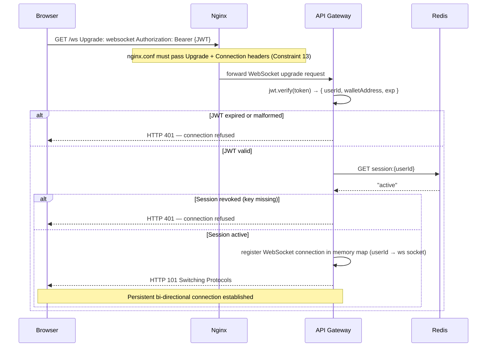

---

## Flow 3 — User Logout (Explicit Session Invalidation)

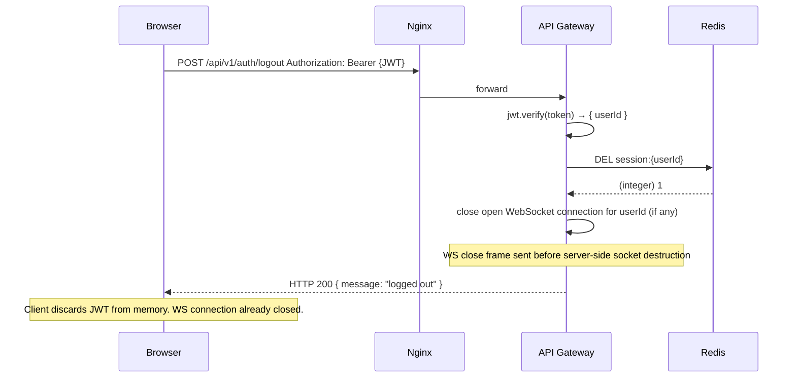

---

## Flow 4 — Session Expiry (TTL-Based Automatic Invalidation)

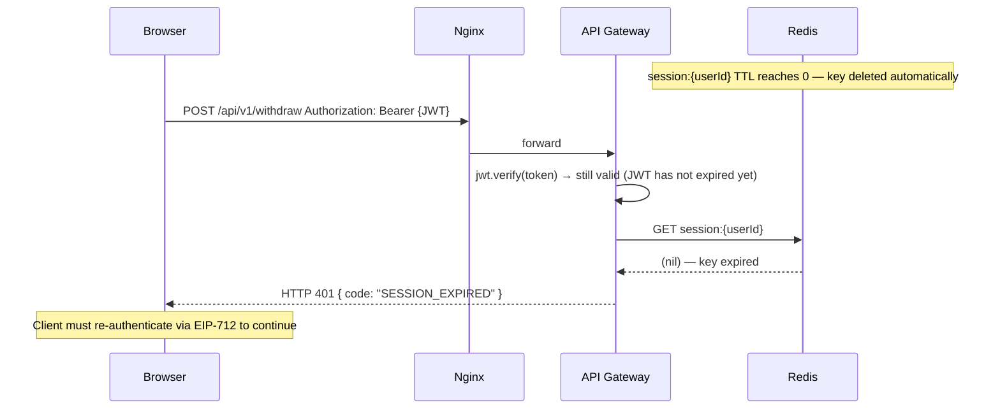

---

## Flow 5 — Session Revocation (Admin-Initiated)

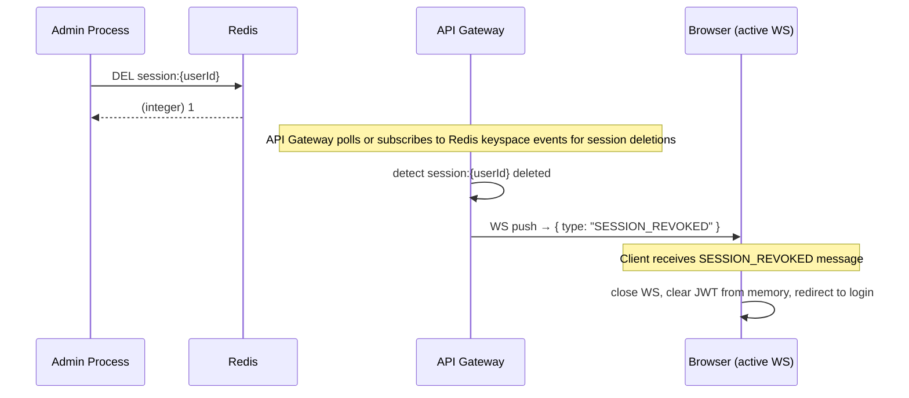

---

## Flow 6 — Bet, WIN Path (Full End-to-End)

The complete betting loop showing synchronous resolution (<20ms) and asynchronous ACID settlement.

```mermaid
sequenceDiagram
    participant B as Browser
    participant N as Nginx
    participant API as API Gateway
    participant Redis as Redis
    participant PF as PF Worker
    participant Kafka as Kafka
    participant LC as Ledger Consumer
    participant PG as PostgreSQL

    B->>N: WS send → { type: "BET_REQUEST", wagerAmount: 10, clientSeed: "abc123", chain: "ethereum", currency: "ETH", target: 50, direction: "under" }
    N->>API: route WebSocket frame

    API->>API: Zod.parse(frame) — validate all fields (wagerAmount > 0, target 2–98, direction, chain, currency, clientSeed ≤ 64 chars)
    API->>API: check Redis session:{userId} still active

    API->>Redis: EVAL lua_balance_check_deduct(userId, "ethereum", "ETH", 10)
    Note over Redis: Atomic: GET balance, assert >= wager, SET balance - wager, INCR nonce, return newBalance + nonce
    Redis-->>API: { success: true, newBalance: 90, nonce: 42 }

    API->>API: fetch serverSeed from Redis/Postgres for userId
    API->>PF: POST /api/pf/calculate { clientSeed: "abc123", nonce: 42, serverSeed: "a3f8..." }
    Note over PF: PF Worker is stateless — Gateway passes all inputs
    PF->>PF: HMAC-SHA256(serverSeed + ":" + clientSeed + ":" + nonce)
    PF->>PF: gameResult = parseInt(hash.slice(0,8), 16) % 100 + 1  →  22
    PF-->>API: { gameResult: 22, gameHash: "d4e8f..." }

    Note over API: direction="under", gameResult=22 < target=50 → WIN
    API->>API: multiplier = 99 / (50 - 1) = 2.0204; payoutAmount = 10 * 2.0204 = 20.20
    API->>Redis: EVAL lua_credit_payout(userId, "ethereum", "ETH", 20.20)
    Redis-->>API: { newBalance: 110.20 }

    API->>Kafka: produce BetResolved { bet_id: uuid, user_id, chain, currency, wager: 10, payout: 20.20, result: 22, hash: "d4e8...", nonce: 42, clientSeed }
    Note over API,B: ← entire path above completes in <20ms

    API-->>N: WS send → { type: "BET_RESULT", betId, gameResult: 22, gameHash, nonce: 42, wagerAmount: 10, payoutAmount: 20.20, target: 50, direction: "under", multiplier: 2.0204, newBalance: 110.20, chain: "ethereum", currency: "ETH", timestamp }
    N-->>B: display win + updated balance

    Note over Kafka, PG: Async ACID settlement — independent of client response
    LC->>Kafka: consume BetResolved
    LC->>PG: INSERT INTO transactions (bet_id,...) ON CONFLICT (bet_id) DO NOTHING
    PG-->>LC: 1 row inserted
    LC->>Kafka: commit offset
```

---

## Flow 7 — Bet, LOSS Path

Identical to Flow 6 up to payout calculation. Shown abbreviated for the key difference.

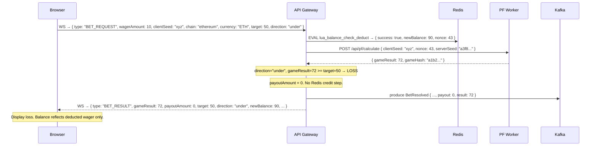

---

## Flow 8 — Bet, Insufficient Balance (Lua Rejection)

The atomic Lua script prevents any double-spend. The flow is aborted before game logic executes.

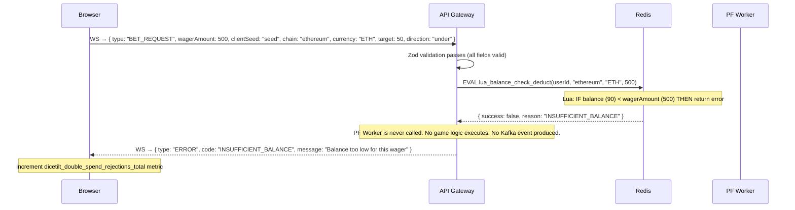

---

## Flow 9 — Bet, Rate Limited (Sliding Window Triggered)

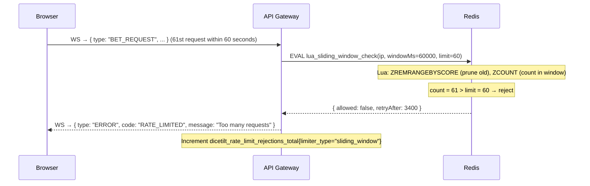

---

## Flow 10 — Bet, Invalid Payload (Zod Rejection)

```mermaid
sequenceDiagram
    participant B as Browser
    participant API as API Gateway

    B->>API: WS → { type: "BET_REQUEST", wagerAmount: -5, clientSeed: "" }
    API->>API: Zod.parse(frame) → ZodError: wagerAmount must be positive; clientSeed must not be empty

    Note over API: Short-circuit. Redis, PF Worker, and Kafka are never touched.
    API-->>B: WS → { type: "ERROR", code: "INVALID_PAYLOAD", message: "wagerAmount must be > 0" }
```

---

## Flow 11 — Bet Amount Adjustment (Client-Side Only)

> **Note:** There is no server-side "reduce bet" concept. Each `BET_REQUEST` message is an independent, atomic wager. The client simply changes the wager input field value before clicking Roll. No server communication occurs until the next `BET_REQUEST` is sent.

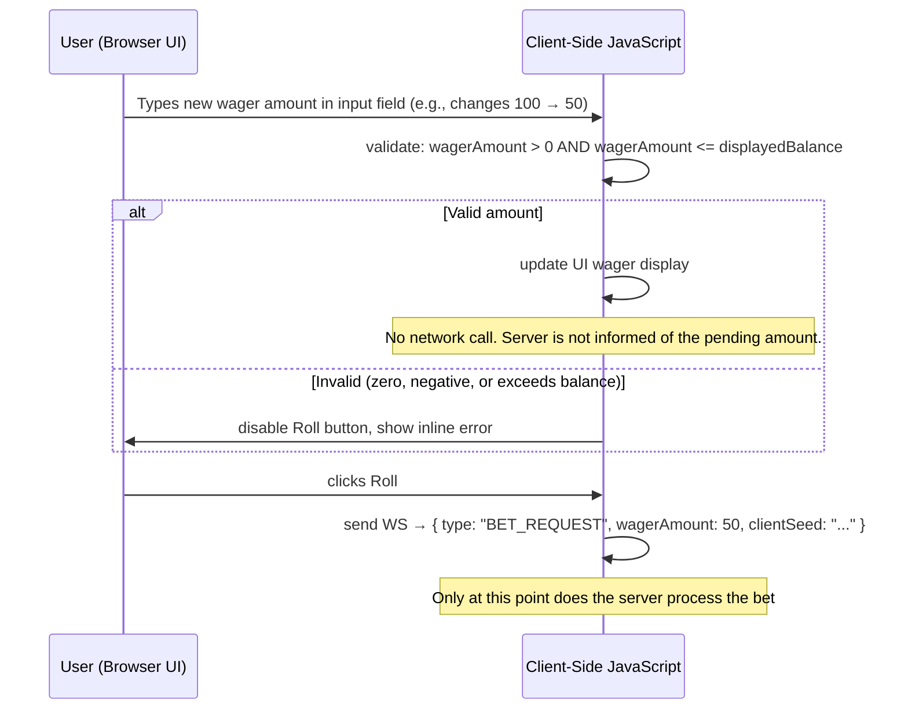

---

## Flow 12 — Provably Fair Status Check

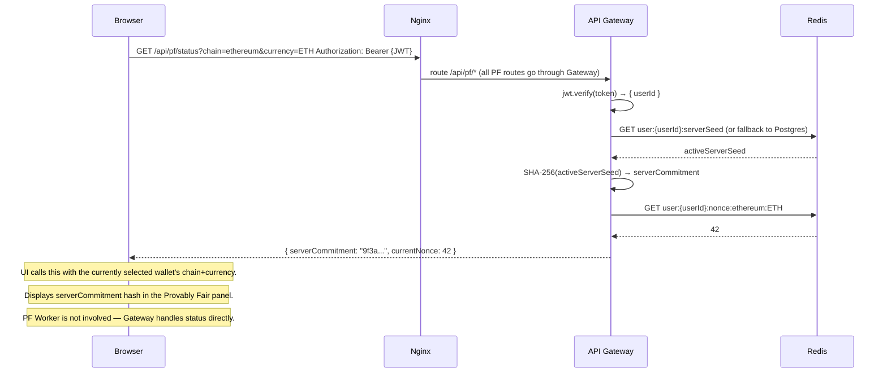

---

## Flow 13 — Provably Fair Seed Rotation + Client Browser Verification

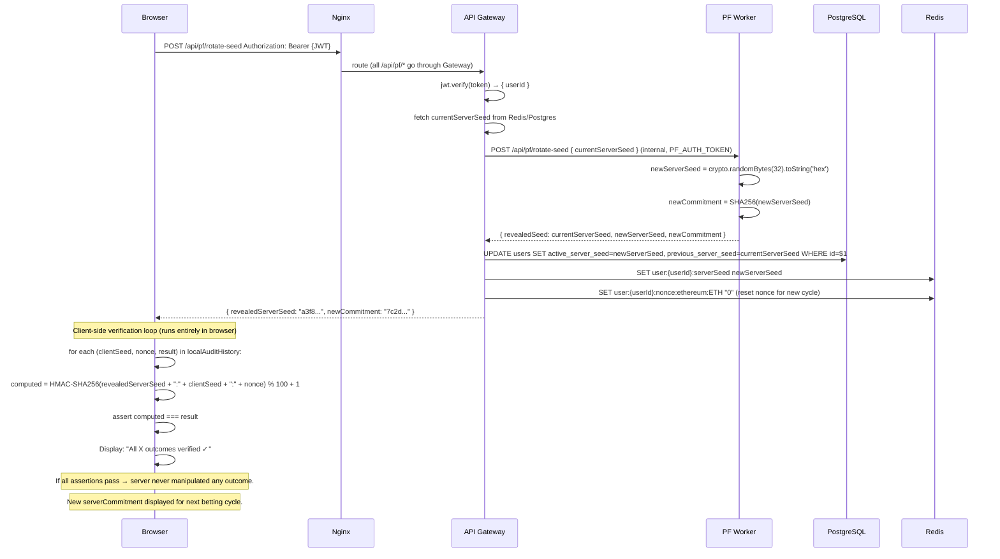

---

## Flow 14 — Caching: Balance Cache MISS (Hydration from Postgres)

Occurs on first login or after a Redis eviction. The API Gateway hydrates Redis before the Lua betting script runs.

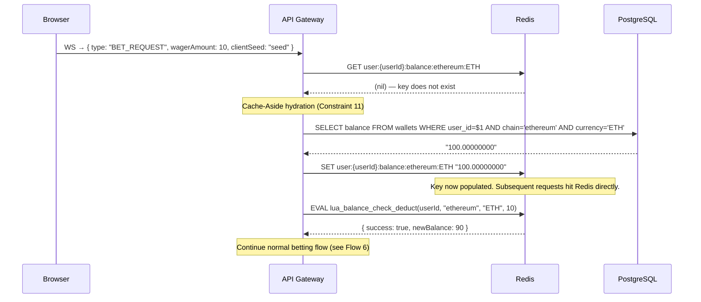

---

## Flow 15 — Caching: Balance Cache HIT (Normal Path)

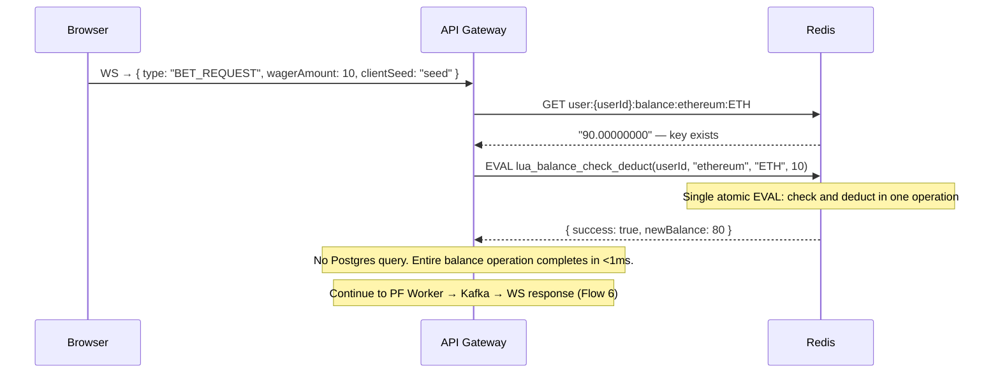

---

## Flow 16 — Caching: Balance Eviction Recovery

When Redis evicts a balance key under memory pressure, the next bet triggers hydration before proceeding.

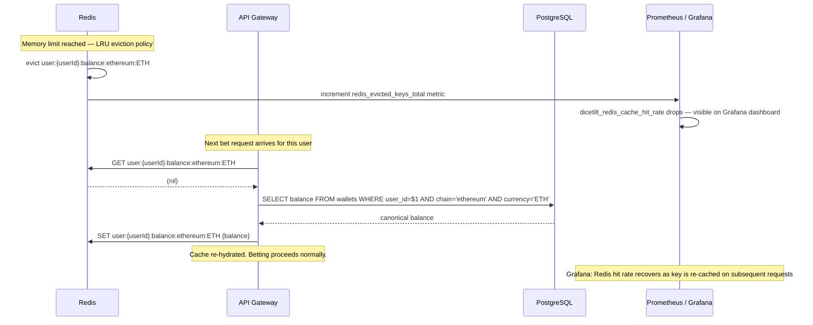

---

## Flow 17 — WebSocket PING / PONG Keep-Alive

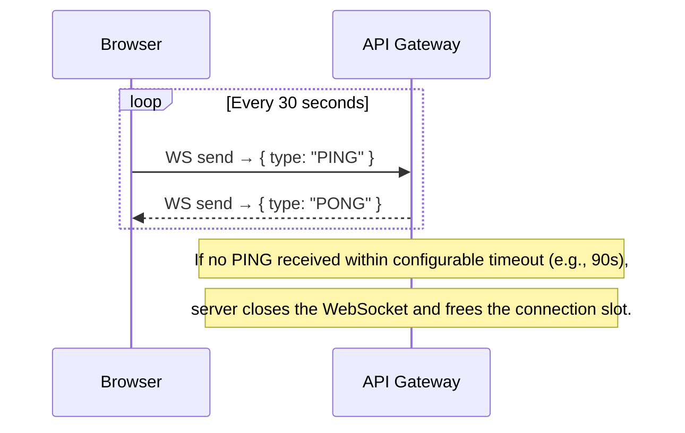

---

## Flow 18 — WebSocket Connection State Machine

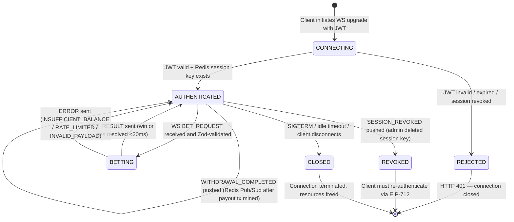
